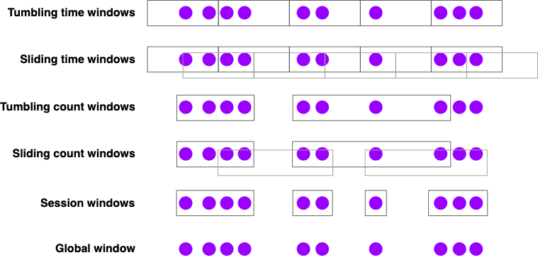

# Streaming Analytics

[https://nightlies.apache.org/flink/flink-docs-release-1.14/docs/learn-flink/streaming_analytics/](https://nightlies.apache.org/flink/flink-docs-release-1.14/docs/learn-flink/streaming_analytics/)

# Event Time and Watermarks

## Introduction

Flink는 3가지 시간 개념을 지원한다

- `event time`: event가 발생한 시각, device가 event를 발생시킨 시각
- `ingestion time`: flink가 event를 ingest 했을때의 시각
- `processing time`: pipeline에서 operator가 event를 처리할때의 시각

특정 날짜에 가장 높은 주가를 계산하는것같이 reproducable event에 대해서는 `event time`을 써야한다. event time은 computing이 진행되는 시각에 의존성이 없기 때문이다. 이런 종류의 realtime application은 processing time을 활용하기도 하지만, 이때는 event 시각이 아닌, event가 process되는 시각에의해 result가 결정된다. processing time을 활용하여 analytics를 연산하면 incosistency가 발생하고 historical data나 새 구현 테스트가 reanalyze하기 어렵게 만든다.

## Working with Event Time

event time을 쓰게되면 Flink가 event의 진행 상황을 파악할수 있도록 하기 위해 Timestamp Extractor와 Watermark Generator를 제공해줘야한다.

## Watermarks

왜 watermark가 필요한지 간단한 예시를 보여줄것이다.

```json
... 23 19 22 24 21 14 17 13 12 15 9 11 7 2 4 ...
```

위 케이스는 out of order로 stream에 들어오는 timestamped event stream이다. 숫자들은 event가 발생한 시각을 나타낸다. 첫번째 event는 4, 두번쨰는 2, ... 이다

여기서 stream sorter를 구현한다고 할때, application은 stream에서 event가 도착하면 processing하고 같은 event를 timestamp 순서에 맞게 다음 stream에 보내야한다.

1. stream sorter는 처음에 `4`를 보게되지만, 바로 이 event를 sorted stream에 보낼 수는 없다. event들이 out of order로 들어오기 떄문에, 이전의 event는 아직 도착하지 않았을것이다. 이 예시에선 우리가 stream의 뒷부분에 어떤 data가 들어오는지 보이니 `2`가 도착할때까지 processing을 멈춰야한다
*어느정도 delay는 필요하다*
2. 그러나 이건 무한히 기다리게 만들 수 있다. 2보다 작은 timestamp를 가지는 event가 도착하는가? 아마도 아닐것이다, 즉 application은 영원히 대기하게되고 1을 못보게 된다.
*1을 쿨하게 버리고 2 를 stream의 시작으로 보낼 수 있어야 한다*
3. 다음에 필요한건 주어진 timestamp에 대해 언제까지 이전 event의 도착을 기다릴지 sort policy를 정의하는 것이다.
*이것이 watermark가 하는 일이다. watermark는 earlier event를 언제까지 기다릴지 결정한다*
Flink에서 event time processing은 `watermark`라고 불리는 special element를 stream에 저장해주는 watermark generator에 의존한다. 특정 시간 t를 가지는 watermark는 이 시점까지 processing이 완료되었다는 의미이다.
4. 서로 다른 정책들이 어떻게 watermark를 만들어내는지 생각해보자
각 event는 조금의 delay후에 도착하고, delay의 스펙트럼은 다양하다. 따라서 일부 event는 다른 애들보다 더 늦게 도착할 수 있다. 가장 단순한 방법은 delay를 maximum delay로 bound시키는 것이다. Flink는 이 방식을 `bounded-out-of-orderness` watermarking이라 부른다. 더 복잡한 방식도 있지만 대부분 application에서 이정도면 충분하다.

## Latency vs. Completeness

watermark를 결정하는 다른 방식은, latency와 completeness사이의 tradeoff를 결정하는 streaming application에 달려있다. batch processing과 다르게 streaming은 기다리는것을 eventually stop하고 결과를 내뱉어줘야한다.

wattermarking을 아주 짧은 시간으로 설정하면 result가 정확하지 않은 값을 가질 가지지만 processing은 빨리 될것이고, 긴 시간으로 설정하면 processing은 오래걸려도 더 정확한 값을 가질 것이다.

또한 처음 결과는 빠르게, 그리고 late data까지 받고나서 한번 update치는 hybrid도 가능하다.

## Lateness

`Watermark(t)` 는 stream이 `t` 까지 완료되었음을 의미하는데, late는 `t` 보다 이전 시각의 event가 왔음을 의미한다.

## Working with Watermarks

event-time 기반의 event processing을 위해 Flink는 각 event와 연관된 시간을 알아야하고, watermark 정보가 들어간 stream이어야 한다.

hands on exercise의 taxi data source에 watermark 처리하는 방법이 들어있다. 직접 구현할땐 events로부터 timestamp를 추출하는 watermark를 생성해주는 class를 구현하면 된다.

```java
DataStream<Event> stream = ...

WatermarkStrategy<Event> strategy = WatermarkStrategy
    .<EVent>forBoundedOUtOfOrderness(Duration.ofSeconds(20))
    .withTimestampAssigner((event, timestamp)) -> event.timestamp);

DataStream<Event> withTimestampsAndWatermarks =
    stream.assignTimestampsAndWatermarks(strategy);
```

# Windows

- unbounded stream에서 aggregation을 할떄 window가 어떻게 쓰이는가
- 어떤 종류의 window를 지원하는가
- DataStream program에서 windowed aggregation을 어떻게 구현하는가

## Introduction

stream processing에서 stream의 bounded subset에 대해 아래와 같은 aggreagated analytics를 해야할 때가 있다

- 분당 page view
- 주당 유저의 세션 수
- 분당 센서의 최대온도

windowing API는 아래와 같다

- Window Assigner: event를 window에 할당한다. 필요하다면 새 window를 생성한다.
- Window Functions: event가 할당된 window에서 연산한다
- Trigger: 언제 window function을 호출할지 결정한다
- Evictor: window에 collect된 element를 지운다 (? 어떨때 지우지..)

간단하게는 아래처럼 쓴다

```java
stream.
		.keyBy(<key selector>)
		.window(<window assigner>)
		.reduce|aggregate|process(<window function);
```

non-keyed stream에대해서도 windowing을 할 수있지만 parallel로 수행되지 않는다.

```java
stream.
		.windowAll(<window assginer>)
		.reduce|aggregate|process(<window function);
```

## Window Assginers

Flink는 아래와같은 built-in window assigner가 있다



- Tumbling time windows
    - 분당 page view
    - `TumblingEventTimeWindows.of(Time.minutes(1))`
- Sliding time windows
    - 10초마다 계산되는 분당 page view
    - `SlidingEventTimeWindows.of(Time.minutes(1), Time.seconds(10))`
- Session windows
    - session당 page view, session은 최소 30분 이상의 갭이 있다고 가정
    - `EventTimeSessionWindows.withGap(Time.minutes(30))`

session window를 포함한 time-base window assigners는 선호에 따라 event time과 processing time 둘 다 사용할 수 있다. 이 두개 time window에는 tradeoff가 있는데, processing time window는 아래와 같은 제약이 있다

- historical data를 처리하기 어려움
- out-of-order data를 처리하기 어려움
- non-deterministic함

그래도 low latency의 이점은 있다.

만약 count based window를 쓴다면 이 window는 batch가 다 들어올때까지 끝나지 않는다는 점을 명심해야 한다. timeout을 내는 옵션을 제공하지 않으므로 필요하다면 custom trigger를 직접 구현해야 한ㄷ.

global window assginer는 같은 key를 가지는 모든 window를 한개의 global window로 할당한다. 이건 custom trigger, custom windowing을 할때만 유용하다. 대부분은 [ProcessFunction](https://ci.apache.org/projects/flink/flink-docs-release-1.13/docs/learn-flink/event_driven/#process-functions)을 쓰는것이 더 나을것이다.

## Window Functions

window를 processing할 3가지 방식이있다

1. batch: window contents를 Iterable로 제공하는 `ProcessWindowFunction` 을 써라
2. incrementally: 각 event가 window로 할당되는 `ReduceFunction` 이나 `AggregateFunction` 을 써라.
3. batch + incrementally: `ReduceFunction` 이나 `AggregateFunction` 을써서 pre-aggregate한 데이터를 `ProcessWindowFunction` 에 전달

아래 예시는 각 sensor에서  1분 window마다 max value를 뽑고, `(key, end-of-window-timestamp, max_value)` 를 가지는 tuple을 다음 stream에 던진다.

### ProcessWindowFunction Example

```java
DataStream<SensorReading> input = ...

input
    .keyBy(x -> x.key)
    .window(TumblingEventTimeWindows.of(Time.minutes(1)))
    .process(new MyWastefulMax());

public static class MyWastefulMax extends ProcessWindowFunction<
        SensorReading,                  // input type
        Tuple3<String, Long, Integer>,  // output type
        String,                         // key type
        TimeWindow> {                   // window type

    @Override
    public void process(
            String key,
            Context context,
            Iterable<SensorReading> events,
            Collector<Tuple3<String, Long, Integer>> out) {

        int max = 0;
        for (SensorReading event : events) {
            max = Math.max(event.value, max);
        }
        out.collect(Tuple3.of(key, context.window().getEnd(), max));
    }
}
```

- window에 들어간 모든 event는 window가 트리거 되기 전까지 keyed Flink state에 buffer된다. (expensive)
- `ProcessWindowFunction` 은 window에 대한 정보를 가지고있고 interface는 아래와 같다

```java
public abstract class Context implements java.io.Serializable {
    public abstract W window();

    public abstract long currentProcessingTime();
    public abstract long currentWatermark();

    public abstract KeyedStateStore windowState();
    public abstract KeyedStateStore globalState();
}
```

`windowState`와 `globalState` 는 key, window단위 또는 global key단위로 data를 저장할 수 있다. 현재 window에 대한 정보를 저장하고 다음 window에서 쓰는경우에 유용하다

### Incremnatal Aggregation Example

```java
DataStream<SensorReading> input = ...

input
    .keyBy(x -> x.key)
    .window(TumblingEventTimeWindows.of(Time.minutes(1)))
    .reduce(new MyReducingMax(), new MyWindowFunction());

private static class MyReducingMax implements ReduceFunction<SensorReading> {
    public SensorReading reduce(SensorReading r1, SensorReading r2) {
        return r1.value() > r2.value() ? r1 : r2;
    }
}

private static class MyWindowFunction extends ProcessWindowFunction<
    SensorReading, Tuple3<String, Long, SensorReading>, String, TimeWindow> {

    @Override
    public void process(
            String key,
            Context context,
            Iterable<SensorReading> maxReading,
            Collector<Tuple3<String, Long, SensorReading>> out) {

        SensorReading max = maxReading.iterator().next();
        out.collect(Tuple3.of(key, context.window().getEnd(), max));
    }
}
```

`Iterable<SensorReading>` 은 1개의 pre-aggregated maximum value를 포함한다

## Late Events

event time window를 쓸때 late event는 drop되는게 default인데, window API에서는 drop되는것을 피하기 위한 방식을 제공한다.

drop될것같은 event들을 collect하기위해서는 `Side Output` 이라는 방식으로 altertnate output stream을 쓸 수 있다.

```java
OutputTag<Event> lateTag = new OutputTag<Event>("late"){};

SingleOutputStreamOperator<Event> result = stream.
    .keyBy(...)
    .window(...)
    .sideOutputLateData(lateTag)
    .process(...);

DataStream<Event> lateStream = result.getSideOutput(lateTag);
```

또한 late event가 적절한 window에 할당되도록 해주는 allowed lateness interval을 정의할 수 있다. 각 late event는 default로 window function을 한번더 호출 시키게 된다, (late firing이라 부름)

기본값으로 allowed lateness는 0인데, watermark를 넘어선 event는 drop되거나 side output으로 간다.

```java
stream.
    .keyBy(...)
    .window(...)
    .allowedLateness(Time.seconds(10))
    .process(...);
```

allowed lateness가 0보다 크면 이 시간을 넘어간 event들은 side output으로 가게된다.

## Surprises

### Sliding Windows Make Copies

Slidint window assginer는 많은 window object를 만들 수 있고, 각 event를 모든 연관된 window로 카피한다. sliding window가 15분마다 실행되고 24시간 길이를 가지면, 각 event는 4*24 = 96 개의 window에 카피된다

### Time Windows are Aligned to the Epoch

1시간단위의 processing time window를 쓰고 application을 12:05에 시작했다고 해도 window의 close가 1:05가 아닌 1:00이다 → 정각 단위

그러나 tumbling, sliding window assginer는 window alignment를 바꿀 수 있는 offset parameter를 받는다.

### Windows Can Follow Windows

```java
stream
    .keyBy(t -> t.key)
    .window(<window assigner>)
    .reduce(<reduce function>)
    .windowAll(<same window assigner>)
    .reduce(<same reduce function>);
```

위와같은 예시에서 Flink runtime이 parallel pre-aggreagtion을 만들것이라 생각하지만 그렇지 않다.

왜냐면 한 time window에 생성된 event들은 window의 종료시점에 기반하여 timestamp가 할당된다. 예를들면 1시간 단위 window에 의해 생성된 모든 event가 시각이 끝나는 시점의 timestamp를 가진다. 이 event를 consume하는 window는 같은 duration이나 그 배수를 가져야 한다.

### No Results for Empty TimeWindows

window는 event가 있을때만 생성되므로, Event가 없을땐 result도 없다

### Late Events Can Cause Late Merges

Session window는 mergable window abstraction에 기반을 두는데, 각 element는 처음에 새 window로 할당되고, gap이 충분히 작으면 window가 merge된다. 이말인 즉 late event는 2개의 분리된 session을 하나로 merge하게되어 late merge를 발생시킨다.