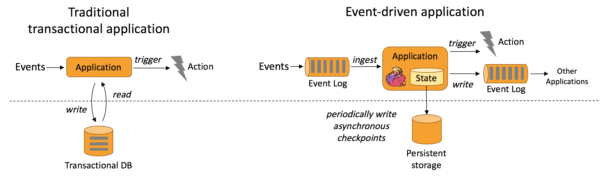
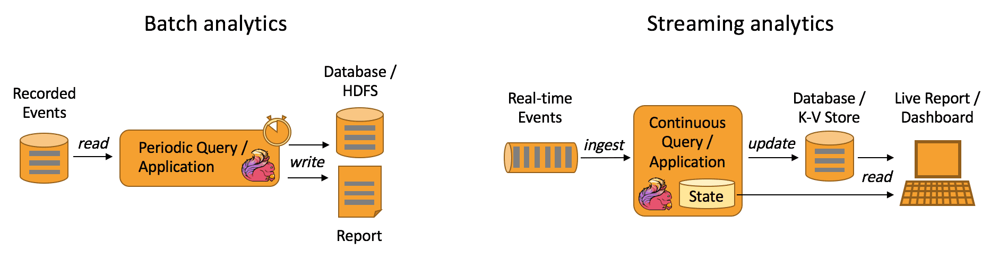
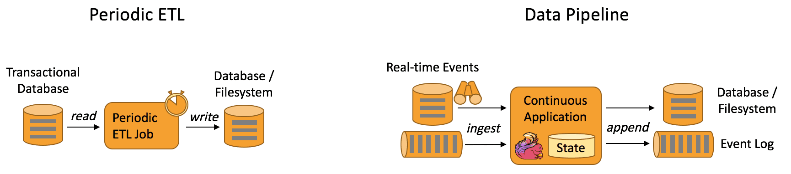

{{ page.description }}

# UseCases

## Introduction

Flink는 다양한 application을 개발하고 run하는데 적합하다. Flink feature는 stream, batch processing을 지원하고, 정교한 state management, event-time processing semantic, exactly-once 도 보장한다. 또한 Flink는 YARN, Mesos, k8s등 다양한 resource provider에서도 동작한다. HA구성을 하면 Flink는 SPOF가 으며, 수천개의 코어나 몇테라의 application state, high throughput, low latency에도 scalable하다.

## Event-driven Application

### What are event-driven applications?

event-driven application은 1개이상의 event stream에서 event를 받아 computation, state update, external action등을 취하는 stateful applicaion이다. event-driven application은 기존 application에서 compute와 data storege tier를 분리한 것이다. 즉 기존 application architecture는 application은 data를 읽고 remote transactional database로 data를 저장한다.

반면에 event-driven application은 stateful stream processing application에 기반을 둔다. data와 computation은 co-located로, local data access(in-memory or disk) 패턴처럼 된다. fault-tolerance는 주기적으로 checkpoint를 remote presistent storage에 저장하는것으로 해결한다. 아래 그림은 기존 applciation architecture와 event-drive architecture의 차이를 보여준다.

### Whate are the advantages of event-drive applications?

remote database에 쿼리하는것 대신 event-drive application은 throughput, latency관점에서 더 높은 성능을 위해 local data를 접근한다. remote persistent storage에 저장하는 periodic checkpoint는 asynchronous, incremental하게 동작한다. 따라서 대부분 event processing에서 checkpoint overhead는 매우 작다. event-driven application은 local data acess의 이점만을 제공하는게 아니다. tiered architecture에서 같은 database를 사용하는 여러개의 application이 존재하는 상황은 일반적이다. 이 경우 application update로 인한 data layout변경이나 service scaling같은 database의 변경사항은 coordinate해야된다. 각 event-drive application은 각각의 data에 대해서만 책임지면 되므로 coordination이 훨씬 줄어든다.

### How does Flink support event-driven application

event-driven application는 어떻게 stream processor가 time과 state를 핸들링하냐에 따라 달려있다. Flink feature 대다수는 이와같은 컨셉에 집증하고 있다. Flink는 exactly-once로 large data volume(몇테라까지)에 대해 매니징하고 많은 state primitive를 제공한다. 또한 Flink는 ProcessFunction에서 제공하는 event-time 지원, customizable window logic, fine-grained time control을 통해 복잡한 비즈니스 로직을 구현할 수 있다. 게다가 Flink는 data stream에서 패턴을 detect하기 위한 Complex Event Processing (CEP) library도 제공한다.

[https://www.confluent.io/learn/complex-event-processing/](https://www.confluent.io/learn/complex-event-processing/)

Flink는 savepoint도 지원한다. savepoint는 application의 시작지점으로 consistent state image이다. savepoint로부터 application은 update되거나, scale을 적용하거나, AB테스팅을 위해 여러 버전의 application을 실행시킬 수 있다

### What are typical event-driven applications?

- [Fraud detection](https://sf-2017.flink-forward.org/kb_sessions/streaming-models-how-ing-adds-models-at-runtime-to-catch-fraudsters/)
- [Anomaly detection](https://sf-2017.flink-forward.org/kb_sessions/building-a-real-time-anomaly-detection-system-with-flink-mux/)
- [Rule-based alerting](https://sf-2017.flink-forward.org/kb_sessions/dynamically-configured-stream-processing-using-flink-kafka/)
- [Business process monitoring](https://jobs.zalando.com/tech/blog/complex-event-generation-for-business-process-monitoring-using-apache-flink/)
- [Web application (social network)](https://berlin-2017.flink-forward.org/kb_sessions/drivetribes-kappa-architecture-with-apache-flink/)

## Data Analytics Applications

### What are data analytics applications?

analytical job은 raw data로부터 정보와 insight를 뽑는다. 전통적으로 analytics는 bounded dataset에서 batch query, application을 수행한다. latest data를 포함시키려면 dataset에 latest data를 포함시키고 query, application을 재실행해야한다. 이 analysis result는 storage에 저장되거나 report로 나온다.

stream processing engine에서 analytics는 real-time fashion으로 수행된다. bounded data set을 읽는것이 아닌 streaming query나 application이 real-time event stream을 ingest하고, event consuming에 따라 지속적으로 result를 생성/업데이트 한다. result는 external database에 저장되거나 internal state에 유지된다. dashboard application은 external database에 저장된 result를 읽거나 application의 internal state에 직접 쿼리한다.

### What are the advantages of streaming analytics applications?

batch analytics와 비교했을때 continuous streaming analytics의 이점은 주기적인 query execution이 없으므로 event에서 insight를 만드는데 latency가 없다는 것이다. batch query와 달리 streaming query는 input data boundary가 없다.

다른 이점은 더 단순한 applicatino architecture이다. batch analytics pipeline은 data ingestion과 query execution을 주기적으로 스케줄링 하기 위한 독립적인 컴포넌트들로 구성된다. 이런 파이프라인은 한 컴포넌트의 장애가 다음 파이프라인으로 이어지기 때문에 안정적으로 운영하기가 어렵다. 반면 flink같은 정교한 streamin processor에서 실행되는 streaming analytics application은 data ingestion부터 continuouse result compuation까지의 모든 단계를 통합시킨다. 따라서 streaming analytics application은 engine(Flink)의 failure recovery mechanism에만 의존하면 된다.

### How does Flink support data analytics applications?

Flink는 batch와 streaming 모두 지원한다. 특히 Flink는 batch, streaming 모두에서 ANSI-compilant SQL interface를 제공한다. SQL query는 historical data set이나 realtime event stream인지에 관계없이 같은 계산을 수행한다. UDF에 대한 지원은 custom code가 SQL query로 수행될 수 있게 해주는 것을 보장한다. 만약 custom logic이 더 필요하다면 Flink의 DataStream API나 DataSet API는 low-level control을 제공한다. 또한 Flink의 Gelly library(Graph API)는 batch dataset에 대해 large-scale, high-perfomance graph analytics를 위한 알고리즘, building block을 제공한다.

### What are typical data analytics applications?

- [Quality monitoring of Telco networks](http://2016.flink-forward.org/kb_sessions/a-brief-history-of-time-with-apache-flink-real-time-monitoring-and-analysis-with-flink-kafka-hb/)
- [Analysis of product updates & experiment evaluation](https://techblog.king.com/rbea-scalable-real-time-analytics-king/) in mobile applications
- [Ad-hoc analysis of live data](https://eng.uber.com/athenax/) in consumer technology
- Large-scale graph analysis

## Data Pipeline Appilcations

ETL은 storage system간에 데이터 변환, 이동에 일반적인 방법이다. ETL job은 OLTP DB에서 analytical DB나 DW로 data를 옮기기 위해 주기적으로 트리거된다.

Data pipeline은 ETL처럼 data를 transform, enrich하고 storage system에서 다른곳으로 data를 옮길 수 있지만, 주기적인 트리거뿐만아니라 streaming mode에서도 동작한다. 따라서 data pipeline은 low-latency로 event stream에서 record를 읽어서 destination으로 옮길 수 있다. 예를들어 data pipeline은 file system directory에서 새 파일을 모니터링 하다가 data를 event log로 남긴다. 다른 예시는 event stream을 database로 materialize하거나 search index를 update 하는 것이 있다. 밑의 사진은 ETL과 data pipeilne의 차이를 보여준다.

### What are the advantages of data pipelines?

Continues data pipeline의 장점은 latency가 줄어드는 것이다. 게다가 data pipeline은 data를 지속적으로 consume하고 emit할 수 있으므로 더 다양한 usecase에 적용 할 수 있다.

### How does Flink support data pipelines?

대부분 data transformation, enrichment task는 Flink SQL interface, UDF function으로 처리할 수 있다. 더 복잡한 usecase는 DataStream API로 해결할 수 있다. Flink는 Kafka, Kinesis등의 다양한 connecotr를 제공하고, directory를 모니터링하는 filesystem을 위한 continuous source와 time-bucketed fashion으로 file을 쓰는 sink를 제공한다

### What are typical data pipeline applications?

- [Real-time search index building](https://ververica.com/blog/blink-flink-alibaba-search) in e-commerce
- [Continuous ETL](https://jobs.zalando.com/tech/blog/apache-showdown-flink-vs.-spark/) in e-commerce