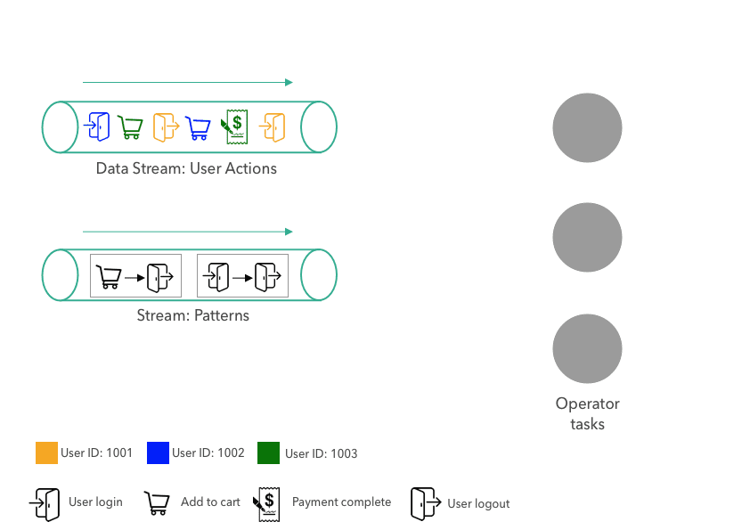
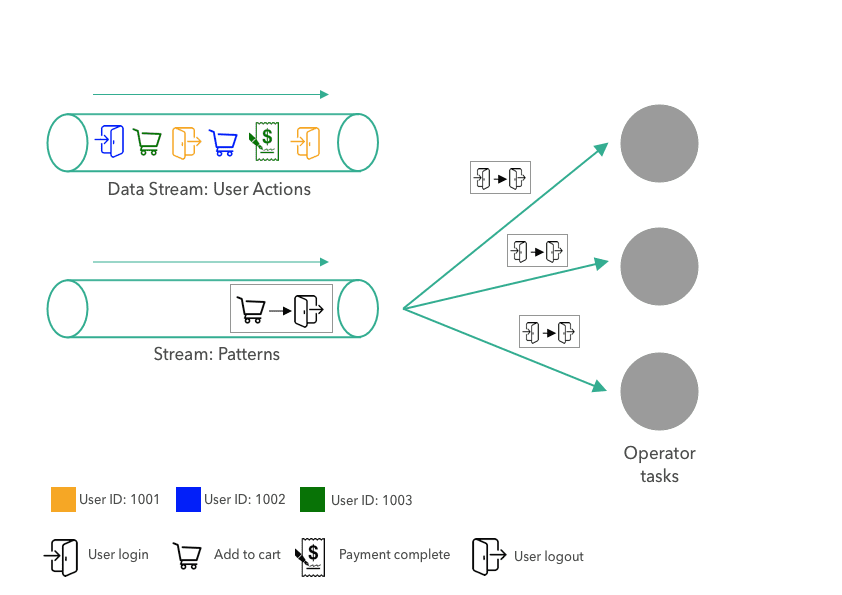
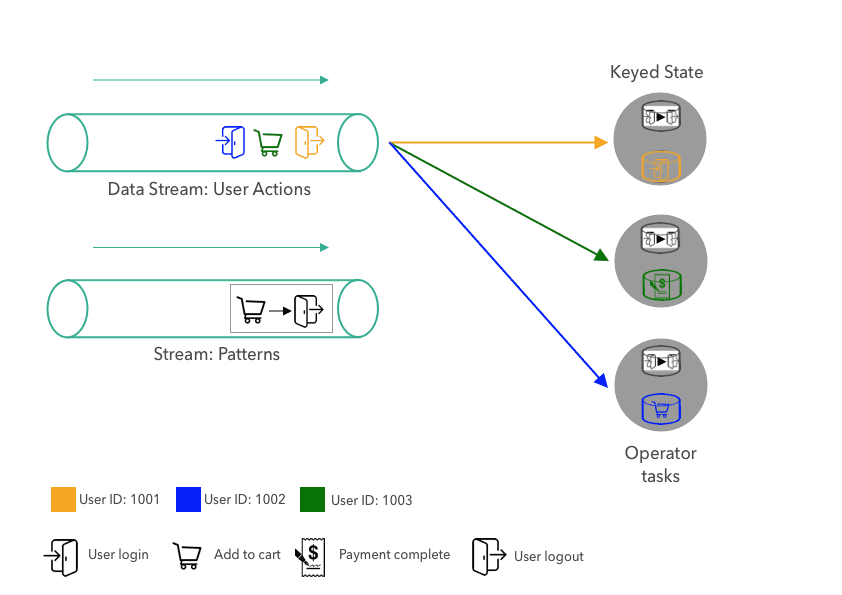
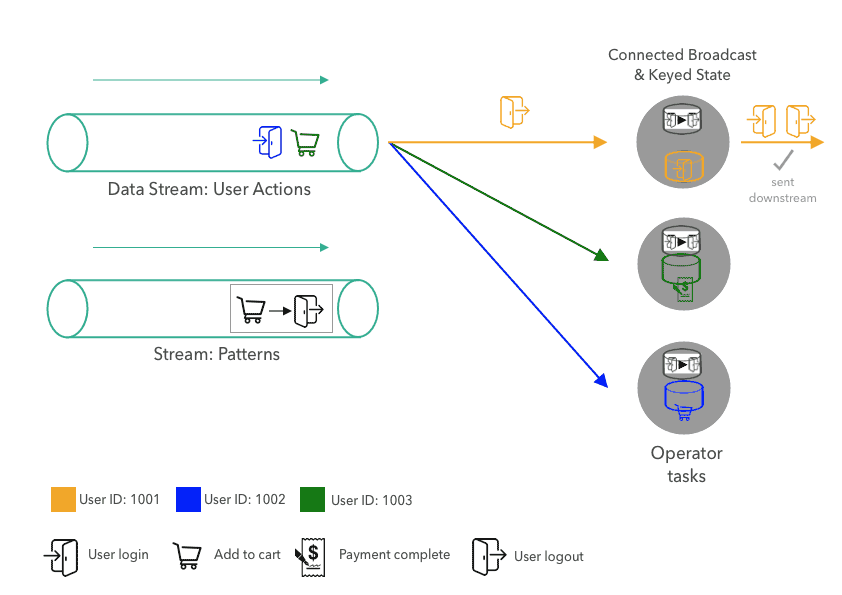

**{{ page.description }}**

# Broadcast State

## What is Broadcast State?

Broadcast State는 특정한 방식으로 2개의 event stream을 합쳐서 process 할 수 있다. 한 stream의 event는, event들을 state로 유지하는 operator의 모든 parallel instance로 broadcast된다. 다른 event stream은 broadcast되지 않지만, 같은 operator의 각각 instance로 전달되고, broadcasted stream의 event와 함께 process된다. 새 broadcast state는 low throughput과 high throughput을 가지는 각각의 stream을 합치거나, processing logic이 다이나믹하게 업데이트 되는 application에 적합하다.

## Dynamic Pattern Evaluation with Broadcast State

E commerce에서 user action event를 받아오는 stream을 생각해보자. 웹사이트를 운영하는 회사는 revenue를 올리고, UX를 향상시키고, 이상행동을 감지하고 막고싶어한다. 웹사이트는 user event stream을 detect하는 streaming application을 구현하려 현다. 그러나 pattern이 변경될때마다 코드를 수정하거나 redploy하는것을 피하고 싶어한다. application은 두번째 stream으로 pattern을 받고, pattern stream에서 새 pattern을 받으면 active pattern을 업데이트 할 것이다.



위 예시에서는 2개의 stream이 있다. 첫번째는 website의 user action이다. user interaction event는 여러 타입의 action (로그인, 로그아웃, 장바구니, 구매)로 구성되고, user id에 따라 색칠을 해놨다. 두번째 stream은 application이 evaluate하려는 action pattern이 들어온다. pattern은 2개의 연속된 action으로 구성된다. 예시에서 첫번쨰 pattern은 user가 로그인하자마자 다른액션없이 로그아웃하는것, 두번째는 유저가 아이템을 장바구니에 담은뒤 구매하지않고 로그아웃 하는것이다.

이런패턴들은 유저행동을 분석하거나, anormaly를 감지하거나, UX를 향상하는데 도움을 준다. 예를들어 구매없이 장바구니에 들어간 아이템은 유저가 왜 구매를 하지 않았는지 이해하거나, 구매를 유도하는 마케팅을 할 수 있다.

예시의 오른쪽에서는 한 operator에 대해 3개의 parallel task가 user action, pattern stream을 ingest하고, action stream에서 pattern을 감지하고, match된 pattern을 downstream으로 emit한다. 단순하게 이 예시의 operator는 2개의 연속된 action pattern을 evaluate한다. active pattern은 stream으로부터 새 pattern이 들어오면 replace되게 된다. 또한 operator는 더 복잡한 pattern이나 여러 pattern을 동시에 evaulate 할 수 있도록 구현된다.



pattern이 operator에 전달되면, pattern은 3개의 parallel task로 broadcast되고, task는 broadcast state로 pattern을 저장한다. broadcast state는 broadcasted data를 통해서만 업데이트되므로, 모든 task의 state는 언제나 같게 된다.



그 다음, 첫번째 user action이 user id에 따라 partition되고 각각의 task로 전달된다. partitioning은 같은 유저의 모든 action이 같은 task에서 처리되도록 보장한다. task가 새 user action을 받으면, 직전에 들어온 action과 함께 active pattern을 evalate한다. 각 유저에 대해 operator는 이전의 action을 keyed state에 저장하고 있다. (위 그림에서는 각 user에 대해 1개의 action만 받았으므로 pattern은 evaluate될필요가 없다.) 마지막으로 각 user의 keyed state에 있는 이전 action은 방금 받은 action으로 replace된다.



그 다음 event인 1001이 logout한 action이 task에 들어간다. task가 action을 받으면 broadcast state의 pattenr과 1001의 이전 액션과 함께 evaluate한다. pattern이 action들과 매치되므로 task는 pattern match event를 emit한다, 마지막으로 task는 keyed state를 방금 받은 action으로 업데이트 한다.

### How to Implement with Broadcast State?

```java
// 2개의 stream (action, pattern)이 있고, stream은 Kafka나 다른 system에서
// ingest될 수 있다. Action과 Pattern은 java object 선언된다
DataStream<Action> actions =
DataStream<Pattern> patterns =
// Action은 Long userId, String action
// Pattern은 String firstAction, String second Action 이다.

// 첫번째로 userId attribute에따라 action stream을 keying한다
KeyedStream<Action, Long> actionsByUser = actions.
  .keyBy((KeySelector<Action, Long>) action -> action.userId);

// Broadcast state는 versitile state primitive인 MapState로 표현된다.
// application이 한 시점에 한개의 pattern을 저장하고있고, evaluate 해야하므로,
// MapState는 key가 Void, value가 Pattern 이다.
// Pattern은 언제나 MapState에서 NULL Key에 저장된다.
MapStateDescriptor<Void, Pattern> bcStateDescriptor =
  new MapStateDescriptor<>("patterns", Types.VOID, Types.POJO(Pattern.class));

// broadcast state에 대해 MapStateDescriptor를 사용해서
// pattern stream에 broadcast() trasnformation을 적용하여
// broadcast stream으로 바꾼다
BroadCastStream<Pattern> bcedPatterns =
  patterns.broadcast(bcStateDescriptor)

// actionsByUser stream과 broadcasted stream bcedPatterns를
// connect()를 통해 연결하고, PatternEvaluator를 적용한다.
// PatternEvaluator는 KeyedBroadcastProcessFunction interface의
// 구현체이다.
DataStream<Tuple2<Long, Pattern>> matches = actionsByUser
  .connect(bcedPatterns)
  .process(new PatternEvaluator());
```

```java
public static class PatternEvaluator
    extends KeyedBroadcastProcessFunction<Long, Action, Pattern, Tuple2<Long, Pattern>> {
  ValueState<string> prevActionState; // user 단위 keyed state
  MapStateDescriptor<Void, Pattern> patternDesc; // broadcast state

  @Override
  public void open(Configuration conf) {
    prevActionState = getRuntimeContext().getState(
      new ValueStateDescriptor<>("lastAction", Types.STRING));
    patternDesc = new MapStateDescriptor<>(
      "patterns", Types.VOID, Typs.POJO(Pattern.class));
  }

  // user action stream에서 호출됨
  @Override
  public void processEvent(
    Action action,
    ReadOnlyContext ctx,
    Collector<Tuple2<Long, Pattern>> out) throws Action
  {
    Pattern pattern = ctx.getBroadcastState(this.patternDesc)
      .get(null); // VOID이므로 null로 접근

    String prevAction = prevActionState.value();
    if (pattern != null && prevAction != null) {
      if (pattern.firstAction.equals(prevAction) &&
          pattern.secondAction.equals(action.action))
      { // MATCH, emit the pattern
        out.collect(new Tuple2<>(ctx.getCurrentKey(), pattern));
      }
    }
    prevActionState.update(action.action);
  }

  // 새 pattern이 들어오면 호출
  @Override
  public void processBroadcastElement(
    Pattern pattern,
    Context ctx,
    Collector<Tuple2<Long, Pattern>> out)
  ) throws Exceiption {
    BroadcastState<Void, Pattern> bcState =
      ctx.getBroadcastState(patternDesc);
    bcState.put(null, pattern);
  }
}
```