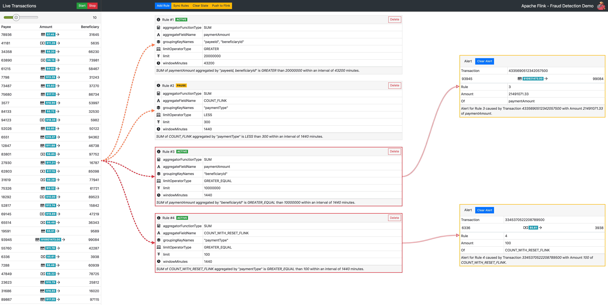
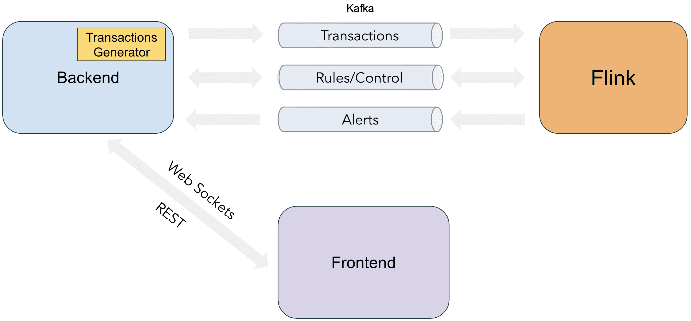
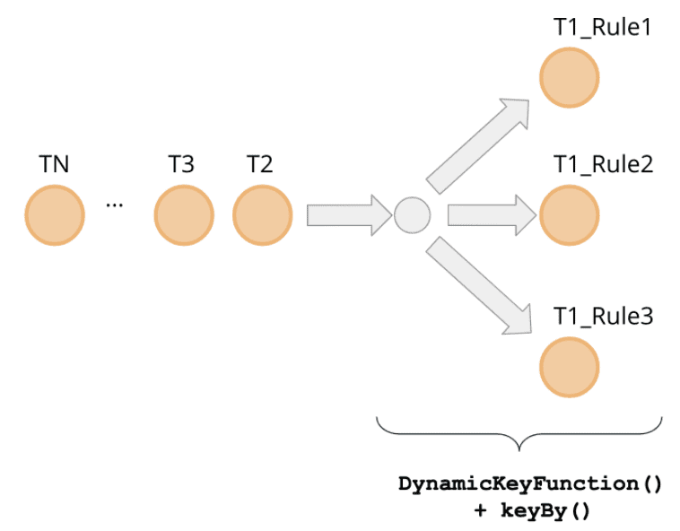
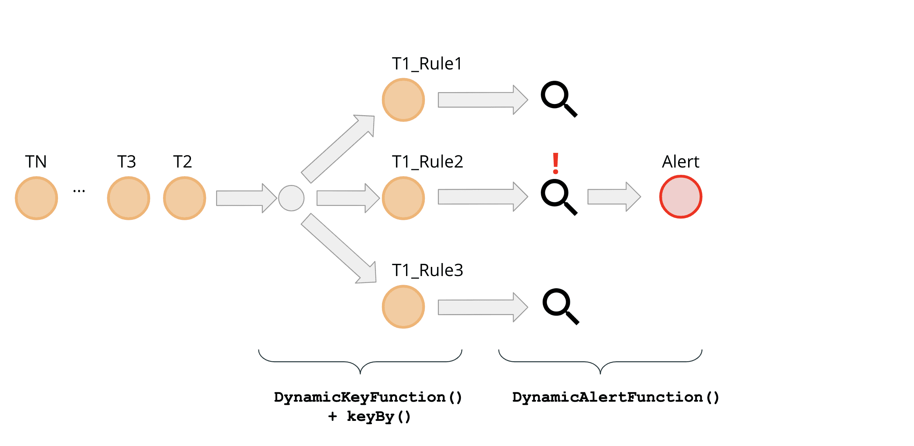

**{{ page.description }}**

# Flink App 1: Fraud Detection

[DEMO](https://github.com/afedulov/fraud-detection-demo)

이 아티클에서는 데모 application의 high-level architecture를 보고, dynamic data partitioning의 구현 디테일을 딥다이브 할것이다. **Dynamic data partitioning**은 runtime에서 event들이 distribute, group되도록 해준다. 이 functionality는 동적으로 recofigure할때 필요하다.

## Bird’s Eye view

demo app은 Kafka with Zookeeper, Flink, Fraud detection webapp으로 구성된다. Fraud detection engine의 goal은 finantial transaction stream을 consume하고 정의된 rule에 반하는지 Evaluate하는 것이다. rule은 자주 변경될 수 있다. production system에서 runtime에 job을 redeploy할 필요 없이 Rule을 더하거나 지우는것은 매우 중요하다.



demo에는 미리 정의된 sample rule이 있다. start button을 누르고 시간이 지나면 UI의 오른쪽에 alert이 뜨는 것을 볼 수 있다. 이 alert은 Flink evaulation의 결과이다.

이 application은 Frontend(React), Backend(Sprint Boot), Fraud Detection app(Flink) 로 구성된다.



Backend는 REST API로 rule을 생성, 삭제 할수 있도록 해주고, 이 이벤트들을 `Control` topic으로 보내준다. 또한 에뮬레이션을 위해 Backend에 Transaction Generator를 넣어 Transaction이 `Transaction` topic으로 흐르게 해놨다. Flink에서 생성되는 alert은 `Alerts`  Topic을 통해 backend로 들어가고 websocket을 통해 UI에 보여진다.

## Dynamic Data Partitioning

`keyBy` method를 통해 stream에 key를 지정하면, 같은 key를 가진 event가 같은 partition으로 할당되도록 shuffle이 발생한다. 즉 같은 key를 가지는 모든 event가 다음 operator의 같은 task에서 처리되도록 한다. 일반적인 streaming application에서 key는 static field로 고정되어있다. 예를들어 transaction stream에 window-based aggregation을 할때 언제나 account id로 grouping 하게된다.

```java
DataStream<Transaction> input = ...
DataStream<...> windowed = input
  .keyBy(Transaction::getAccountId)
  .window(/* window specification */);
```

이 방식은 다양한 usecase에서 horizontal scalability를 만들어준다. 그러나 runtime에 비즈니스 로직에 유연성을 만들어주려면 static key로는 부족하다.

“일주일동안 같은 **sender**가 같은 **receiver**에게 **지급한 금액의 합**이 **백만 달러**를 넘길떄마다 alert을 발생한다”

위 요구사항에서 rule을 동적으로 만들 수 있는 여러 parameter를 찾을 수 있다.

1. Aggregation Field (지급액)
2. Grouping Fields (sender, receiver)
3. Aggregation Function (sum)
4. Window duration (1 week)
5. Limit (1000000)
6. Limit operator (greater than)

따라서 아래와같은 JSON format으로 정의할 수 있다.

```json
{
  "ruleId": 1,
  "ruleState": "ACTIVE",
  "groupingKeyNames": ["payerId", "beneficiaryId"],
  "aggregateFieldName": "paymentAmount",
  "aggregatorFunctionType": "SUM",
  "limitOperatorType": "GREATER",
  "limit": 1000000,
  "windowMinutes": 10080
}
```

여기서 event group을 위해 `gruopingKeyNames` 를 결정하는것이 중요하다. 같은 parameter (ex: payer #25 → beneficiary #12) 를 가지는 모든 transaction은 evaulating Operator의 같은 task에서 aggregate되어야 한다. 일반적으로 Flink에서 이런 방식으로 data를 distribute하는것은 `keyBy` method로 구현한다.

Flnk의 `keyBy` [doc](https://nightlies.apache.org/flink/flink-docs-stable/dev/api_concepts.html#define-keys-using-field-expressions) 에서는 대부분 하드코딩된 `KeySelector`를 쓴다. 그러나 flexibility를 위해 이 app은 rule spec에 따라 dynamic하게 key를 지정해야 한다. 이를위해 모든 event가 적절한 task로 dispatch되도록 operator를 한개 더 만들어야만 한다.

```json
DataStream<Alert> alerts = transactions
  .process(new DynamicKeyFunction()) // redistribute해주는 operator
  .keyBy(/* some key selector */)
  .process(/* actual calculations and alerting */);
```

각각의 rule의 `groupingKeyNames` 에 따라 event를 grouping하게 된다. 각각의 rule은 서로 다른 `groupingKeyNames` 조합을 가지게 된다. 즉 incoming event는 여러 rule에서 evaluate되어야 한다. 이건 event가 evaulating operator에서 여러 rule에 맞추어 여러 task로 보내져야 하는것을 말한다. 이런 dispatch를 만들어주는 것은 `DynamicKeyFunction` 이다.



`DynamicKeyFunction` 은 정의된 rule set을 iterate하면서 모든 event가 `keyBy` method를 이용해 각 rule의 grouping key에 맞추어 process되도록 준비해준다.

```java
public class DynamicKeyFuction
  extends ProcessFunction<Transaction, Keyed<Transaction, String, Integer>>
{
  List<Rule> rules = /* rules */

  @Override
  public void processEvent(
    Transaction event,
    Context ctx,
    Collector<Keyed<Transaction, String, Integer>> out
  ) {
    for (Rule rule :rules) {
      out.collect(new Keyed<>(
        event,
        KeysExtractor.getKey(rule.getGruopingKeyNames(), event),
        rules.getRuleId()
      ));
    }
  }
```

`KeysExtractor.getKey` 는 event에서 groupingKeyNames에 있는 field를 꺼내고, single concatenated string으로 만들어준다 `{payerId=25;beneficiaryId=12}`. Flink는 이 string으로 hash를 만들고 이 processing을 cluster의 특정 task로 할당한다. 이건 payer #25, beneficiary #12간의 모든 transaction을 트래킹하고, 정의된 rule에 따라 evaulate 하게 해준다.

DynamicKeyFunction의 output인 `Keyed` class는 아래와 같다.

```java
public class Keyed<IN, KEY, ID> {
  private IN wrapped; // event
  private KEY key; // key hash
  private ID id; // rule id
}
```

이 event는 main processing pipeline에서 `keyBy` 메소드의 input으로 들어가고, dynamic shuffle 구현의 마지막 스텝에서 `keySelector`로 쓸 수 있다.

```java
DataStream<Alert> alerts = transactions
  .process(new DynamicKeyFunction())
  .keyBy((keyed) -> keyed.getKey())
  .process(new DynamicAlertFunction());
```

`DynamicKeyFunction` 을 적용하여 rule단위 evaluation을 수행하기위해 **implicit**하게 event를 복사하게 된다. 이를통해 rule processing의 horizontal scalability를 얻게 되었다. 이 system은 cluster에 더 많은 서버를 붙여서 더 많은 rule을 처리할수 있게 해준다. 당연히 data rate, network bandwidth, event payload size 에 따라 이슈를 만들수 있는 data copy이므로, production에서는 추가적인 최적화가 가능하다. 예를들면 같은 groupingKeyName을 가지는 여러 Rule을 합쳐서 evaulation하거나, evaluation에 필요하지 않은 field를 제거해주는 filtering layer를 만드는 방법이 있다.

