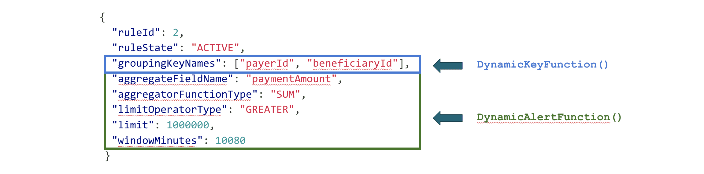

# Flink App 2: Dynamic Update of Application Logic

[https://flink.apache.org/news/2020/03/24/demo-fraud-detection-2.html](https://flink.apache.org/news/2020/03/24/demo-fraud-detection-2.html)

# Rules Boradcasting

이전의 data processing pipeline을 보자

```java
DataStream<Alert> alerts = transactions
  .process(new DynamicKeyFunction())
  .keyBy((keyed) -> keyd.getKey())
  .process(new DynamicAlertFunction());
```

`DynamicKeyFunction` 은 dynamic data partitioning을 제공하고, `DynamicAlertFunction`은 transaction을 처리하는 main logic을 실행하고 rule에 따라 alert를 보낸다. 첫번째 포스팅에서 usecase를 단순화하고, rule set이 pre defined라고 가정하고, `DynamicKeyFunction` 에서 `List<Rule>` 로 접근가능하다고 했다. 하지만 이 방식은 rule이 바뀔때마다 다시 compile해야하는것이다.



이전 포스팅에서 `groupingKeyNames`는 `DynamicKeyFunction`에서 message key를 뽑기 위해 쓰였다. 이 포스팅에서는 `DynamicAlertFunction`에 쓰인다. `DynamicAlertFunction`은 이전 operation(`DynamicKeyFunction`)과 parameter(초록박스)로 로직을 정의한다. 즉 `DynamicKeyFunction`과 `DynamicAlertFunction`은 에 같은 rule이 존재해야 한다. 이를 위해서 brodcast state를 사용해야 한다.


위는 구현하려는 전체 job graph이다.

- **Transaction Source**: 병렬적으로 kafka partition에서 transaction message를 받는다.
- **Dynamic Key Function**: dynamic key로 data enrich를 한다. `keyBy`는 dynamic key를 hash로 만들고, event를 다음 operator의 모든 parallel task로 파티셔닝한다.
- **Dynamic Alert Function**: data window를 쌓고, 이를 바탕으로 alert을 생성한다.

# Data Exchange inside Apache Flink

위의 job graph는 operator간 다양한 data exchange pattern을 보여준다. broadcast pattern이 어떻게 동작하는지 이해하기 위해 Flink의 distributed runtime에 어떤 messagse propagation method가 있는지 잠깐 봐보자


transaction source 다음에 **FORWARD** connection은 transaction source operator에서 한개의 parallel instance(task)에서 전송되는 모든 data는 `DynamicKeyFunction` operator의 정확히 한 instance로 전달되는것을 의미한다. 또한 두개의 연결된 operator가 같은 parallelism을 가지게 된다.


`DynamicKeyFunction` 과 `DynamicAlertFunction` 사이의 **HASH** connection은 각 message에 대해 hash가 생성되고 message들은 다음 operator의 available parallel instance로 evenly distribute된다. **HASH** connection은 명시적으로 `keyBy` 사용해야 한다.


**REBALANCE** distribution은 `rebalance` 를 호출하거나, 다음 Operator에서 paralleism이 바뀌는 경우에 생긴다. `rebalance` 를 직접 호출하면 data는 round-robin으로 repartition되고 data skew를 완화해준다.


위에서 Fraud Detection jobgraph는 `Rules` source라는 추가적인 data source를 가진다. `Rules`는 **BROADCAST** channel을 통해 main processing data flow에 섞이게 된다. **FORWARD, HASH, REBALANCE** 같이 operator간에 각 message를 receiving operator의 parallel instance중 한 곳에서만 처리하는것과 다르게, **BROADCAST**는 각 message를 모든 parallel instance로 뿌리게 된다. **BROADCAST**는 key나 source partition에 관계없이 모든 message가 다음 모든 operator로 전달되게 한다.

# Broadcast State Pattern

`Rules` source를 사용하도록 만들기 위해 `Rules` source를 main data stream에 연결해야 한다.

```java
DataStream<Transaction> transactions = ...
DataStream<Rule> rulesUpdateStream = ...

BroadcastStream<Rule> rulesStream = rulesUpdateStream
  .broadcast(RULES_STATE_DESCRIPTOR);

DataStream<Alert> alerts = transactions
  .connect(rulesStream)
  .process(new DynamicKeyFunction())
  .keyBy((keyed) -> keyed.getKey() )
  .connect(rulesStream)
  .process(new DybnamicSAlertFunction());
```

broadcast stream은 `broadcast` method를 호출하고 state descriptor를 설정하여 만들 수 있다. Flink는 broadcasted data가 operator에 저장되고 main data flow에서 쓸수있어야 되므로 자동적으로 이 state descriptor로부터 broadcast state를 생성한다. broadcast state는 processing function에서 `open` methoc를 호출하여 init해야하는 다른 state type과는 다르다. 또한 broadcast state는 언제나 key-value format `MapState`이다.

```java
public MapStateDescriptor<Integer, Rule> RULES_STATE_DESCRIPTOR =
  new MapStateDescriptor<>("rules", Integer.class, Rule.class);
```

```java
public abstract class BroacastProcessFunction<IN1, IN2, OUT> {
  public abstract void processElement(
    IN1 value,
    ReadOnlyContext ctx,
    Collector<OUT> out
  ) throws Exception;

 public abstract void processBroadcastElement(
    IN2 value,
    Context ctx,
    Collector<OUT> out
 ) throws Exception;
}
```

차이점은 rules stream에 message가 도착하면 `processBroadcastElement` 가 호출된다. 이 class를 상속하는 DynamicKeyFunction을 구현하면 runtime에 distribution key를 수정할 수 있다.

```java
public class DynamicKeyFunction
    extends BroadcastProcessFunction<Transaction, Rule, Keyed<Transaction, String, Integer>>
{
  @Override
  public void processBroadcastElement(
    Rule rule,
    Context ctx,
    Collector<Keyed<Transaction, String, Integer>> out)
  {
    BroadcastState<Integer, Rule> broadcastState = ctx.getBroadcastState(RULES_STATE_DESCRIPTOR);
    broadcastState.put(rule.getRuleId(), rule);
  }

  @Override
  public void processElement(
    Transaction event,
    ReadOnlyContext ctx,
    Collector<Keyed<Transaction, String, Integer>> out)
  {
    ReadOnlyBroadcastState<Integer, Rule> rulesState = ctx.
      getBroadcastState(RULES_STATE_DESCRIPTOR);

    for (Map.Entry<Integer, Rule> entry : rulesState.immutableEntries())
    {
      final Rule rule = entry.getValue();
      out.collect(new Keyed<>(
          event,
          KeysExtractor.getKey(rule.getGroupingKeyNames(), event),
          rule.getRuleId()
      ));
    }
  }
}
```

`processElement` 는 transaction을 받고 `processBroadcastElement` 는 rule을 받는다. 새 rule이 생성되면 `processBroadcastState`를 통해 모든 parallel instance로 뿌려진다. rule ID를 key로, value를 rule class로 쓴다. brodacast state는 언제나 `MapState` 를 써야하므로 map에서 iterate한다.

`DynamicAlertFunction`은 위의 `DynamicKeyFunction` 처럼 rule을 `MapState` 에 저장한다. 첫번째 포스팅에 나온것처럼 각 `processElement` input의 각 message는 한개 rule에 의해 processing되고 `DynamicKeyFunction`에 의해  “pre-marked” 된다.