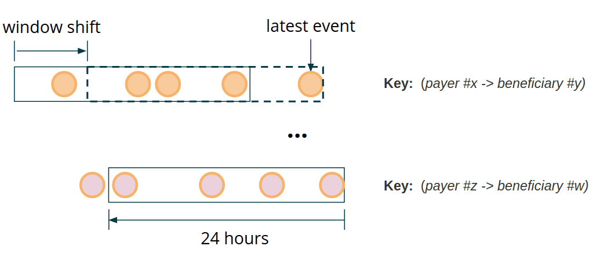
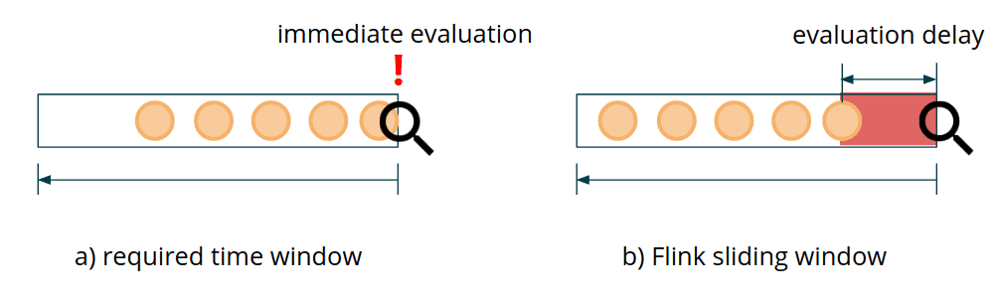
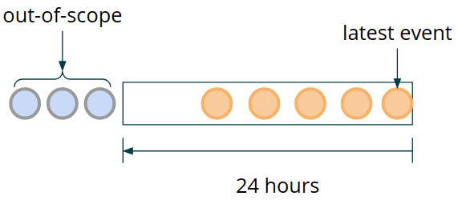
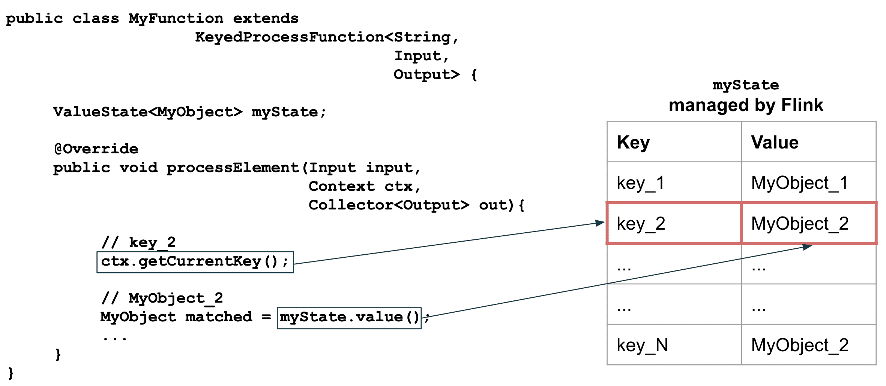
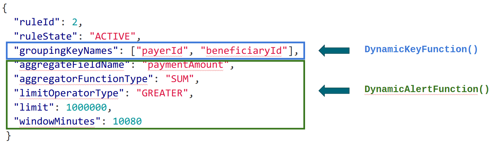
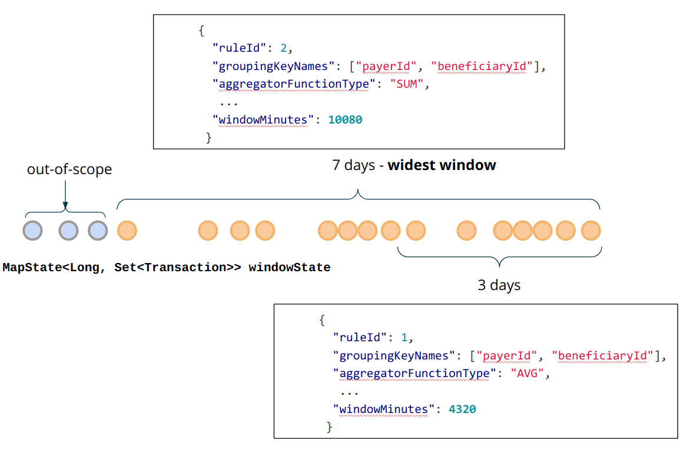
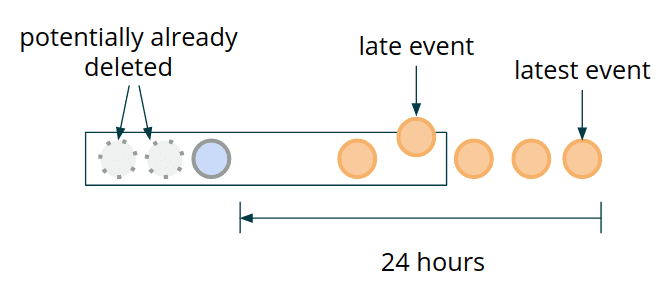
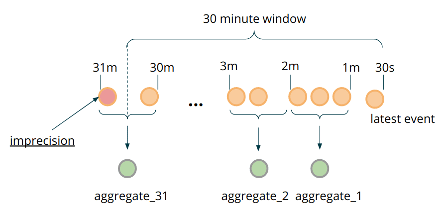

{{ page.description }}

# Flink App 3: Custom Window Processing

이 포스팅에서 Flink의 streaming business logic requirements를 만족시키도록 구현할 수 있는 Process Function을 활용할 것이다. Fraud Detection에서 DataStream API가 requirements 를 만족시키지 못할때 custom time window를 구현 하는 방법을 보여줄 것이다. 특히 각 event에 대해 짧은 latency를 요구할때의 trade off를 보여줄 것이다.

## ProcessFunction as a “Window”

### Low Latency

fraud detection rule을 다시 봐보자

“**하루**동안 같은 **sender**가 같은 **receiver**에게 **지급한 금액의 합**이 **백만 달러**를 넘길떄마다 alert을 발생한다”

payer와 beneficiary 필드를 합친 key에 의해 파티션된 transaction stream에서, 각 transaction에 대해 lookback을 하고, 이전 payment sum이 threshold를 넘겼는지 확인해야 한다. computation window는 특정 partition key에 대해 마지막으로 본 event 위치로 이동된다.



fraud detection의 key requirements중 하나는 low response time이다. fraud detection이 빨라질수록 negative action을 미리 막을 수 있다. 특히 finantial domain에서는 fraud detection을 수행하는 시간만큼 일반 사용자의 행동이 지연되게 된다. processing을 빠르게 하면 다른 경쟁자들에 비해 우위를 점할수있고, alert을 생성하는데까지 latency limit을 500ms정도까지 낮게 유지할 수 있다.

Flink는 다양한 usecase에서 쓸 수 있는 [Window API](https://nightlies.apache.org/flink/flink-docs-release-1.11/dev/stream/operators/windows.html) 를 제공한다. 그러나 fraud detection usecase처럼 각각의 incoming transaction에 대한 low latency를 맞춰주는 window API는 없다. Flink에는 **현재 이벤트 기준으로 몇분전/몇시간전/몇일전을 표현하는 window는 없다.** Window API에서 event는 windows로 들어가지만([window assigner](https://nightlies.apache.org/flink/flink-docs-release-1.11/dev/stream/operators/windows.html#window-assigners)), 각 이벤트에 대한 window evaulation이나 creation을 제어할 수 없다. fraud detection의 목표는 새 event가 들어왔을때 이전에 연관된 event와 함께 즉각적인 evaluation을 하는것이다. Window API는 custom trigger, evictor, window assigner를 정의할수 있게 제공하지만, 위의 요구사항을 만족시키긴 쉽지 않고, 깨지기 쉬운 로직이 된다. 게다가 broadcast state를 접근할수 없어서 dynamic reconfiguration이 불가능하다.



Flink API의 [sliding window](https://nightlies.apache.org/flink/flink-docs-release-1.11/dev/stream/operators/windows.html#sliding-windows) example을 보면, slide S인 sliding window를 쓰면, S/2 만큼의 evaluation delay가 생기게 된다.(???왜지..) 즉 500ms delay를 맞추기위해선 window slide가 1s로 정의해야 하는고 실제 computation까지 고려하면 더 오래걸린다. Flink가 각 sliding window pane에 window state를 저장하므로 high load condition에서는 쓰기 힘들게 된다.

requirements를 만족하기 위해 직접 low-latency window를 만들어야 한다. `ProcessFunction`은 low-level이지만 파워풀한 buidling block이다.

```java
public class SomeProcessFunction
  extends KeyedProcessFunction<KeyType, InputType, OutputType>
{
  public void processEvent(InputType event, Context ctx, Collector<OutputType> out) {}
  public void onTimer(long timestamp, OnTimerContext ctx, Collector<OutputType> out) {}
  public void Open(Configuration parameters) {}
}
```

- `processEvent`는 input event를 하나씩 받는다. 각 event에 대해 `out.collect(someOutput)`을 호출해서 1개 이상의 output event를 만들어 낼 수 있다. 또한 [side output](https://nightlies.apache.org/flink/flink-docs-release-1.11/dev/stream/side_output.html) 으로 data를 넘기거나 특정 input을 무시할수도 있다.
- `onTimer`는 Flink가 이전에 register한 timer가 다되면 호출한다. event time, processing time timer를 지원한다.
- `open`은 constructor와 동일하다. TaskManager에서 호출하고 Flink-managed state를 register하는 등의 init에 쓰인다. serializable하지 못하거나, JobManager에서 던져줄수 없는 field를 init하는데 적절하다.

가장 중요한견 `ProcessFunction`은 Flink에서 관리하는 fault-tolerant state를 접근할 수 있다. Flink의 message processing과 delivery guarantee와 함께 고려했을때, 다양하고 복잡한 비즈니스 로직을 resilient event-driven application을 만들 수 있게 된다. state를 가진 custom window processing도 가능한것이다.

### Implementation

#### State and Clean-up

time window로 process하기 위해 data가 속한 window를 계속 잡고 있어야 한다. fault-tolerant한 data를 보장하고, 장애상황에서도 복구하기 위해서는 data window를 Flink-managed state에 저장해야 한다. 시간이 지날수록 모든 이전 transaction을 keep할 필요는 없어진다. 위에서 언급한 sample rule에서 24시간이 지난 모든 event는 버려도 된다. 즉 data window는 지속적으로 움직이고 stale transaction은 계속해서 out-of-scope로 가게 된다(즉 버려진다).



`MapState`를 써서 event window를 저장할 것이다. 효율적으로 out-of-scope event를 버리기 위해 event timestamp를 `MapState`의 key로 쓸 것이다. 일반적으로 같은 timestamp에 여러 event가 들어오므로 각각의 transaction이 아닌 transaction set으로 저장해야 한다.

```java
MapState<Long, Set<Transaction>> windowState;
```

> `KeyedProcessFunction` 안에서 Flink-managed state가 사용될때,현재 process하는 event가 자동적으로 key로 설정되므로 data는 `state.value()` 로 받아올 수 있다.
`MapState` 를 쓸경우 `MyObject` 대신 `Map` 이 리턴된다.
`mapState.value().get(inputEvent.getKey())` 같은 코드를 써야한다면 `MapState` 대신 `ValueState` 를 써라.
event당 여러 value를 저장하고싶을때에 `MapState`가  적절하다.
>
>
> 
>

여러개의 서로 다른 rule에서 정의된 event들을 받아온다. 서로 다른 rule은 같은 grouping key를 가질 수 있다. 즉 alerting function이 같은 key scope를 가지는 transaction을 받을 수 있지만, 다른 Rule에 의해 evaluate되고, 다른 길이의 time window를 가질 것이다. 이건 어떻게 적절하게 `KeyedProcessFunction`에 fault-tolerante window state를 저장해야 하는지에 대한 문제가 된다. rule당 분리된 `MapState`를 생성, 관리하는것도 한방법이다. 그러나 중복저장이라는 큰 단점이 있다. 더 나은 방법은 같은 key마다 rule이 필요로하는 충분한 data를 저장하는 것이다. 이를 위해선 rule이 더해질때마다 lagest time window span을 계산하고 broadcast state에 `WIDEST_RULE_KEY` 같은 reserved key로 저장해야 한다. 이 data는 cleanup 시점에도 쓰일것이다.

```java
@Override
public void processBroadcastElement(Rule rule, Context ctx, Collector<Alert> out)
{
  ...
   updateWidestWindowRule(rule, boradcastState);
}

private void updatWidestWindowRule(Rule rule, BoradcastState<Integer, Rule> broadcastState)
{
  Rule widestWindowRule = broadcastState.get(WIDEST_RULE_KEY);
  if (widestWindowRule == null) {
    broadcastState.put(WIDEST_WRULE_KEY, rule);
    return;
  }
  if (widestWindowRule.getWindowMillis() < rule.getWindowMillis()) {
    broacastState.put(WIDEST_RULE_KEY, rule);
  }
}
```

이전 포스팅에서 `DynamicKeyFunction`은 `groupingKeyNames` parameter로 dynamic data paritioning을 할수 있게 해줬다. 그 다음은 `DynamicAlertFunction` 에 대해 볼것이다.



alerting process function은 `Keyed<Transaction, String, Integer>` type의 event를 받는다. Transaction은 wrapped event이고, String은 key값, Integer는 rule ID 이다. 이 rule은 broadcast state로 저장되어있고 rule ID로 읽어 올 수 있다.

```java
public class DynamicAlertFunction
  extends KeyedBroadcastProcessFunction<
    String, Keyed<Transaction, String, Integer>, Rule, Alert>
{
  private transient MapState<Log, Set<Transaction>> windowState;
  @Override
  public void processEvent(
    Keyed<Transaction, String, Integer> value,
    ReadOnlyContext ctx,
    Collector<Alert> out
  ) {
    /* Add Transaction to state */
    long currentEventTime = value.getWrapped().getEventTime(); // (1)
    addToStateValuesSet(windowState, currentEventTime, value.getWrapped());

    /* Calculate the aggregate value */
    Rule rule = ctx.getBroadcastState(Descriptors.rulesDescriptor).get(value.getId()); // (2)
    Long windowStartTimestampForEvent = rule.getWindowStartTimestampFor(currentEventTime); // (3)
    SimpleAccumulator<BigDecimal> aggregator = RuleHelper.getAggregator(rule); // (4)
    for (Long stateEventTime : windowState.keys()) {
      if (isStateValueInWindow(stateEventTime, windowStartForEvent, currentEventTime)) {
        aggregateValuesInState(stateEventTime, aggregator, rule);
      }
    }

    /* Evaluate the rule and trigger an alert if violated */
    BigDecimal aggregateResult = aggregator.getLocalValue(); // (5)
    boolean isRuleViolated = rule.apply(aggregateResult);
    if (isRuleViolated) {
      long decisionTime = System.currentTimeMillis();
      out.collect(new Alert<>(
        rule.getRuleId(),
        rule,
        value.getKey(),
        decisionTime,
        value.getWrapped(),
        aggregateResult
      ));
    }

    /* Register timers to ensure state cleanup */
    long cleanupTime = (currentEventTime / 1000) * 1000; // (6)
    ctx.timerService().registerEventTimer(cleanupTime);
  }
}
```

각 step의 디테일은 아래와 같다

(1) 새 event를 window state에 더한다

```java
static <K, V> Set<V> addToStateValuesSet(
  MapState<K, Set<V>> mapState,
  K key,
  V value
) throws Exception {
  Set<V> valuesSet = mapState.get(key);
  if (valuesSet == null) {
    valuesSEt = new HashSet<>();
  }
  valuesSet.add(value);
  mapState.put(key, valuesSet);
  return valuesSet;
}
```

(2) incoming transaction에 필요한 broadcasted rule을 가져온다.

(3) rule에 정의된 window span과 현재 transaction의 timestamp를 바탕으로 evaluation을 할때 필요한 timespan의 시작 시점을 가져온다.

(4) 모든 window state entry를 iterate하면서 aggregate value를 계산하고, aggregate function을 적용한다. aggregate function은 average, max, min, sum이 가능하다.

```java
private boolean isStateValueInWindow(
  Long stateEventTime,
  Long windowStartForEvent,
  long currentEventTime
) {
  return stateEventTime >= windowStartForEvent
		&& stateEVentTime <= currentEventTime;
}

private void aggregateValuesInState(
  Long stateEVentTime,
  SimpleAccumulator<BigDecimal> aggregator,
  Rule rule
) throws Exception {
  Set<Transaction> inWindow = windowState.get(stateEventTime);
  for (Transaction event : inWindow) {
    BigDecimal aggregatedValue = FieldExtractor
      .getBigDecimalByName(rule.getAggregateFieldName(), event);
    aggregator.add(aggregatedValue);
  }
}
```

(5) aggreagted value를 threshold value와 비교하고 조건에 따라 alert을 만든다.

(6) cleanup timer를 만든다. timer는 현재 transaction이 out-of-scope로 가게되면 제거시킨다.

> timer를 만들땐 round를 고려해야 한다. timer가 트리거되는 precision과 사용중인 timer 수 사이의 trade off를 맞춰야 한다. timer는 fault tolerant state에 저장되는데 millisecond precision으로 관리하는것은 불필요하다. 이 포스팅에서는 rouding을 통해  주어진 timestamp에 key당 최대 한개의 timer만 만들게된다. 즉 같은시간에 들어온 이벤트 여러개는 한개의 타이머를 만들게 된다.
[https://nightlies.apache.org/flink/flink-docs-release-1.11/dev/stream/operators/process_function.html#timer-coalescing](https://nightlies.apache.org/flink/flink-docs-release-1.11/dev/stream/operators/process_function.html#timer-coalescing)
>

(7)  `onTimer` method가 window state cleanup을 trigger한다.

위에서 말한것처럼, 가장 넓은 window span을 가진 rule의 evaluation에 필요한 만큼의 event를 state에 저장해야한다. 즉 cleanup시점에 widest window의 범위를 넘어가는 event를 제거해야 한다.



```java
@Override
public void onTimer(
  final long timestamp,
  final OnTimerContext ctx,
  final collector<Alert> out
) throws Exception {
  Rule widestWindowRule = ctx
    .getBroadcastState(Descriptors.rulesDescriptor)
    .get(WIDEST_RULE_KEY);

  Optional<Long> cleanupEventTimeWindow = Optional
    .ofNullable(widestWindowRule)
    .map(Rule::getWindowMillis);
  Optional<Long> cleanupEventTimeThreshold = cleanupEventTimeWindow
    .map(window -> timestamp - window);
  cleanupEventTimeThreshold.ifPresent(this::evicOutOfScopeElementsFromWindow);
}

private void evicOutOfScopeElementsFromWindow(Long threshold) {
  try {
    Iterator<Long> keys = windowState.keys().iterator();
    while (keys.hasNext()) {
      Long stateEventTime = keys.next();
      if (stateEventTime < threshold) {
        keys.remove()
      }
    }
  } catch (Exception e) {
    throw new RuntimeException(e)
  }
}
```

> `ListState` 는 모든 transaction object가 deserialized되기때문에 성능에 악영향을준다. `MapState` 의 key iterator는 key에대한 deserialization만 하므로 overhead를 감소시킨다. 특이 이 optimization은 `RocksDBStateBackend` 를 쓸때 유용하다.
>

## Improvements and Optimizations

장점

- Low latency
- 다양한 usecase 처리 가능
- 효율적인 state reuse (같은 key를 가지는 rule이 state를 공유)

단점

- 기존 window API의 potential future optmization을 이용할 수 없게 됨
- Window API 밖에서 구현했으므로 late event handing 없음.
- quadratic computation complexity와 large state가 만들어 질 수 있음

### Late Events

late event arrival 케이스에서 window를 다시 evaluate 하는것이 의미가 있는가?? 만약 의미가 있다면 예상되는 out-of-order event (late event)만큼 cleanup을 위해 widest window를 더 길게 잡아야 한다. 이렇게 하면 late firing에 대해 잠재적으로 incomplete한 time window를 가지는 상황을 없앨 수 있다. 즉 밑 그림에서 lateset event 가 온 뒤로, late event가 들어오게되는 경우 이미 potentially already deleted event도 킵해놨으므로 late event에 대해서도 제대로 프로세싱이 가능하다.



하지만 low latency processing을 강조한다면 late event arrival이 의미가 없을 수 있다. 이 케이스에선 가장 최근의 timestamp만 보고, monotonic increase 하지않는 event (late event)에 대해 alerting logic을 돌리지 않고 state에 저장만 하는것으로 끝내면 된다.

### Redundant Re-computations and State Size

state에 각 transaction을 저장하고 새 event가 올때마다 aggregate을 다시 해야된다. 반복되는 연산은 computing resource 측면에서 효율적이지 못하다.

state에 각 transaction을 저장하는 이유는 뭔가? 저장된 event의 granularity가 time window calculation의 정밀도와 직결한다. 각 transaction을 저장했기때문에  604800000ms(7일) timewindow가 지나면 old event들은 정확하게 버릴 수 있다. 그런데 정말로 long time window에서 millisecond precision이 필요한가? 또는 예외적인 케이스에서 false positive를 허용할수 있는가? 이 usecase에서는 이정도의 precision은 필요없고 bucketing, pre-aggregation같은 방식으로 추가적인 최적화를 할 수 있다.

- 각 event를 저장하는것 대신, 한 transaction의 field나 transaction set으로부터 aggregated value를 저장하는 parent class를 만든다.
- `MapState` key로 millisecond timestamp를 쓰는것 대신, 적절하게 precision을 조정해서 각 entry가 bucket이 되도록 설정한다.
- window가 evaluate될때마다 transaction의 data를 저장하지말고, 새 transaction data를 bucket aggregation에 추가한다.



### State Data and Serializers

같은 timestamp를 가지지만 서로 다른 Event를 가져오는것이 가능한가? 이전 예제에서는 `MapState<Long, Set<Transaction>>` 으로 해결했다. 그러나 이 방식은 성능에 악영향을 미친다. Flink는 native `Set` serializer를 지원하지 않으므로 비효율적인 [Kryo serializer](https://nightlies.apache.org/flink/flink-docs-release-1.11/dev/types_serialization.html#general-class-types)를 쓴다. 정확히 같은 timestamp를 가지는 서로다른 이벤트가 없다고 가정한다면 `MapState<Long, Transaction>` 으로 쓸 수 있다. 이 가정과 다른경우가 발생하는것을 모니터링하기위해 [side-outputs](https://nightlies.apache.org/flink/flink-docs-release-1.11/dev/stream/side_output.html) 을 이용할 수 있다. 일반적으로 [Kryo fallback을 제거](https://flink.apache.org/news/2020/04/15/flink-serialization-tuning-vol-1.html#disabling-kryo)하고, application이 [더 효율적인 seriazlier](https://flink.apache.org/news/2020/04/15/flink-serialization-tuning-vol-1.html#performance-comparison)를 쓰는지 확인할것을 권장한다.

**Event pruning**: 모든 event를 저장하고 serde의 overhead를 만들지 말고, 각 event data를 필요한 정보들로만 줄이는것이 필요하다.

위와같은 최적화들은 large object에 대해 효과가 좋지만 무조건 처음부터 할 필요는 없다.