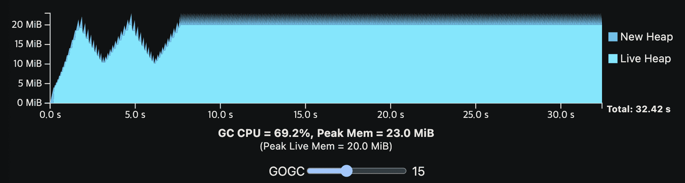

**{{ page.description }}**

# A guide to the Go Garbage Collector

2022년 10월 10일 Go 1.19 기준의 문서입니다.

## Tracing GC

Golang GC는 pointer를 따라가서 live object를 식별하는 tracing GC이다.

object와 pointer들은 Object graph를 형성한다. live memory를 식별하기 위해 GC는 program root에서부터 object graph를 스캔한다. (program root는 program에서 사용중인 object를 식별하는 포인터이다.) root의 두개 예시는 local variable, global variable이다.

Golang GC는 mark-sweep을 사용한다. GC의 상태를 추적하기 위해 방문하는 값을 live로 표시한다. tracing이 끝나면 GC는 heap을 스캔해서 marked(not lived)인 모든 메모리를 할당 가능한 상태로 만드는 sweeping을 진행한다.

다른 방식으로는 object들을 새 메모리에 옮기고 pointer를 업데이트하는 moving GC도 있다, golang은 위의 non-moving GC를 쓴다.

## The GC cycle

golang GC가 mark-sweep GC이므로 2개 phase로 나뉜다. 중요한점은, 모든 memory가 추적되기 전까지는 unscanned pointer가 있을 수 있으므로 어떤 memory도 release하지 않는다. 따라서 sweep은 mark와 완전히 분리되어야 한다. 또한 GC를 할일이 없으면 GC는 실행되지 않을 수 있다. GC는 지속적으로 sweeping, tuning off, marking을 수행한다.

다음 섹션은 GC 비용에 대한 직관을 만들고 **유저들이 GC parameter tuning**에 도움울 줄수 있을것이다.

### Understanding Costs (GC model)

이 섹션은 golang GC와 tuning parameter의 비용을 추론하기 위한 framework을 제공해줄것이다.

시작하기 전에 GC cost는 3가지 단순한 공리를 기반으로 한다.

1. GC는 CPU time과 physical memory 두가지 리소스만을 필요로한다.
2. GC memory cost는 live heap memory와 이전 mark phase에서 할당된 새 heap memory, metadata를 위한 공간으로 구성된다(이전 GC의 비용에따라 비례한 memory cost도 있지만 작다)

*Note:* live heap memory는 이전 GC cycle에서 live라고 결정된(GC cycle의 마지막이 marking이므로) memory이다. new heap memory는 현재 cycle에서 새로 할당된 memory이고 GC가 끝날때 live일수도, 아닐수도 있다.
3. GC의 CPU cost는 cycle당 비용과 live heap 크기와 비례하는 비용이 있다.

*Note:* 점진적으로 생각해보면, sweeping은 dead memory를 포함해서 전체 heap의 크기에 비례해서 수행하므로 marking, scanning보다 오래걸린다. 하지만 sweeping의 현재 구현은 marking, scanning보다 훨씬 빠르므로 무시할만 하다 (왜일까..)

이 모델은 GC의 주된 비용을 알수있어 간단하지만 효과적이다. 하지만 이것들이 어떻게 상호작용하는지, cost간 magnitude는 어떤지 모른다. 이를 알기 위해선 steady-state라 불리는 아래 상황을 생각해봐야한다.

- application이 새 메모리를 할당(bytes per second)하는 비율은 일정하다

*Note:* 이 allocation rate 새 메모리가 live한가 라는 문제와는 다르다는것을 인지해야한다. 새 메모리가 모두 dead일수도, 모두다 live일수도, 일부만 live일수도 있다. (old heap memory는 dead가 될수 있으므로 해당 메모리가 live라고해서 무조건 Live heap이 커지는건 아니다).

각 request를 처리할때마다 2MiB의 heap memory를 할당하는 웹서비스를 생각해보자. request를 처리하는동안 최대 512KiB가 live이며, request를 끝내면 모든 memory가 dead가 된다. 단순하게 하기위해 각 request는 1초의 runtime을 가진다고 하자. 그리고 request의 steady stream은 100RPS라면 allocation rate은 200MiB/s이고, 50MiB의 peak live heap을 가진다.
- application의 object graph는 매번 거의 동일하게 보인다. (object가 비슷한 크기이고 일정한 수의 pointer를 가지고, graph의 maximum depth도 일정하므로)
따라서 GC의 marginal cost는 일정하다고 할 수 있다.

*Note:* 위의 steady state는 인위적인것처럼 보이지만 일정한 워크로드를 수행하는 application의 행동과 상당히 유사하다. 워크로드는 application이 실행되는동안 바뀌지만 일반적인 application의 행동은 여러 steady-state로 이루어지며 각 steady-state로 이동하기 위한 잠깐의 행동(즉 working set의 변화?)으로 나타난다.

*Note:* steady-state는 live heap에 대한 어떤 가정도 하지 않는다. live heap은 GC cycle에 따라 줄어들수도있고, 증가할수도있고, 그대로일수도 있다. 요 섹션에서는 live heap이 일정하게 유지되는 케이스를 보고 GOGC 섹션에서 live heap이 바뀌는 경우를 자세히 볼것이다.

live heap size가 일정한상황에 steady-state에서 모든 GC cycle은 GC가 동일한 주기로 실행된다면 cost model에서 동일하게 보일것이다. 일정한 주기로, 일정한 allocation rate을 가지기 떄문이다. 따라서 live heap size가 일정하면 새 heap memory도 일정하고 memory 사용량도 일정하다. 그리고 marginal GC CPU cost도 일정하므로, fixed cost는 regular interval을 만들게 된다.

만약 GC가 주기보다 더 길게 실행된다고 생각해보자. 그렇다면 더 많은 메모리가 할당되지만 GC cycle들은느 여전히 서로 같은 CPU cost를 가진다. 하지만 GC cycle의 주기가 길어지고 CPU cost가 줄어들것이다(빈도가 줄어든다?. 반대 케이스인 GC가 더 빨리 시작한다하면 한 사이클에서 적은 메모리를 할당하고 CPU cost가 더 자주 발생할것이다.

**이 상황은 GC를 얼마나 자주 실행하는가에 따라 GC에서 생기는 CPU time과 메모리의 trade off로 볼 수있다. 즉 trade off는 GC frequency로 인해 결정된다.**

GC가 언제 시작하는지 결정하는것도 필요하다. 이건 직접적으로 steady-state안에서 GC frequency를 결정하므로 trade-off를 조절한다. golang에서 GC가 언제 시작되는가를 결정하는것은 메인 파라미터이며 유저가 제어가능하다.

### GOGC

high level에서 GOGC는 CPU와 memory간 trade off를 결정한다.

각 GC cycle의 target heap size를 결정하는 방식으로 동작한다. traget value는 다음 cycle의 total heap size이다. GOGC의 목표는 target heap size보다 total heap size가 커지기전에 collection cycle을 끝내는 것이다. total heap size는 이전 cycle이 끝난 직후의 live heap size와 이전 cycle 이후에 할당된 new heap memory를 더한 값이다.

$Target\ heap\ memory = Live\ heap+(Live\ Heap+GC\ roots)*GOGC/100$

예를 들어, live heap size가 8MiB, goroutine stack이 1MiB, global variable pointer가 1MiB인 Go program이 있다. GOGC = 100 일때 다음 GC 이전에 할당될것이라 보이는 new memory는 10MiB가 되고, total heap footprint는 18MiB가 된다. GOGC = 50 이면 5MiB, 200이면 20MiB를 가지게 된다.

*Note:* GOGC는 Go 1.18에서 root set이 포함되었다. 이전에는 live heap만 봤었다. goroutine stack의 메모리는 작았고 live heap size가 GC가 동작하는 기전을 dominate했기 때문이다. 하지만 program이 수십만개의 goroutine을 가지는경우 GC는 잘 동작하지 못했다.

heap target은 GC frequency를 제어한다. target이 크면 GC의 주기가 길어진다. 이를 추정하기에 좋은 정확한 식이 있긴 한데, heap target이 GC의 CPU와 memory의 tradeoff를 선택한다는것이 중요하다. 중요한점은 **GOGC 값을 두배로하면 heap memory가 두배가 되고 Total GC CPU cost가 절반으로 줄어든다는 것이다.**

- GOGC값이 두배가 되면 Total GC CPU cost가 절반이 되는 이유
    
    heap target은 total heap size에 대한 target인데, 주로 new heap memory에 영향을 미친다(live heap은 app에서 거의 바뀌지 않으므로?)
    
    $Target\ heap\ memory = Live\ heap+(Live\ heap+GC\ roots) *GOGC/100$
    
    $Target\ heap\ memory = Live\ heap + New\ heap\ memory$,
    $New\ heap\ memory=(Live\ heap + GC\ roots)*GOGC/100$
    
    여기서 GOGC를 두배로하면 2배의 new heap memory가 각 GC cycle에 할당될수 있음이 보인다. 또한,$Live\ heap + GC\ roots$는 GC가 스캔해야되는 메모리 양임을 인지하자.
    
    다음 Total GC CPU cost에 대해 볼것이다. Total cost는 cost per cycle로 쪼개고, time period T와 GC frequency를 곱하면 된다.
    
    $Total\ GC\ CPU\ cost=(GC\ CPU\ cost\ per\ cycle)*(GC\ frequency) * T$
    
    GC CPU cost per cycle은 GC model에 따라 아래의 수식을 가진다.
    
    $GC\ CPU\ cost\ per\ cycle=(Live\ heap+GC\ roots)*(Cost\ per\ byte)+Fixed\ cost$
    
    (mark, scan phase가 주된 비용을 차지하므로 sweep phase cost는 무시한다)
    
    steady-state는 constant allocation rate과 constant cost per byte에 의해 결정되므로, new heap memory로부터 GC frequency를 알아낼 수 있다.
    
    $GC\ frequency=(Allocation\ rate)/(New\ heap\ memory)$
    
    $\ \ \ \ \ \ \ \ \ \ \ \ \ \ \ \ \ \ \ \ \ \ \ = (Allocation\ rate)/((Live\ heap + GC\ roots)*GOGC/100)$
    
    합쳐서 보면 아래 식을 얻을 수 있다
    
    $Total\ GC\ CPU\ cost = (Allocation\ rate)/((Live\ heap+GC\ roots) * GOGC/100)*((Live\ heap+GC\ roots)*(Cost\ per\ byte)+Fixed\ cost) * T$
    
    충분히 heap size가 큰 대다수 케이스에서 GC cycle의 marginal cost는 fixed cost에 dominate되므로 위 식을 간단하게 만들 수 있다.
    
    $Total\ GC\ CPU\ cost =(Allocation\ rate)/(GOGC/100)*(Cost\ per\ byte) * T$
    
    위 식에서 GOGC를 두배로 하면 total GC CPU cost가 절반이 됨을 알 수 있다. (밑에 나올 viz는 fixed cost를 simulate해서 GC CPu overhead가 GOGC가 두배가 되더라도 정확히 절반이 되지 않음을 보여준다). 또한 GC CPU cost는 메모리 스캔 대상인 allocation rate, cost per byte에 의해 주로 결정됨을 알 수 있다. 이 비용을 줄이고싶다면 Optimization guide 섹션을 보면 된다.
    

*Note:* target heap size는 target일 뿐이고 몇가지 이유로 GC cycle이 해당 target에서 끝내지 못할 수 있다. 첫째로 충분히 큰 heap allocation은 target을 넘어간다. GC model 섹션에서 나온 다른것들도 영향을 미친다. 디테일을 보고싶으면 latency 섹션을 보고, 모두다알고싶으면 additional resources 섹션에서 찾아볼 수 있다.

GOGC는 `GOGC` env나 `runtime/debug` package의 `SetGCPercent` API를 통해 설정가능하며, GC를 끄는데도 사용할 수 있다.

이해를 돕기 위해 위의 GC cost model을 viz로 만들었다. viz에 나온 프로그램은 GC없이 10초의 CPU time이면 완료된다. 첫 1초에는 live heap을 키우는 initialization step을 지난 뒤 steady-state로 들어간다. application은 total 200MiB의 메모리를 할당하고. 한 시점에 20MiB만큼을 live memory로 가진다. 또한 live heap만 GC work를 만드는데 영향을 준다. (다른건 메모리를 안쓴다는말)

GOGC vaule를 바꿔가면서 GC overhead를 보면 된다. 각 GC cycle은 new heap이 0이 될때끝난다. new heap이 0이되는동안 GC는 N번쨰 cycle의 mark phase와, N+1번째 cycle의 sweep phase를 수행한다. viz는 GC가 실행되는동안 application이 멈춘다는 것을 가정하며 GC CPU cost와 시간상으로 겹치지 않는다.

GC는 언제나 CPU와 peak memory overhead를 가지는것을 알고있어야한다. GOGC가 증가할수록 CPU overhead는 감소하지만 peak memory는 heap size에 비례해서 증가한다. GOGC가 감소하면 peak memory는 감소하지만 CPU overhead가 증가할것이다.

*Note:* viz는 CPU time을 나타낸다 (wall clock time이 아니다). 만약 프로그램이 1 CPU이며 모든 resource를 독정함다면 이와 동일하게 행동할것이다. 실제 프로그램은 multi-core이고 CPU를 독점할수없다. 따라서 wall-time impact는 줄어들것이다.

*Note:* Go GC는 최소 4MiB의 total heap size를 가진다. GOGC-set target이 4MiB 미만이면 올려진다.

밑은 더 현실적인 예시이다. application은 여전히 GC없이 10 CPU second를 필요로 하지만, steady-state allocation rate은 중간부터 갑자기 증가하고, live heap size도 조금 달라진다. 이 예시는 live heap size가 변화할때 어떻게 steady-state가 보이는지, 높은 alloation rate이 더 빈번한 GC cycle을 만드는지 보여준다.

### Memory limit

Go 1.19 이전에 GOGC는 GC 행동을 제어하는 유일한 파라미터였다. 하지만 available memory가 유한한 경우에는 잘 동작하지 못했다. live heap size에 일시적인 spike가 생기는 경우를 생각해보자. GC가 live heap size에 비례한 total heap size를 선택하기 떄문에, 높은 GOGC value가 일반적으로 더 나은 trade-off를 만든다고 해도  GOGC는 **peak live heap size**에 맞게 구성되어야 한다.

아래 그림은 일시적인 heap spike를 보여준다

위 workload가 60MiB의 available memory를 가진다면 다른 나머지 GC cycle이 메모리가 남는다해도 peak때 60MiB를 넘기면 안되므로, GOGC는 100을 넘길 수 없다. 또한 일부 application에서 일시적인 peak는 드물고 예측하기 힘들어서 OOM이 나게 된다.

이것이 Go 1.19에서 runtime memory limit을 추가한 이유이다. memory limit은 `GOMEMLIMIT` env나 `runtime/debug` pakcage의 `SetMemoryLimit` API로 설정한다. memory limit은 Go runtime이 쓸 수 있는 최대 memory를 설정한다. 

Go GC가 얼마나 많은 heap memory를 쓸수있는지 명시적으로 제어하기 때문에, Go GC가 이 memory limit에 기반한 total heap size를 설정하고 Go runtime 이 사용할수있는 다른 memory size도 설정할 수 있다.

아래 viz는 가장 처음에 나온 single-phase steady-state program이다. 여기서 Go runtime에 10MiB의 overhead를 넣었고, memory limit을 설정할 수 있게 했다.

memory limit이 낮아지면 GOGC에 의해 결정되는 peak memory가 낮아져서 GC는 더 자주 동작한다.

이전 일시적인 heap spike의 예시도 보자. memory를 많이쓰지않으면서도 잘 동작하게 된다.

일시적인 peak의 memory는 memory limit을 넘지 못하지만, 일반적인 상황에선 의도대로 잘 동작한다.

또한 GOGC가 꺼져있어도 memory limit이 GC를 수행하게 만들어 OOM이 나지 않게 한다.

live heap이 total memory를 다 차지하면서 memory limit에 가까워지는 상황을 생각해보자. steady-size viz에서 GOGC를 끄고 memory limit을 점점 낮추는 상황과 비슷하다. GC가 (맞추지도 못할) memory limit을 맞추기 위해 계속 수행하니 application이 실행되는 총 시간이 급격히 길어진다.

이 thrashing은 program을 stall시키므로 위험하다. 또한 일시적인 heap spike가 프로그램을 무한히 stall시킬 수도 있다.

무기한 stall은 빨리 종료되는 OOM보다 훨씬 나쁜 상황이다. 이러한 이유로 memory limit은 soft하게 설정해야 한다. Go runtime은 모든 상황에서 memory limit이 유지될것이라 보장하지는 않는다. memory limit을 완화시키는건 GC에서 빠져나갈 구멍을 제공해주므로 thrashing을 피할수있어 중요하다. memory limit을 초과하는상황에 GC가 너무 많은 시간을 쓰지 않도록 해준다.

내부적으로 어떻게 동작하는지는 GC가 CPU time의 upper limit을 설정하는 것이다 (일시적인 spike에 대응하는 시간도 포함). 이 limit은 현재 대략 50% (`2 * GOMAXPROCS` CPU second window)이다. GC CPU 시간을 제한하면 GC가 딜레이되지만 memory limit을 초과해도 new heap memory를 할당할 수 있다. (overcommit한다는 의미?)

50% GC CPU limit에 대한 직관은 available memory가 충분한 프로그램에서 worst case를 고려한것이다. 실수로 memory limit을 낮게 설정하더라도 GC가 CPU time의 50%이상을 차지할 수 없으므로 프로그램의 속도는 최대 2배까지만 느려진다.

**Suggested uses**

memory limit은 강력하지만 Go runtime은 memory limit이 잘못사용될 상황에서 완화하는 방법을 제공한다. 아래 내용은 memory limit에 대한 몇가지 가이드를 제공해준다

- Go program의 실행 환경을 제어가능하고, container memory limit처럼 resource를 접근하는 유일한 프로그램이라면 memory limit을 활용해라.
고정된 available memory를 가지는 web service container가 대표적인 예시이다.
**이 케이스에서 Go runtime이 인지하지 못하는 추가적인 memory를 약 5~10%정도 할당하는 것이다.**
- condition이 바뀌는것에 따라서 동적으로 memory limit을 조정해라.
C library가 일시적으로 많은 메모리를 사용하는 cgo program이 대표적인 예시이다.
- Go program이 다른 program과 제한된 메모리를 공유하면서 이 program들이 Go program과 디커플링 되어있다면, memory limit을 설정하면서 동시에 GOGC를 끄지 마라. 그대신 memory limit을 유지하되 GOGC를 평균적인 케이스보다 작은정도의 합리적인 값을 선택해서 의도 밖의 동작을 하지 않도록만 만들어라.
co-tenent program에서 memory reservation을 하고싶을 수 있지만, program이 완전히 동기화 되는게 아니라면 두 program 모두 불가피하게 더 많은 메모리가 필요하게 될것이다. Go program이 더 적은 메모리를 사용하도록 하면 더 안정적으로 동작할것이다. container의 overcommited 환경에서도 똑같이 적용될 수 있는 말이다.
- 프로그램이 input에 비례한 memory를 쓰는경우 처럼 환경을 제엉할 수 없다면 memory limit을 설정하지 마라.
CLI tool이 대표적인 예시다. program에 memory limit을 넣어두면 어떤 종류의 input이 들어와서 얼마나 많은 메모리를 쓸지 몰라 성능이 나빠질 수 있다.
- program이 이미 memory limit에 가까운경우 memory limit을 OOM을 피하기 위한 목적으로 쓰지마라.
이건 OOM risk대신 slowdown으로 옮겨가는것 뿐이다. 이런 경우에 memory limit을 늘리거나 GOGC를 줄이는것이 더 효과적이다 (thrasing mitigation보다 더 나음)

### Latency

이 doc의 viz는 GC가 동작하는동안 application이 멈추는것으로 모델링했다.

하지만 Go GC는 fully stop-the-world는 아니고 대부분 application과 동시에 수행된다. 이건 application latency를 줄여준다. latency 관점에서 stop-the-world GC는 mark and sweep phase를 모두 수행하기 위해 긴 시간이 필요하다. 그대신 Go GC는 heap size에 비례한 pause를 만드는것을 피하고 application이 활발하게 실행되는 동안에도 core tracing algorithm은 동작한다. (pause는 `GOMAXPROCS` 에 비례하지만 일반적으로는 goroutine을 멈추는 시간이 dominate하다). collecting은 cost없이 application과 동시에 진행된다. 실제로 stop-the-world GC보다는 더 낮은 throughput을 만들긴 한다. 하지만 lower latency가 lower throughput을 의미하는건 아니며 Go GC의 성능은 모두다 향상되고있다.

핵심은 GC frequency를 줄이면 latency도 개선될 수 있다는 점이다. GOGC, memory limit을 튜닝해서 GC frequency를 감소시키는것 뿐만 아니라 optimization guide에 설명된 최적화에도 똑같이 적용된다.

하지만 latency는 cost를 모아서보는게아닌 순간순간의 상황을 봐야하므로 throughput보다 이해하기 복잡하다. 따라서 latency와 GC frequency의 관계는 간접적인데, 아래 내용들이 latency에 영향을 주는것들이다.

1. GC가 mark phase와 sweep phase사이를 전환할때 stop-the-world가 잠깐 멈춘다.
2. GC가 mark phase에 있을때 25%이상의 CPU 차지하는것으로 인한 스케줄링 딜레이
3. high allocation rate 유발하는 user goroutine
4. GC가 mark phase에서 동작하는동안 pointer write (GC가 할일이 늘어남)
5. root가 스캔될때 goroutine은 멈춰야만 함

### Additional resources

- [The GC Handbook](https://gchandbook.org/)—An excellent general resource and reference on garbage collector design.
- [TCMalloc](https://google.github.io/tcmalloc/design.html)—Design document for the C/C++ memory allocator TCMalloc, which the Go memory allocator is based on.
- [Go 1.5 GC announcement](https://go.dev/blog/go15gc)—The blog post announcing the Go 1.5 concurrent GC, which describes the algorithm in more detail.
- [Getting to Go](https://go.dev/blog/ismmkeynote)—An in-depth presentation about the evolution of Go's GC design up to 2018.
- [Go 1.5 concurrent GC pacing](https://docs.google.com/document/d/1wmjrocXIWTr1JxU-3EQBI6BK6KgtiFArkG47XK73xIQ/edit)—Design document for determining when to start a concurrent mark phase.
- [Smarter scavenging](https://github.com/golang/go/issues/30333)—Design document for revising the way the Go runtime returns memory to the operating system.
- [Scalable page allocator](https://github.com/golang/go/issues/35112)—Design document for revising the way the Go runtime manages memory it gets from the operating system.
- [GC pacer redesign (Go 1.18)](https://github.com/golang/go/issues/44167)—Design document for revising the algorithm to determine when to start a concurrent mark phase.
- [Soft memory limit (Go 1.19)](https://github.com/golang/go/issues/48409)—Design document for the soft memory limit.

## A note about virtual memory

이 가이드는 GC에서 phsyical memory 사용에 대해 주로 초점을 맞췄지만 이게 진짜로 의미하는게 뭔지, 어떻게 VM(top cmd의 VSS)과 비교할수있는지도 궁금할것이다.

VM이 OS가 관리하는 매핑일 뿐이므로, physical memory에 매핑되지 않는 large VM reservation은 저렴하다 (근데 왜 large VM reservation을 해두면 latency가 줄어드니까?). Go runtime은 아래 상황에서 VM cost가 매우 싸다고 가정한상태로 사용한다.

- Go runtime은 매핑된 VM을 절대 지우지않고, 대부분 OS가 제공하는 special operation을 이용해 특정 VM range와 관련된 phsical memory를 release한다.
이 방식은 Go runtime이 더이상 쓰지않는 memory를 OS에게 직접 반납하도록 해서 memory limit에 대한 직접적인 제어를 하게된다. 또한 Go runtime은 background에서 지속적으로 쓰이지않는 memory도 release한다. (Additional resources 참조)
- Go runtime의 내부 data structure 구현에서 large VM reservation을 사용한다. 64bit platform에서는 최소 VM footprint가 700MiB이다.

따라서 VSS같은 VM metric은 Go program의 memory footprint를 이해하는데 쓸모가 있진 않고, RSS를 봐야 한다.

## Optimization Guide

### Identifying costs

GC를 최적화하기전에 GC의 major cost를 봐보자. Go ecosystem은 application의 cost를 측정하고 최적화 하기 위한 여러 툴을 제공한다([Diagnostics](https://tip.golang.org/doc/diagnostics)). 그중 GC cost를 볼떄 도움되는 툴들을 볼것이다

1. CPU Profile
[CPU profiling](https://pkg.go.dev/runtime/pprof#hdr-Profiling_a_Go_program)을 먼저 보는게 좋다. CPU profiling은 CPU time을 쓰는 위치를 알려주지만, CPU profiling에 익숙하지 않다면 특정 app에서 GC의 영향을 보기 어려울것이다.
이것은 runtime package의 여러 function들이 어떤 역할을 하는지 찾아본다면 어느정도 쉽게 해결된다. 아래 function들은 CPU profile을 해석하는데 도움이 될것이다.
*Note:* 아래 function들은 leaf function이 아니므로 기본 pprof tool에서는 보이지 않을 수 있다. 그대신 `top -cum` command나 `list` command을 쓰고, cumulative percent column을 봐야한다.
    - `runtime.gcBgMarkWorker`: dedicated mark worker goroutine의 entrypoint이다. 여기서 쓰이는 시간은 GC frequency와 object graph의 크기,복잡도에 따라 바뀐다. gcBgMarkWorker는 application이 marking,scanning에 쓰는 시간에 대한 baseline을 제공해준다.
    *Note:* 대부분 idle Go app에서 Go GC는 job을 빨리 끝내기 위해 추가적인 CPU resource를 쓴다. 따라서 큰 비중을 차지할 수 있다.
    - `runtime.mallocgc`: heap memory에 대한 memory allocation의 entrypoint이다. 15%이상의 시간을 여기에 사용한다면  많은 memory가 할당된다는 것을 의미한다.
    - `runtime.gcAssistAlloc`: GC가 scanning, marking할때 도움을 주는 goroutine function이며, `runtime.mallocgc` call tree 안에 포함된 부분이다. 5%이상의 시간을 쓰면 allocation의 속도 관점에서 app이 GC보다 더 앞서나갈수있다고 생각할 수 있다.(즉 memory를 너무 많이할당하는 문제일 수있다?). 이 시간은 GC의 영향을 많이받으며, app이 직접 marking, scanning에 쓰는 시간을 나타낸다.
2. Execution traces
Execution trace는 app이 실행되는동안 short window로 깊게 내용을 보여준다. execution traces는 Go GC와 관련한 다양한 이벤트, execution path를 보여주고, 어떻게 app이 Go GC와 상호작용하는지도 알 수 있다.
[runtime/trace](https://pkg.go.dev/runtime/trace) pcakage에서 execution trace를 볼 수 있다.
3. GC traces
GC 행동을 더 직접적으로 볼 수있는 툴이다. 이건 GC cycle마다 STDERR로 직접 프린트하고 GODEBUG env를 넣어야한다. 이건 Go GC를 디버깅하기 위한것이므로 GC implementation에 대해 알아야한다
core GC trace는 `GODEBUG=gctrace=1` 로 설정하면 된다. 이 trace가 뿌리는 output은 [이 문서](https://pkg.go.dev/runtime#hdr-Environment_Variables) 를 보면 된다.
pacer trace라는 추가적인 GC trace는 `GODEBUG=gcpacertrace=1` 로 설정해서 쓸 수있으며 이 [github issue](https://github.com/golang/go/issues/44167) 를 보면된다.

### Eliminating heap allocations

아래 나오는 방법은 GOGC 섹션에서 말한것처럼 go program의 allocation rate이 GC frequency의 major factor이므로, 이걸 활용해서 큰 성능 향상을 만들 수 있다.

**Heap profiling**

GC cost의 원인을 찾아낸 뒤 heap allocation을 줄이기 위한 다음 방법은 heal allocation이 어디서 많이 발생하는지 찾아내는 것이다. 따라서 [memory profile](https://pkg.go.dev/runtime/pprof#hdr-Profiling_a_Go_program)(특히 heap)을 봐야한다.

memroy profile은 heap allocation이 어디서 생기는지 보여주고, allocation된 시점의 stack trace를 볼 수 있다. 각 memory profile은 아래 4가지 방법으로 break down할 수 있다.

- `inuse_objects`: live인 object 수
- `inuse_space`: live object들이 사용하고 있는 bytes
- `alloc_objects`: go program이 시작한 시점부터 할당된 object 수
- `alloc_space`: go program이 시작한 시점부터 할당된 memory 크기

`pprof` 의 `-sample_index` flag나, interactive mode에서 `sample_index` 옵션으로 heap memory를 여러 view로 볼 수 있다.

*Note:* memory profile은 default로 heap object 일부만 샘플링하므로 모든 heap allocation을 포함하지 않지만, hot-spot을 찾아내기엔 좋다. sample rate을 바꾸려면 `runtime.MmeoryProfileRate` 을 보면 된다.

`alloc_space` view가 allocation rate을 직접 볼 수 있고, hot-spot을 쉽게 찾아낼 수 있다.

**Escape analysis**

heap profile을 봐서 hot-spot을 찾아냈다면 없앨 차례다. go compiler의 escape analysis를 이용해서 compiler가 대안을 찾고, memory를 효율적으로 쓰게 할 수 있다. 대표적인 예시가 goroutine 이다. go compiler는 왜 go value가 heap으로 갔는지 알려줄 수 있다. 따라서 analysis 결과를 바탕으로 코드를 바꾸면 된다(물론 어렵지만!).

go compiler의 escape analysis를 보는 방법은 `go build -gcflags=-m=3` 으로 가능하다. 또한 vs code에서 viz도 가능한데 아래 설정을 해야한다

1. Set the `[ui.codelenses` setting to include `gc_details`](https://github.com/golang/vscode-go/wiki/settings#uicodelenses) .
2. Enable the overlay for escape analysis by [setting `ui.diagnostic.annotations` to include `escape`](https://github.com/golang/vscode-go/wiki/settings#uidiagnosticannotations) .

### Implemetnation-specific optimizations

*Note:* 아래 optimization을 적용하는건 code readability를 낮추므로, 진짜로 중요한곳에만 최적화를 하는게 좋다.

- pointer가 없는 값을 다른 값들과 분리된다
data structure에서 불필요한 pointer를 없애 GC의 cache pressure를 줄일 수 있다. 하지만 object graph가 복잡하고 GC가 marking, scanning에 많은 시간을 쓰는 경우에만 효용이 크다.
- GC는 값의 마지막 pointer에서 value scanning을 하지 않음
struct type의 value에 pointer field를 묶어두는것이 이득이 된다. 이것도 marking, scanning에 많은 시간을 쓸때만 효용이 크다.

GC는 모든 pointer와 상호작용하므로 pointer대신 slice index를 쓴다면 GC 비용을 줄일 수 있다.