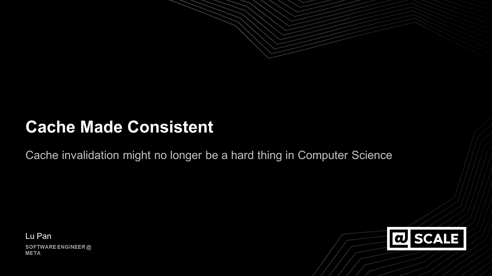
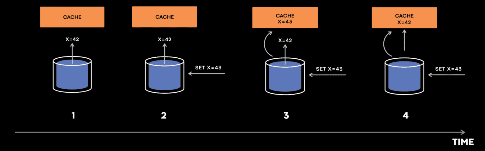
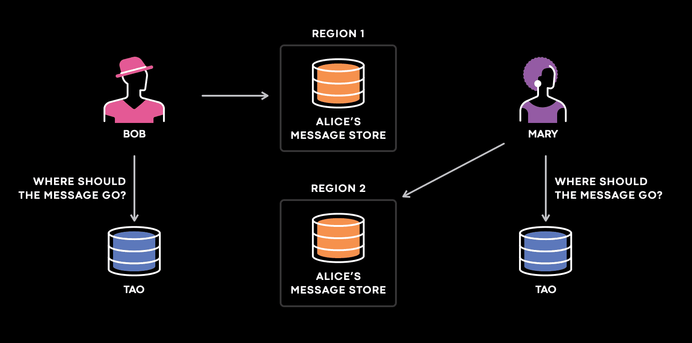
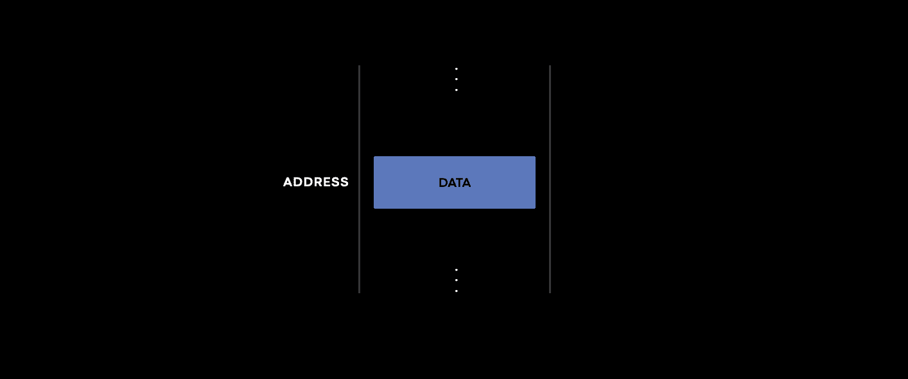
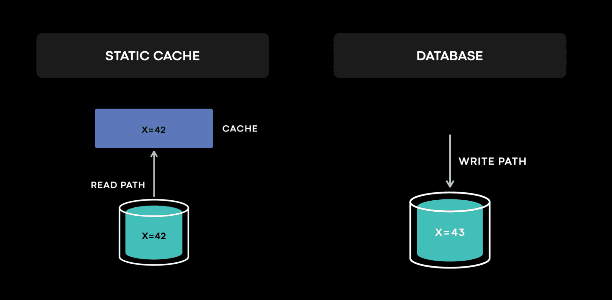
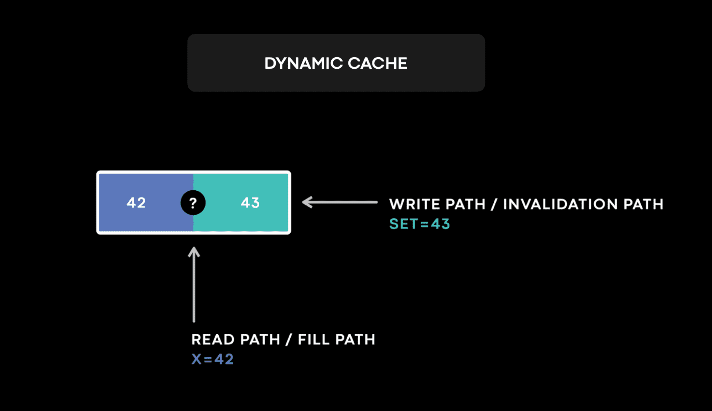
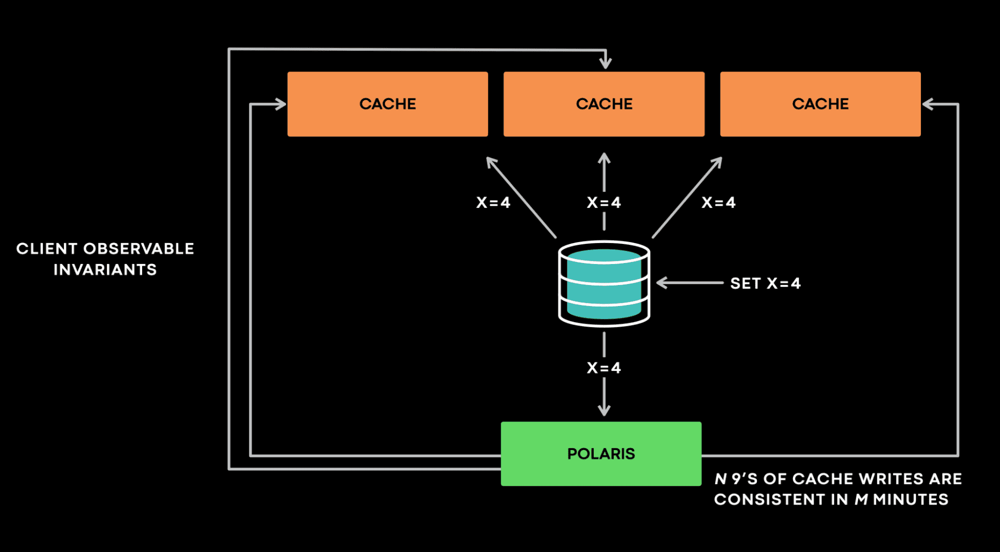
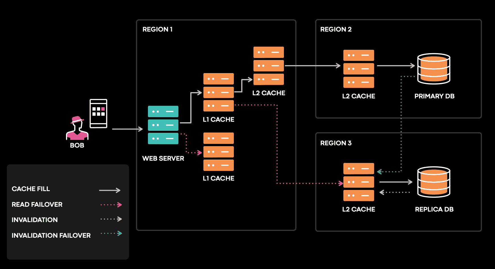
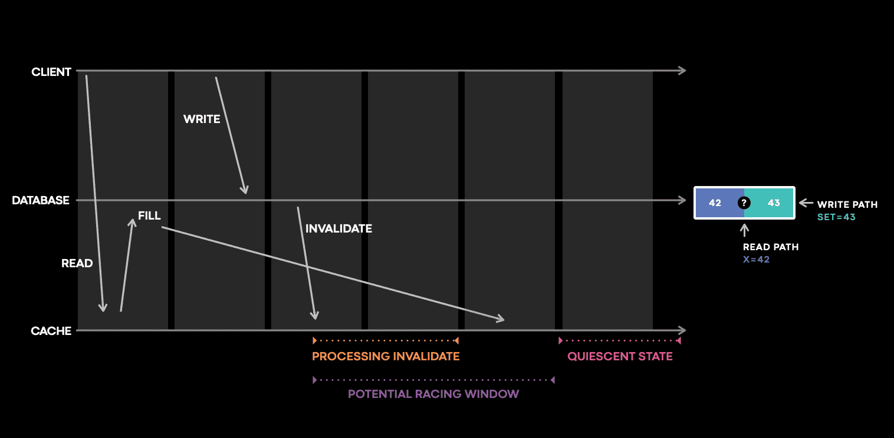
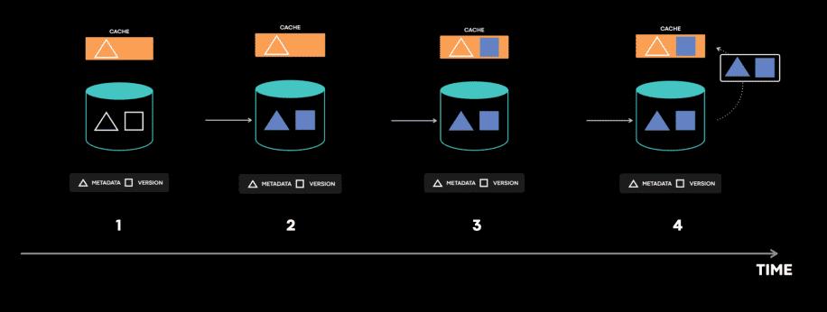

{{ page.description }}

# Cache made consistent: Meta’s cache invalidation solution

[HN comments](https://news.ycombinator.com/item?id=31671252)

cache는 latency를 줄이고 read-heavy workload를 scale하고, 비용을 줄인다. cache는 어디에서나 쓰인다. cache는 핸드폰이나 브러우저에서도 쓰인다. CDN과 DNS는 필수적인 geo-replicated cache이다

Phil Karlton은 “There are only two hard things in computer science: cache invalidation and naming things.” 라고 말했었다. 당신이 만약 cache를 invalidation하면서 쓰고있다면 cache inconsistency가 발생했을 가능성이 높다.

Meta에서는 [TAO](https://engineering.fb.com/2013/06/25/core-data/tao-the-power-of-the-graph/), [Memcache](https://research.facebook.com/publications/scaling-memcache-at-facebook/)를 포함한 매우 큰 cache deployment를 운영하고있다. 몇년동안 TAO의 cache consistency를 6 nines에서 10 nines까지 높였다.

우리는 cache invalidation에 대해 이론과 실제의 갭을 줄일수있는 효율적인 솔루션이 있다고 믿는다. 이 포스트의 principle, methodology 다양한 scale의 cache service에 적용될 수 있다. Postgres의 data를 Redis에서 캐싱하거나, disaggregated materialization을 유지하는 경우에도 동작할것이다.

## Defining cache invalidation and cache consistency

정의에 따르면 cache는 data의 (DB같은) 원본을 가지고 있지 않는다. Cache invalidation은 source data에 변경이 생길 때 stale cache entry를 invalidate하는 process이다. cache invalidation이 잘못 처리되면 cache에 영원히 inconsistent value가 남아있을 수 있다.

cache invalidation은 cache 자신이 아닌 외부에서 (mutation을 일으킨 직후) 액션을 취해야 한다. client나 pub/sub system등은 cache에게 변경이 일어났음을 알려야 한다. freshness를 유지하기 위해 TTL에만 의존하는 cache는 cache invalidation을 하지않으므로 이 포스팅에서는 언급하지 않겠다.

cache inconsistency가 발생하는 단순한 예시를 가져왔다.

cache는 DB에서 `x` 를 가져오려고 시도한다. 하지만 `x=42` 라는 응답이 cache host에 동작하기 전에, 누군가가 `x=43` 으로 업데이트하고, `x=43` 에 대한 cache invalidation event가 cache host에 먼저 도착해서 cache에 `x=43` 이 저장된다. 그 다음, `x=42` 응답이 뒤늦게 도착해서 cache에 `x=42` 가 저장되면, DB는 `x=43` 을 가지고, cache는 `x=42` 를 가지게 된다.

해결책중 하나는 version field를 사용하는 것이다. version field를 통해 older data가 새 data를 overwrite하지 못하도록 하는 conflict resolution을 수행한다. 하지만 `x=43 @version=2` 가 `x=42` 가 도착하기 전에 evict되면 어떻게 될것인가? 이 케이스에서 cache host는 새 data에 대한 정보가 사라지게 된다.

cache invalidation의 챌린지는 invalidation protocol의 복잡도뿐만아니라 cache consistency를 모니터링하고 왜 cache inconsistency가 발생하는지 확인하는것이다. consistent cache를 디자인하는건 consistent cache를 운영하는것과는 다르다.

## Why do we care about cache consistency at all?

이렇게 복잡한 cache invalidation problem을 해결해야 하는가? 당근… 일부 케이스에서 cache inconsistency는 DB의 data loss만큼 나쁜 상황을 만든다. 유저 관점에서는 데이터 손실과 구분할수 없을 수 있다.

어떻게 cache inconsistency가 split-brain을 만드는지 다른 예시를 보자. Meta의 messaging use case는 user가 속하는 TAO의 primary stroage의 매핑을 저장한다. user가 Meta(facebook)에 접근하는 곳과 가까운 위치로 primary message storage를 옮기기 위해 shuffling이 자주 일어난다. 너가 message를 누군가에게 보낼때마다 system은 TAO에 쿼리를해서 message를 저장할 위치를 결정한다. 몇년전 TAO는 덜 consistent했는데 일부 TAO replica가 reshufflling이후 incosnsitent data를 가지고 있었다.

shuffling 이후 Alice의 primary message store는 region 2에서 region 1으로 옮겨졌고, Bob, Mary는 Alice에게 메시지를 보낸다. Bob이 Alice에게 메시지를 보낼때 system은 Bob이 있는 곳과 가까운 region의 TAO replica에서 쿼리를 해서 message를 region 1로 보낸다. Mary가 Alice에게 메시지를 보낼 때, system은 Mary가 있는 곳과 가까운 TAO replica에 쿼리했는데, 이 replica가 inconsistent data를 가지고 있어 region 2에 메시지를 보낸다. Mary와 Bob은 그들의 메시지를 다른 region에 보내어 어떤 region도 Alice의 complete copy를 가지지 못하게 된다.

## A mental model of cache invalidation

cache invalidation의 챌린지를 이해하는건 어렵다. 단순한 model에서 시작해보자. cache의 핵심은 addressable storage medium에 data를 저장하는 stateful service이다. 분산시스템은 기본적으로 state machine이다. 모든 state transition이 정확하게 수행된다면, 분산시스템이 예측한대로 동작한다고 볼 수 있다. 그렇지 않으면 문제가 발생할 것이다. 따라서 key question은 “stateful service의 data를 벽녕하는건 무엇인가?” 이다.

static cache는 단순한 cache model이다 (e.g., simplified CDN). data는 imuutable하고 cache invalidation은 없다. DB에서 data는 write(또는 replication)에서만 변경된다. DB엔 거의 모든 state change에 대한 log가 있다. anomaly가 발생할때마다 log는 어떤일이 일어났는지 이해하는데 도움을 주고 원인을 찾아가는데 도움을 준다. fault-tolerant distributed database를 만드는건 여러 챌린지가 따라온다. 이것들은 단순한 metal model로나타낼 수 있다.

TAO와 Memcache같은 dynamic cache에서 data는 read(cache fill)와 write(cache invalidation) path 둘다에서 변경된다. 두 path에서 변경을 하는건 race condition이 생기게 하고 cache invalidation을 어려운 문제로 만든다. cache의 data는 durable하지 않으므로 conflict resolution에 필요한 version이 때때로 evict될수 있다. 이런 특징들을 합쳐서 보면 dynamic cache는 상상을 초월하는 race condition을 만든다.

그리고 모든 cache state change를 로깅하는건 비현실적이다. cache는 주로 read-heavy workload에서 scalability를 위해 도입되는데, 이는 대부분의 cache state change가 cache fill path에서 발생하는것을 의미한다. TAO에선, 하루에 1천조개의 쿼리를 서빙한다. cache hit rate이 99%라 하더라도 10조개의 cache fill이 발생할 것이다. 모든 cache state change를 로깅하면 read-heavy cache workload가 logging system때문에 write-heavy workload로 바뀌게 된다. 분산시스템(여기선 distributed cache)를 로그없이 디버깅하는건 불가능하다.

이런 챌린지에서도 Meta는 몇년간 TAO의 cache consistency를 6 nines에서 10 nines로 향상시켰다 (6 nines: 99.9999%, 10 nines: 99.99999999%).

## Reliable consistency observability

cache invalidation에서 생기는 cache inconsistency를 해결하기 위해 먼저 필요한건 측정을 하는것이다. cache consistency를 측정하고 inconsistency가 발생했을때 알람을 주는 것이 필요했다. 또한 사람들은 쉽게 노이즈를 필터링해버리기 떄문에 false positive가 생겨선 안된다. 즉 false positive가 많이들어오면 노이즈로 인식해서 알람을 무시하게 되고 신뢰도가 떨어지며 알람이 쓸모없어지게 된다. 또한 consistency를 10 nines 이상으로 유지하기때문에 측정또한 매우 정확해야 한다. consistency fix가 반영되면 개선된 상태를 정량적으로 측정할 수도 있어야 한다.

Meta는 측정 문제를 해결하기 위해 Polaris라는 서비스를 만들었다. stateful service에서 생기는 anomaly가 client에서 보일 수 있다면 anomaly로 판단한다. client가 볼 수 없는 anomaly는 중요하지 않다. 이와 같은 principle을 바탕으로 Polaris는 client가 볼 수 있는 inconsistency를 측정한다.

Polaris를 high level로 보면 Polaris는 client로서 stateful service와 통신하고 stateful service의 내부는 모른다고 가정해서 general하게 사용하기 쉽다. Polaris는 주로 “Cache should eventually be consistent with the database”를 모니터링한다(특히 async cache invalidation). 이 케이스에서 Polaris는 cache server의 역할로 cache invalidation event를 받는다. 예를들어 Polaris가 `x=4 @version=4` 에 대한 invalidation event를 받으면, 모든 cache replica에서 이 이벤트에 대한 violation이 생겼는지 검증한다. 한 cache replica가 `x=3 @version=3` 을 가지고 있으면 Polaris는 incosnistent하다 판단하고, invalidation event를 requeue해서 해당 cache replica가 다음에 다시 확인할수 있또록 한다. Polaris는 1분, 5분, 10분같은 timescale로 inconsistency를 리포팅한다. multi-timescale design은 Polaris가 backoff, retry를 효율적으로 구현하기 위해 내부에 여러 queue를 가지도록 만들지만, false positive를 막는데에도 필요하다.

다른 흥미로운.. 예시를 보자.. Polaris는 `x=4 @version=4` 에대한 invalidation event를 받았다. 하지만 아직 cache replica를 찔러봤는데 x가 없다는 응답을 받았다. 이 응답은 Polaris가 inconsistency라고 판단해야하는지 명확하지 않다. 왜냐면 `@verxion=3` 이 없고, `@version=4` 에 대한 write이 latest write이며 실제로 inconsistency인 상황일 수도 있다. 또한 `@version=5` write이 key x를 지운다면 Polaris는 자신이 가지고 있던 invalidation event보다 cache가 더 최신의 데이터를 가지고 있는 것일 수 있다.

이런 상황에서 Polaris는 cache를 bypass하고 database에 무엇이 들어있는지 확인한다. cache를 bypass하는 쿼리는 compute-intensive하다. 또한 cache의 usecase가 read-intensive workload를 위한것이기 때문에 database를 쿼리하는건 위험할 수 있다. 따라서 cache를 bypass하는 쿼리가 너무 많이 가지 않도록 한다. Polaris는 reporting timescale을 넘어가는 inconsistency에 대해서만 위와 같은 쿼리를 실행시켜서 DB에 부하를 많이 가하지 않도록 한다. 실제로 위와같은 상황은 같은 key에서 일어나야 하므로 매우 드물다. 따라서 consistency check을 재시도하여 reporting timescale이내에 끝나는 경우가 대부분이므로 cache bypass query가 발생하는것도 드물다.

또한 Polaris는 cache server에 special flag를 보낸다. 이 flag로 Polaris는 해당 cache server가 cache invalidation event를 처리했는지 알 수 있어 replication/invalidation lag으로 인한 일시적인 cache inconsistency와 영구적인 cache inconsistency를 구분할 수 있다(이미 invalidation event를 처리했는데 inconsistency가 발생한다면 영구적이고, invalidation event를 처리하지 않은상황이라면 일시적이라고 판단하게 될 듯).

Polaris는 “N nines of cache writes ar consistent in M minutes” 와 같은 metric을 5분단위로 제공하고 있다. 사용자는 10 nines 에 해당하는 cache write은 5분동안 consistent하다고 알수 있다(100억개중 한개 미만의 cache write이 5분동안 inconsistent하다).

Polaris는 production service와 독립적으로 scaling할수있돌고 분리된 서비스로 배포된다. 더 높은 consistency를 원하면 더 긴 time window로 aggregation을 하거나 Polaris throughput을 올릴 수 있다.

## Consistency Tracing

Cache는 여러 region, 여러 시간대에 다른 upstream에서 채워진다. promotion, shard 이동, failure recovery, network partition, hardware failure등이 cache inconsistency를 만들 수 있다.

위에서 말한것처럼 모든 cache data change를 log, trace하는건 불가능하다. 그렇다면 cache inconsistency가 발생했을 때에 cache 변경에 대한 log, trace를 하는건 어떨까? 어떤 component의 한 버그가 cache inconsistency로 이어질 수 있는 복잡한 분산시스템에서, 모든 cache inconsistency는 아니지만 대부분의 cache inconsistency를 찾아낼수 있을까?

우리는 이런 복잡성을 관리하는데 도움이 되는 간단한 솔루션을 찾아야 했다. single cache server의 관점에서 전체의 cache consistency 문제를 바라보게 하고싶다. 하루가 지나면 inconsistency가 cache server에서 보여야한다. 위와같은 관점은 아래와 같은 문제만 보면 된다.

- cache server가 invalidation을 받았는가?
- cache server가 invalidation을 제대로 처리 했는가?
- 나중에 inconsistency가 발생 했는가?

위 그림은 포스팅의 처음에 설명한 예시를 space-time diagram으로 표시한것이다. 가장밑의 cache host timeline을 보면 client write 이후에 invalidation과 cache fill이 모두 cache를 업데이트 하기 위한 경쟁 생기는 window가 있음을 알 수 있다. 그 후 cache는 quiescent state가 될것이다. cache fill은 대량으로 발생할수도있지만 cache consistency관점에서 큰 관심사는 아니므로 무시한다 (write-heavy인데 cache를 쓰면 너무자주 inconsistent해지므로?).

Meta는 위의 potential racing window에서 발생하는 cache mutation을 log, trace하는 stateful tracing library를 만들었따. potential racing window는 cache inconsistency를 발생시킬 수 있는 복잡한 interaction이 일어나는 지점이다. 이 window는 cache eviction을 커버하며 심지어 log가 없어도 invalidation이 오지 않았음을 알 수 있다. 이 library는 중요한 일부 cache service와 연관된 invalidation pipeline 전체에 심어져있다. library는 최근에 수정한 data에대한 인덱스를 버퍼링해서 추후에 cache state change가 log로 남아야하는지 결정할때 쓰인다. code tracing도 지원해서 traced query의 정확한 code path도 알 수 있다. 이 methodology는 많은 결함을 찾고 고치도록 도와주며 cache inconsistency를 자동으로 찾아내고 scalable하다.

## A real bug we found and fixed this year

ordering과 conflict resolution을 위해 각 data에 version을 설정하는 system이 있다. 이 케이스에서 `metadata=0 @version=4`가 cache에 있는데, db에는 `metadata=1 @version=4`가 들어있었다. cache는 inconsistency를 계속 가지고 있었다. 이 state가 발생하는건 불가능하다. 너가 이 문제를 직면했따면 어떻게 접근할것인가? 우리가 final inconsistent state로 가기까지의 모든 step에대한 timeline을 얻는다면 얼마나 좋을까? consistency tracing은 우리가 필요로하는 timeline을 제공해준다

이 시스템은 **metadata table, version table이 따로 있는 극히 드문 케이스인데, transaction은 이 두개를 업데이트한다**. consistency tracing으로부터 우리는 어떤 상황이 발생했는지 알게되었다.

1. cache는 metadata와 version을 가져오려고 시도한다.
2. 첫번째 라운드에서 cache는 **old metadata**를 저장했다.
3. 그 다음 write transaction은 metdata와 version을 atomic하게 업데이트 했다.
4. 두번째 라운드에서 cache는 **new version**을 가져와 저장한다. 여기서 cache fill operation 사이에 database transaction이 들어갔다. 이건 racing window가 매우 작기때문에 매우 드물게 일어난다. 이건 버그다라고 생각할 수 있지만, 실제로 이 로직은 예상된대로 동작했다. 지금까지는 cache invalidation이 cache가 consistent state를 가진다고 가정하기 때문이다.
5. 그후 cache invalidation이벤트가 new metadata와 new version을 업데이트하려고 시도한다.
6. cache invalidation 이벤트는 cache host에 드물게 일시적인 에러를 낼수 있지만 error handling code를 트리거하게 된다.
7. error handler는 cache에서 item을 제거한다.
`drop_cache(key, version)`

`drop_cache`는 arguement로 들어온 `version` 값보다 작은 version을 가지면 cache에서 item을 제거한다. 하지만 inconsistent cache item은 latest version을 가지고 있어 `drop_cache`는 아무런 일도 하지 않고 stale metadata를 계속 들고있게 된다. 이 예시는 간단하게 설명했지만 실제로는 훨씬 복잡하다. 실제로는 DB replication, cross region communication이 이 문제에 엮여있었다. 이 버그는 위의 모든 step이 특정한 순서대로 발생해야만 생기므로 아주 드물다.

몇년전에 이런 버그에 대한 root cause를 찾는것은 몇주동안 누군가가 code와 서비스를 깊게 들여다봐도 찾을까말까였었다. 이런 케이스에서 Polaris는 anomaly를 식별하고 즉시 알람을 보냈다. consistency tracing을 통해 on-call engineer들이 30분이내에 버그를 찾을 수 있었다.

## Future cache consistency work

어떻게 우리가 cache를 더 consistent하게 만들었는지 공유했다. 앞으로 가능한한 cache consistency를 100%에 가깝게 높이고자 한다. disaggregated secondary index에 대한 consistency는 우리가 풀어야할 다음 문제이다. 또한 read 시점에 cache consistency를 측정하고 consistency를 향상시키려 한다. 마지막으로 우리는 distributed system을 위한 high-level consistency API를 만들고 있다.