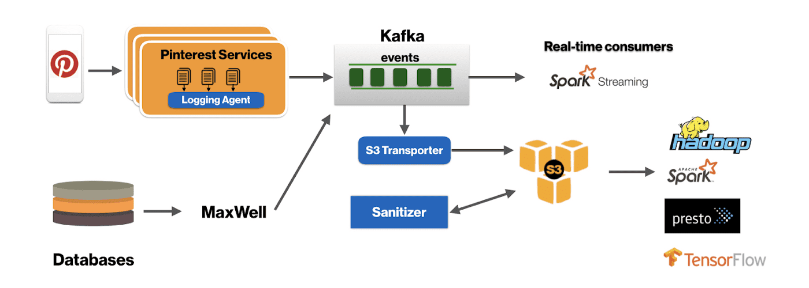
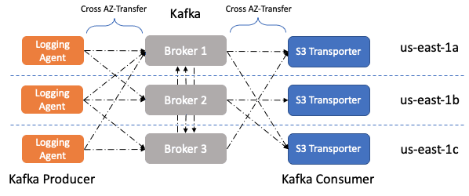
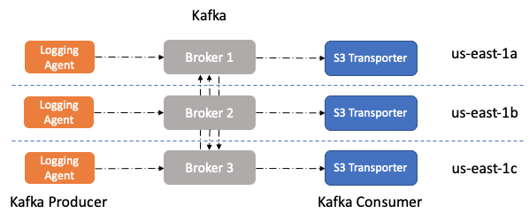

{{ page.description }}

# Optimizing Kafka for the cloud

## Takeaways

- locality aware system을 만드는것과 balancing algorithm은 cost를 크게 줄일 수 있다
- Kafka Producer, Consumer rack을 인지하면 route traffic을 효율적으로 관리할수있다
- data driven engineering decision making은 시스템을 계속 개선시키는데 중요하다.

Cloud를 운영할때 중요한 principle중 하나는 outage로부터 application을 보호하는 것이다. 일반적인 방법은 여러 failure domain에 걸쳐서 deploy를 하는 것이다. public cloud environment에서 Availability Zone (AZ)는 failure domain의 역할을 한다. 따라서 application이 fault tolerant 하게 만들기 위해 multiple AZ를 사용 할 수 있다.

HDFS와 같은 분산시스템은 데이터센터 안에서 여러 랙에 걸쳐 replica를 분산하는것으로 fault tolerant하게 만든다. AZ를 랙으로서 쓰는것은 cloud environment에서 일반적이다. 여러 AZ에 걸쳐 data copy를 뿌려서 one fail로부터 fault tolerant하게 만들지만, AZ transfer cost가 함께 청구된다.

Pinterest에서는 Kafka를 [user action counting](https://medium.com/pinterest-engineering/building-a-real-time-user-action-counting-system-for-ads-88a60d9c9a)이나 CDC 같이 몇개의 주요 서비스를 위해 scalable, fault tolerant distributed message bus로 사용한다. Kafka를 매우 큰 [스케일로](https://medium.com/pinterest-engineering/how-pinterest-runs-kafka-at-scale-ff9c6f735be) 운영하고 있기 때문에, AZ transfer cost에대해 인지할 필요가 있고, 가능한한 효율적으로 동작해야하고, AZ간에 data전송되는 양을 줄일 필요가 있다.

Kafka cluster가 여러 AZ에 걸친 broker들을 가지면, 세종류의 cross AZ network traffic이 생긴다

1. Inter-broker replication traffic
2. Traffic from Producers in different AZs
3. Traffic from Consumers in different AZs

1번은 fault tolerance를 위해 필요하지만, 2번과 3번은 원하지 않는 cost이다.

## Design

### Approach 1

Producer와 Consumer가 동일한 AZ를 공유하는 leader의 파티션에 대해서만 data를 r/w 해서 cost efficiency를 만들 수 있다.

### Approach 2

특정 AZ에 kafka cluster를 deploy할 수 있지만, 이를 위해선 다른 real-time consumer들이 az-aware한 로직을 만들어야 한다.

Simplicity관점에서 code와 stack change를 최소화하기 위해 Approach 1을 선택했었다. Producer/Consumer AZ awareness는, r/w하는 파티션의 leader broker의 rack information을 lookup하고, producer와 consumer assignment의 partitioning logic을 바꾸는것으로 풀 수 있다.

Kafka에서 broker의 rack 정보는 Producer/Consumer가 공유하는 PartitionInfo의 일부분이다. 따라서 각 broker가 AZ에 node rack info가 kafka cluster에 publish되므로, rack awareness를 주입할 수 있다.

## Producer AZ Awareness

서버에 붙어있는 Logging Agent는 microbatch로 log file을 읽어서 kafka로 publish하고, 유저가 어떻게 로그가 kafka에서 partitioning되는지 설정할 수 있다.

logging agent의 key design은 Kafka의 producer.send()를 호출하기 전에 pre-partitioning해주어서 advanced routing을 할 수 있다는 점이다. 여기서 AZ-aware하게 만드려면 logging agent가 EC2 Metadata API를 이용해 agent가 동작하는 node의 AZ info를 검색해야한다. 그 다음 Kafka producer metadata에 있는 rack 정보를 활용하기 위해 logging agent와 같은 AZ에 있는 leader partition에만 write하도록 partitioner를 수정했다. 이 코드는 topic에만 적용되고, key based partitioning에서는 ordering이 AZ-awareness를 가지게되면 partition이 다른 AZ로 바뀔때 ordering이 보장되지 않으므로 사용되지 않는다

## Consumer AZ Awareness

S3 transporter는 Kafka에서 로그를 읽고 S3에 저장한다. S3 transporter도 producer와 비슷하게 구현했다.

Pinterest의 S3 transporter는 Kafka Consumer Assignment를 쓰지 않고, 직접 partition assignemt system을 구현하여 node가 restart하거나, 일시적인 network 문제가 생기거나 할떄에도 locality를 유지하고 따라서 특정 batch에서 replay해야 하는 data 양을 줄일 수 있다(이해안됨..)

Pinterest의 S3 transporter는 AZ info를 Zookeeper로 lookup, publish 한다. 이를 통해 S3 transporter master가 Kafka partition을 rack에 기반하여 worker들에게 할당하게 만들어준다. 만약 rack (AZ) info를 가져오지 못했을때에는 어떤 rack으로 할당해야 cost가 줄어드는지 모르므로, 모든 worker에게 할당하는 방식으로 동작한다.

## Results

AZ aware S3 transporter를 production에 배포해서 logging에 대해서는 AZ transfer cost가 25% 줄어들었고 천천히 Rollout하고있기때문에 cost는 더 줄어들것이다.

또한 이 구현을 standard Kafka Producer와 Consumer에게도 적용하기위해 contrubution도 진행하였다.