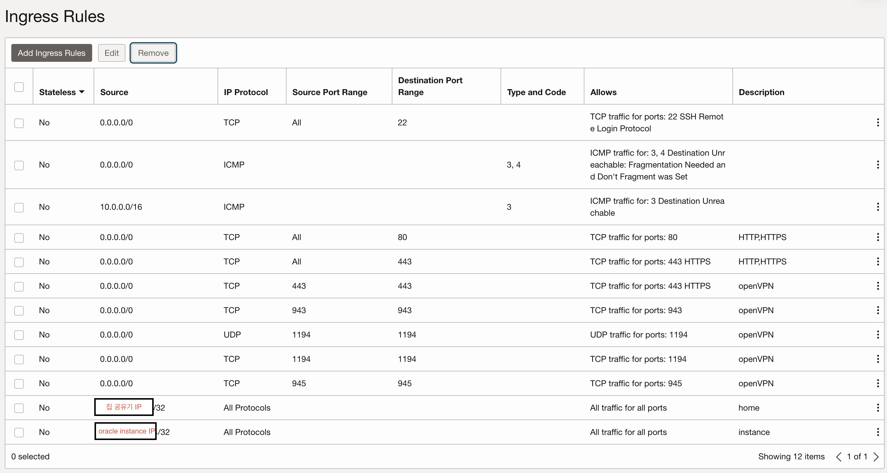
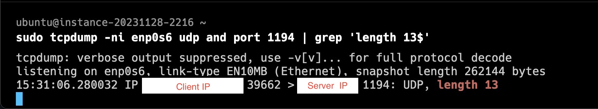

# 1) k8s cluster를 묶기 위한 openVPN 설치

k3s로 공유기에 속한 머신 4대와 oracle instance 2대를 한 클러스터로 묶어야함. 근데 k3s에선 ip로 통신하기때문에, 192.168.0.x IP로 등록됨 .. 그러면 oracle instance들은 로컬 머신들을 볼수없다..

cloud instance랑 집에있는 머신들이랑 k3s로 연결하기 쉽게 만들기 위해서 openVPN을 설치한다

- 네트워크 잘 모름
- k8s port에대해서도 정확히 모름
- 집에 머신이 4대라서 port-forwarding으로 해결할수있는지 모르겠음
- k3s install command 건들고싶지 않음(복잡해보임)

OCI 서버스펙
- instance type: VM.Standard.A1.Flex(2 core, 12GB memory, 100gb storage), 두대 띄우기 위해서 free tier 절반 사이즈
- OS: Canonical-Ubuntu-22.04-aarch64-2023.10.13-0
- fault domain: 두대가 서로 다른 fault domain에 위치 (미래에 할지도 모를 HA)

용어 (접속하는 인스턴스가 많으니 헷갈리지 않기 위해 메모)
- openvpn server instance: OCI instance 두대중 openvpn server가 설치된 인스턴스
- openvpn client instance: OCI instance 두대중 openvpn client로 사용하는 인스턴스


## OCI 서버 접근
ssh key를 받은다음 permission을 400으로 바꿔줘야함, 유저는 ubuntu임
```sh
chmod 400 isntance.key
ssh -i instance.key ubunutu@${INSTANCE_IP}
```

apt 패키지들 전부 업그레이드 하고 재부팅
```sh
sudo apt update;
sudo apt upgrade;
sudo reboot
```

### openVPN 설치

https://www.cyberciti.biz/faq/howto-setup-openvpn-server-on-ubuntu-linux-14-04-or-16-04-lts/

스크립트 다운로드 + 실행
```sh
wget https://git.io/vpn -O openvpn-install.sh;
sudo chmod +x openvpn-install.sh;
sudo bash openvpn-install.sh;
```

실행하면 뜨는 옵션
- UDP/TCP?: UDP
- PORT: 그냥 엔터 (default 1194)
- DNS server: Google
- Name: user (맘대로해도됨)

그리고 완료되면 `/root/user.ovpn` 에 client config 파일이 생성됨

### Security List (Security Group)
instance에 떠있는 openvpn server를 접근하기 위해선 security group을 열어줘야한다

근데 실패해서 특정 IP로 모든 포트 열어주게 했음..
1194 UDP만 있으면 된다고 하는데 아무튼 실패함.

- description이 openVPN인건 openVPN에서 쓴다는 모든 포트들 다 등록해보았음 (실패)
- 안돼서 아래 두개 등록해둠
  - 집 IP: 공유기에 붙어있는 머신들이 접속
  - instance IP: openVPN server가 띄워진 instance말고, client로 접속할 instance의 IP임



### openvpn client config 추가
https://www.cyberciti.biz/faq/howto-setup-openvpn-server-on-ubuntu-linux-14-04-or-16-04-lts/

openvpn server instance 에서 실행했던 openvpn-install.sh 커맨드를 다시 실행하면,
```sh
OpenVPN is already installed.

Select an option:
   1) Add a new client
   2) Revoke an existing client
   3) Remove OpenVPN
   4) Exit
Option: # 1번 선택 

Provide a name for the client:
Name: OCI-openvpn-client # client name 설정

... (설정중)

OCI-openvpn-client added. Configuration available in: /root/OCI-openvpn-client.ovpn

```

`/root/OCI-openvpn-client.ovpn` 으로 config file이 추가된다
(`/root/user.ovpn` 도 있음)

이제이걸 openvpn client로 쓸 서버들에 옮기면 됨

### openvpn client server에 openvpn client 설치

```sh
# root user로 되어있으니 owner를 바꿔준다
OPENVPN_SERVER_INSTANCE $ sudo cp /root/OCI-openvpn-client.ovpn ~/
OPENVPN_SERVER_INSTANCE $ sudo chown ubuntu:ubuntu ~/OCI-openvpn-client.ovpn
OPENVPN_SERVER_INSTANCE $ exit;

# 로컬로 ovpn file을 옮기고, client로 다시 또 옮겨준다
local $ scp -i ssh.key ubuntu@${OPENVPN_SERVER_INSTANCE}:/home/ubuntu/OCI-openvpn-client.ovpn .
local $ scp -i ssh.key OCI-openvpn-client.ovpn ubuntu@${OPENVPN_CLIENT_INSTANCE}:/home/ubuntu/

# 파일 확인
local $ ssh -i ssh.key ubuntu@${OPENVPN_CLIENT_INSTANCE}
OPENVPN_CLIENT_INSTANCE $ ls
OCI-openvpn-client.ovpn
```

https://www.cyberciti.biz/faq/howto-setup-openvpn-server-on-ubuntu-linux-14-04-or-16-04-lts/

여기 문서를 다시 보면서 openvpn client를 설치
```sh
sudo apt install openvpn -y # openvpn 설치

sudo cp OCI-openvpn-client.ovpn /etc/openvpn/client.conf
```

테스트, 여기서 문제가있으면 한 3분내에 handshake failure 메시지가 나온다
```sh
sudo openvpn --client --config /etc/openvpn/client.conf
```

실행후 확인
```sh
sudo systemctl start openvpn@client

ping 10.8.0.1 # openvpn server instance로 ping을 보낸다

sudo apt install net-tools # ifconfig 커맨드 설치
ifconfig # 여기서 10.8.0.xxx IP가 찍힘, 이게 vpn 내부 IP임
```


## 트러블슈팅
할때 쓴것들

## system app log 보기
```sh
sudo systemctl status openvpn-server@server.service
sudo journalctl -f -u openvpn-server@server.service
```

## network 잘 열려있는지 확인
ping ${IP} 로는 뭐가 되는지 안되는지 만족스럽지않음 ㅋㅋ

미리 설치
```sh
sudo apt install -y tcpdump netcat net-tools
```

client에서는 어차피 잘 보내줄건데, server에서 잘 받고있는 상황인지 확인 필요.
여기서 안찍히면 security list 이슈로 판단할수 있음

- openvpn server instance: tcpdump를 아래처럼 켜두자
```sh
# network device name 'enp0s6'은 ifconfig로 대충 찍어서 확인
sudo tcpdump -ni enp0s6 udp and port 1194
```

- openvpn client instance: udp에 패킷을 던져보자
```sh
echo -n 'aaaabbbbccccd' | nc -u ${OPENVPN_SERVER_IP} 1194 # openvpn port가 1194
```

이렇게 하면 packet length 13으로 packet이 들어온게 찍히면 security list가 정상.

안찍히는거면 security list에 문제있는거임

