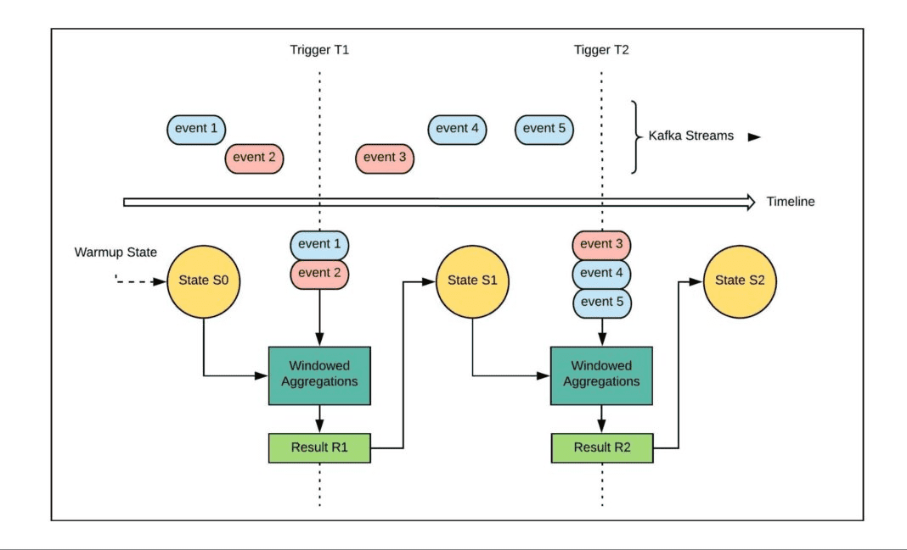
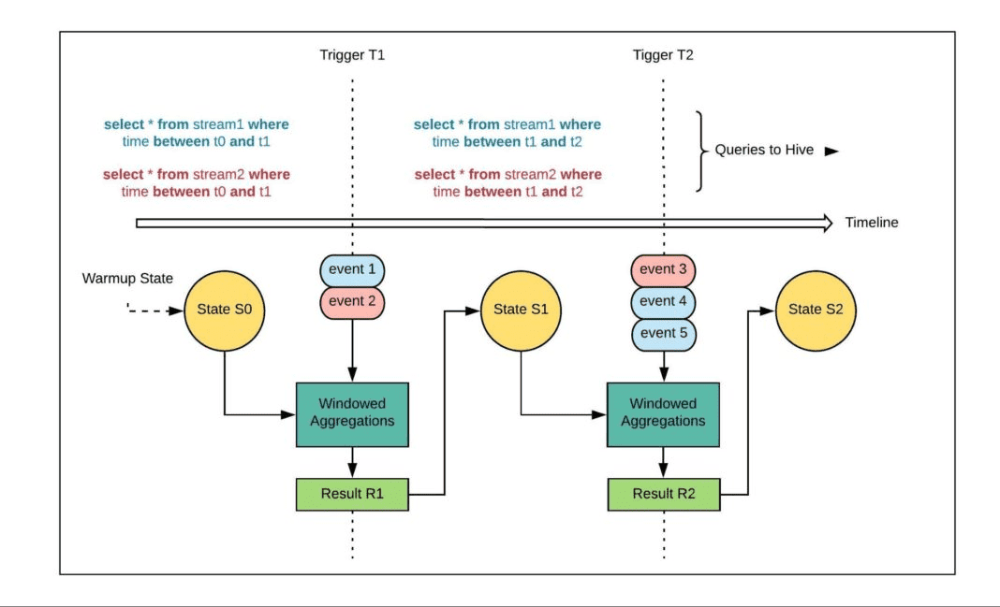

# Kappa+ Architecture

[https://eng.uber.com/kappa-architecture-data-stream-processing/](https://eng.uber.com/kappa-architecture-data-stream-processing/)

# Designing a Production-Ready Kappa Architecture for Timely Data Stream Processing

우버는 dynamic pricing, driver dispatching, [fraud detection](https://eng.uber.com/mastermind/) 위해 Flink와 Spark 등의 rubust한 data processing system을 사용한다. 이런 data streaming은 [exactly-once semantic](https://medium.com/@jaykreps/exactly-once-support-in-apache-kafka-55e1fdd0a35f) 으로 동작하고, 몇년간 이런 시스템은 low-latency로 streaming data application을 만들기위해 산업에 널리 쓰였다.

그러나 streaming system은 event order를 보장할 수 없으므로 어떻게 late data를 핸들링할지 trade-off를 결정해야한다. 일반적으로 streaming system은 이와같은 Out-of-order problem을 [event-time windows and watermarking](https://spark.apache.org/docs/latest/structured-streaming-programming-guide.html#handling-late-data-and-watermarking) 을 이용해 완화시킨다. 이 방식은 효율적이지만 watermarking 이후의 데이터는 버릴수밖에 없는 inaccuracy를 가지고 있다. streaming pipline의 low latency와 batch pipeline의 correctness을 만족시키는 시스템을 만들기 위해 많은 조직이 [Lambda Architecture](http://nathanmarz.com/blog/how-to-beat-the-cap-theorem.html)를 활용한다.

Lambda Architecture를 활용하는것은 엔지니어가 backfill을 통해 안정적으로 데이터를 넣어줄 수 있지만, batch와 streamgin이라는 2개의 분리된 codebase를 가지게 된다. streaming pipeline이 realtime으로 돌아가면, batch pipeline은 delay된 스케쥴로 reprocessing하여 streaming이 놓친 데이터를 채워넣게된다. Lambda Architecture는 많은 이점을 주면서도 streaming과 batch라는 두개의 codebase를 만들어야하는 어려움이 있다.

이런 tradeoff를 해결하기 위해 stream processing system을 위한 [Kappa Architecture](https://www.oreilly.com/ideas/questioning-the-lambda-architecture)가 나왔다. Key idea는 Hive와 같은 structured data source로부터 Kafka Stream으로 data를 replay하는 것이다. 그 다음 replay된 kafka topic에 대해 streaming job을 다시 실행시켜 streaming/batch와 production/backfill usecase를 만족시키는 unified codebase를 만들어준다.

많은 포스팅들이 어떻게 kappa architecture를 만드는지에대해 설명하지만, production에 성공적으로 적용하는 방법을 설명한 케이스는 거의 없다. 많은 가이드들은 엔지니어들이 아키텍쳐적 결정을 할때 고려해야하는 성능과 비용에대한 논의를 생략한다.

우버는 unified codebase를 이용한 streaming workload의 백필을 잘하도록 만드는 Kappa Architecture를 디자인했다. 이 방식은 streaming analytics를 위한 seamless한 data join뿐만아니라 개발자 생산성도 향상시킨다. 이 포스팅에선 향상된 matching, calculation을 위한 uber의 data streaming pipline이 Kappa Architecture로 전환하기 위해 배운것들을 공유할 것이다.

# Motivation

운전자 경험을 [sessionizing](https://eng.uber.com/sessionizing-data/) 하기위한 pipeline은 uber core business에 가장 큰 stateful streaming usecase로 남아있다. 초반엔 uber의 [dynamic pricing](https://www.uber.com/en-GB/blog/uber-dynamic-pricing/)에 쓰이는 많은 advanced modeling usecase를 위해 low latency로 서빙했다. 하지만 user experience analysis나 bot detection 같이 원래 목적을 넘어서 session 정의에 대한 여러 usecase가 있음을 발견했다. Data scientist, analysts, operation manager들은 오랜 기간동안 backward-looking analysis를 할때 session 정의를 정식 session 정의으로 사용했다.

streaming pipline이 생성한 이 데이터들은 correctness와 latency 측면에서 극명하게 다른 니즈케이스에서도 사용됐다. 어떤 팀은 second-level latency(offline으로도 충분한?)면 되지만 빠른 연산이 필요한 analytic의 sesionizing system을 사용했다. 또 다른 팀은 MoM 같은 분석을위해 correctness와 completeness가 중요한 usecase에 streaming pipeline data를 사용하기도 했다. 위와같은 다양한 usecase를 커버하기 위해선 stateful streaming pipeline에게 robust backfill은 필수적임을 보았다.

적당한 time window안에서 re-compute하는 backfill pipeline은 late arriving과 out-of-order event를 처리하기 위한 것이다. 예를들면 다음 uber app session까지 driver 평가를 기다리는것이다. 이 케이스에서, driver streaming pipeline에서 event를 놓치게 되면, 며칠정도 지연되는(며칠이면 엄청긴거아닌가) backfill pipeline은 놓친 event를 적절한 session으로 쉽게 돌릴 수 있다. 따라서 backfill pipeline은 late arriving에 대응할 뿐만 아니라, streaming pipeline으로 인한 inconsistency나 data hole도 채우는데에도 유용하다.

# Design considerations

stateful streaming pipeline을 위한 scalable backfill strategy가 필요함에따라 Uber는 현재 backfill solution에대한 최싄 기술에대해 리뷰했다. 첫번째 iteration에서는 두가지 접근방식을 고민했다

## Approach 1: Replay our data into Kafka from Hive

Hive같은 structured data에서부터 old event들을 kafka topic으로 replay시키고, dataset을 재생성하기 위해 replayed topic에 대한 streaming job을 재실행하는 방식이다. 이 방법은 streaming job에 대한 코드변경이 없지만, Hive-to-Kafka replayer를 만들 필요가 있었다. 이전 kafka topic에서 나타난 순서와 거의 같은순서로 replayed events가 kafka topic에 복제되는 것을 보장해야 하기 때문에 idempotent replayer를 만드는것은 아마도 까다로웠을것이다. 원래의 순서로 다르게 kafka topic으로 새 backfill job을 재실행하는것은 event-time windowing logic과 watermarking에 inaccuracy를 만들 수 있었다.

현실에서 나타나는 다른 문제는 효과적으로 replay할 기간에 제약이 있다는 것이다. 며칠분량의 데이터를 한번에 다시 밀어넣게 되면 lag이 발생할 수 있다.

## Approach 2: Leverage a unified Dataset API in Spark

Uber는 [Spark Streaming](https://spark.apache.org/docs/latest/streaming-programming-guide.html)을 사용하기 때문에 structured streaming [unified declarative API](https://databricks.com/wp-content/uploads/2018/12/sigmod_structured_streaming.pdf)을 활용하고, backfill을 위한 streaming code를 재사용하는것도 한 선택지였다. spark batch mode에서 structured streaming query는 hive와 다르게 batch query가 동작할때 event-time window와 watermarking을 무시한다. (무슨 의미인지 잘...)

이 방식은 코드를 재사용하지만 장기간의 데이터를 backfill하려 할때 문제가 될 수 있다. Uber의 여러 data usecase에서 Structured Streaming을 쓰는것은 한개 batch job에서 며칠 데이터를 backfill 해야하므로, resource를 더 provisioning하여 production resource에 문제가 없게 만들어야 한다.

추가로 Uber의 production pipeline은 kafka에서부터 data를 processing하며, 다시 kafka sink로 넣어준다. downstream application과 dedicated ES, Hive publisher는 이 sink들을 통해 data를 가져간다. 만약 며칠 데이터를 한번에 backfill할 수 있는 리소스가 있다 하더라도, downstream sink나 backfill이 똑같이 반영되어야 하는 consumer가 overwhelm되지 않도록 rate-limit을 구현 하는 것을 필요로 한다.

## Combined Approach

우리는 두개 방식에 대해 리뷰하고 테스트했지만 어느것도 우리 요구사항에 대해 scalable하지 못했다. 따라서 우린 두 방법의 이점을 가져가면서 단점을 완화하는 방법을 고안했다.

Hive to Kafka replay method (Approach 1)은 코드변경없이 같은 streaming pipeline을 실행할 수 있지만, 각각 backfilled kafka topic에 대한 dedicated topic같은 한번 infra resource를 셋팅해야 했고, 몇주 분량의 data를 Kafka cluster로 replay해야 했다. 이런 작업들이 실용적이지 못해서 Hive-to-Kafka replay는 Uber stack에서 scalable하게 구현하기엔 어려웠다.

Batch mode로 spark streaming job을 수행 시키는것 (Approach 2) 또한 리소스 문제가 있었다.

우리의 니즈에 맞게 두 방식을 합치기 위해, Hive table을 Spark에서 streaming source로 모델링하는것으로 table을 unbounded stream으로 전환하여 새 streaming system을 kappa architecture로 모델링 하기로 결정했다. Spark의 [Kafka source](https://spark.apache.org/docs/latest/structured-streaming-kafka-integration.html)처럼 streaming hive source는 Kafka topic 대신 Hive table의 event trigger로부터 data를 가져왔다. 이 방식은 data를 temp kafka topic으로 replay해야하는 번거로움을 없애면서, approach 1이 가지는  이점을 제공했다.

또한 이 방식은 one-shot backfill을 시도하는것 대신 Hive에서 incremental read를 하기 때문에 downstream sink에 부하를 생기게 만드는 Approach 2의 문제점도 피해갔다. backfiller는 발생하는 순서대로 windowed aggregation을 수행했다. 예를들면 t0에 트리거된 window w0 은 t1이 트리거한 w1이 수행되기 이전에 수행되는것이다.

과거에 일어난 event stream으로부터 backfill하기 때문에 production streaming pipline에서 몇초/몇분 정도의 데이터가 아닌 몇시간정도이ㅡ 데이터를 window 사이에 넣을 수 있었다 (잘 이해 안감 ㅜ). event time window나 trigger interval을 명시하여 dataset을 효과적으로 backfill할 수 있다.

# Kappa Architecture Implementation

우리는 이 방식을 구현하기 위해 아래와 같은 principle을 정했다.

1. streaming과 batch job간에서 스위칭 하는것은 pipeline에서 hive를 사용하여 kafka datasource를 전환하는것처럼 간단해야 한다. 또한 추가적인 단계나 dedicated code path를 필요로 해선 안된다.
2. Hive connector로 전환, event time window 튜닝, 효과적인 backfill을 위한 watermarking 튜닝등 backfill solution은 나머지 부분에 가정이나 변경사항을 만들어서는 안된다.
3. event-time windowing operation과 watermarking은 backfill이나 production job에서 같은 방식으로 동작해야 한다
4. Hive connector는 streaming job type에 관계없이 똑같이 동작해야 한다. 예를들면 statefull, stateless에서도 똑같이 잘 동작해야하고, event-time window, processing-time window, session window에서도 똑같이 잘 동작해야 한다.

backfill로 동작하면서도 original streaming job의 windowing과 watermarking을 유지 하는것은 event가 일어난 순서대로 수행되게 만들어 correctness를 보장한다. 또한 한번에 모든것이아닌 한 window 시간 마다 backfill잡이 동작하므로 자연스럽게 rate limiter 역할을 한다. backfill mode에서 한 window에서 처리할 data 양을 결정할 수 있으므로 backfill이 prodjction job을 재실행 하는것보다 빠르게 동작할 수도 있다.

어떻게 두 갈래의 backfill 시스템을 구현했는지 보여주기 위해, 2 개의 kafka stream 을 사용하는 stateful stream job 의 예시를 가져왔다. 이 예시에서 backfill은 아직 수행되지 않은 상태이다. 이 job은 10초의 event-time window를 가지고 있다. 즉 watermark가 10초씩 흐를때마다, window를 trigger하고. 각 window의 output은 internal state store에 저장된다.

- watermark가 흐를때마다 window를 trigger하는 kafka에 의해 수행되는 stateful streaming job. aggregation은 window 에 속하는 event단위로 적용 , result는 state store로 들어감

위의 job에 대한 backfill system을 위에서 언급한 principle을 바탕으로 두개의 방법을 합쳤고, 결과로 Spark source api를 사용해서 streaming source 역할을 하는 hive connector를 만들었다. 일단 trigger간에 event window안에서 kafak read를 hive query로 바꾸고싶었다. 이 시스템을 redesign 하면서 10 window마다 10초만큼의 data에 대해 hive query를  실행시키는건 비효율적이며, 불필요하다는 것도 깨달았다. 따라서 watermarking을 10초에서 2시간으로 늘려, event가 trigger될때마다 2시간치의 data를 hive에서 읽었다.

3번쨰 principle 관점에서, 이 feature는 변경사항이 hive connector로 스위칭하는 것, window size 바꾸거나 backfill도중 watermarking duration을 조정하는것을 제외하고 downstream에 노출되지 않음을 보장한다. 아래 그림은, 위 그림에서 stateful streaming job에서 hive connector를 이용한 backfill mode를 구현한 것이다.

- backfill mode에서 위의 그림과 같은 stateful streaming job이다. 차이점은 unbounded kafak stream에서 hive로 query를 수행하는 것으로 바뀌었다.

backfill을 위해 kafka connector에서 hive로 바꿀때, 위에 설명한 principle들을 지키기 위해 기존 streaming job의 state persistence, windowing, triggering semantics를 저장했다. trigger간에 읽는 data 양을 조절할 수 있기 때문에 며칠에 걸쳐 hive에서 한번에 모든 data를 읽지않고, 서서히 backfill할 수도 있다. 또한 backfill job을 위한 별도의 resource를 넣지 않고도 prod stateful streaming job과 같은 config로 backfill이 가능하다.

# The Future of Kappa+ architecture

streaming pipeline이 scalable, seamless하게 backfill하기 위해 production에서 Kappa Architecture를 만드는것은 쉽진 않았다. Hive에서 kafka로 replay하는것이나, batch job으로 backfill하는것은 scalable하지 못하고 resource 제약도 심했다. 따라서 우린 Hive connector를 streaming source로 활용하여 해결하였다.

이 구현은 Spark streaming에서 만들어졌지만, Apache Flink와 같은 다른 streaming processing system에서도 적용할 수 있다.