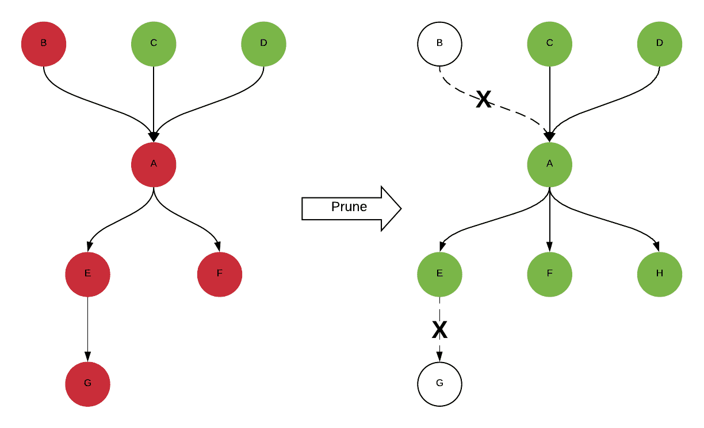

**{{ page.description }}**

# How Uber Achieves Operational Excellence in the Data Quality Experience

## Introduction

uber는 높은 data quality로 business operation, decision에 큰 영향을 주고 있다. data quality를 보장하지 못하면 downstream service computation이나 ML model의 성능이 떡락해서 원인을 찾고 backfill하는데 시간을 엄청 쓰게 된다.

따라서 DQ를 위해 monitoring, detcting, handling하는 consolidated data quality platform을 만들기로 했다. 전사적으로 DQ standard를 만들고 달성시키기 위해 2천개의 주요 dataset을 지원하게 했고, 거의 90%의 DQ 문제를 감지했다. 이 포스팅에서는 uber의 DQ standard와 workflow를 어떻게 만들었는지 보여줄것이다.

## Case Study

uber는 data-driven company로서 모든 business decision을 data로부터 만든다. 예를들어 여러 factor(region, weather, event 등)를 기반으로 동작하는 realtime ML model에의해 surge multiplier가 계산된다. 하지만 가장 중요한 factor는 demand, supply이다. supply가 demand보다 높으면 surge multiplier는 minimum value(1.0)에 가까워질 것이다.

supply, demand dataset은 real-time data pipeline으로 들어온다. data가 incomplete, inaccurate하게 만드는 pipeline lagging등 system-level issue는 surge multiplier의 값이 잘못 계산되어 기사의 수입이 줄어들 것이다. downstream이 data를 받기 전에 위와 같은 DQ 문제를 빠르게 캐치해야 한다.

가장 직관적인 해결책은 validation rule(test)를 미리정의한뒤 주기적으로 test를 실행하고 DQ가 SLA를 만족하는지 확인하는것이다. supply dataset에 대해서 domain logic에 맞춰 아래의 test들을 정의해두고있다. system은 각 test를 configured frequency에 따라 실행시키고 fail이 발생하면 alert을 보낸다.

<table>
    <thead>
        <tr>
            <th>Description</th>
            <th>Mocked Queries</th>
            <th>Mocked Assertion</th>
        </tr>
    </thead>
    <tbody>
        <tr>
            <td>Daily supply data count should be no less than 10000</td>
            <td><code class="language-plaintext highlighter-rouge">SELECT COUNT(*) FROM supply WHERE datestr = CURRENT_DATE;</code></td>
            <td><code class="language-plaintext highlighter-rouge">query_value > 10000</code></td>
        </tr>
        <tr>
            <td rowspan=2>Supply data count should be consistent week over week</td>
            <td><code class="language-plaintext highlighter-rouge">SELECT COUNT(*) FROM supply WHERE datestr = CURRENT_DATE;</code></td>
            <td rowspan=2><code class="language-plaintext highlighter-rouge">ABS(query0_value - query1_value) / query1_value < 0.01</code></td>
        </tr>
        <tr>
            <td><code class="language-plaintext highlighter-rouge">SELECT COUNT(*) FROM supply WHERE datestr =  DATE_ADD(’day’, -7, CURRENT_DATE);</code></td>
        </tr>
    </tbody>
</table>

uber의 DQ platform은 위의 방식을 바탕으로 만들었다. 하지만 수천개의 table에도 scalable하며 operational overhead를 줄이기 위해선 아래의 제약들을 해결해야했다.

- 전사적으로 정의된 standard data quality measurement가 없다
- dataset에대한 test는 손이 많이간다. 또한 여러 table을 batch로 처리하는것이 어렵다.
- DQ test말고도 alert을 만드릭 위한 standard, automated way가 필요하고 false positive incident가 user에가 가는것을 막아야 한다.
- real incident가 감지되면 alert을통해 user에게 알리는것 뿐만 아니라, operator의 개입을 최소화하면서 이슈가 최종적으로 해결되는것을 보장하는 incident management process가 필요하다.
- platform의 성능을 측정하기 위해 success critera에 대한 정의가 필요하다.
- company-scale platform으로서 다른 data platform과 연동하여 모든 data producer, consumer에게 cetralized experience를 제공해야 한다.

## Data Quality Standardization

Uber의 DQ baseline을 정하기 위해 data producer, consumer에게 피드백을 받고 최근 몇년간의 주요 data incident를 분석했다 (오.. 이거 필요.). 일반적으로 data가 consume된 뒤 들어오거나, 없거나, 중복이 있거나, 다른 data center간 discrepancy가 있거나, data가 incorrect했다. 따라서 dataset의 모든 면을 커버하기 위해 아래의 test category를 정의했다.

- **Freshness**: data가 99.9% 만큼 들어오기까지 걸린 시간.
- **Completeness**: 해당 dataset과 upstream dataset중 하나와 비교했을때의 row 비율.
- **Duplicates**: duplicate primary key를 가진 row 비율.
- **Cross-datacenter Consistency**: test가 동작하는 datacenter에 있는 dataset copy와 다른 datacenter copy를 비교했을때의 data loss 비율.
- **Others**: business logic에 따라 더 복잡한 test 추가.

<table>
    <thead>
        <tr>
            <th>Category</th>
            <th>Prerequisite</th>
            <th>Test formula</th>
        </tr>
    </thead>
    <tbody>
        <tr>
            <td>Freshness</td>
            <td>Completeness metric이 채워진 뒤</td>
            <td><code class="language-plaintext highlighter-rouge">current_ts - latest_ts where data is 99.9% complete < freshnessSLA</code></td>
        </tr>
        <tr>
            <td rowspan=2>Completeness</td>
            <td>upstream, downstream이 1:1 매핑될 때</td>
            <td><code class="language-plaintext highlighter-rouge">downstream_row_count / upstream_row_count > completenessSLA</code></td>
        </tr>
        <tr>
            <td>샘플링된 upstream data를 hive로 가져가는 job인 경우</td>
            <td><code class="language-plaintext highlighter-rouge">sampled_row_count_in_hive / total_sample_row_count > completenessSLA</code></td>
        </tr>
        <tr>
            <td>Duplicates</td>
            <td>PK가 정의되어있는 경우</td>
            <td><code class="language-plaintext highlighter-rouge">1 - primary_key_count / total_row_count < duplicatesSLA</code></td>
        </tr>
        <tr>
            <td rowspan=2>Cross-datacenter Consistency</td>
            <td>N/A</td>
            <td><code class="language-plaintext highlighter-rouge">min(row_count, row_count_other_dc) / row_count > consistencySLA</code></td>
        </tr>
        <tr>
            <td>두개 DC에서 샘플링한 데이터로 bloom filter를 돌리는 job인 경우</td>
            <td><code class="language-plaintext highlighter-rouge">intersection(primary_key_count, primary_key_count_other_dc) / primary_key_count > consistencySLA</code></td>
        </tr>
        <tr>
            <td>Others</td>
            <td>N/A</td>
            <td>유저가 정의</td>
        </tr>
    </tbody>
</table>

## Data Quality Platform Architecture

DQ architecture는 Test Execution Engine, Test Generator, Alert Generator, Incidient Manager, Metric Reporter, Consumption Tool로 구성된다. Test Execution Engine은 다른 query engine을 통해 요청을 실행하고, assertion evaluation을하고, 결과를 DB에 저장한다. 다른 component는 Test Execution Engine을 기반으로 onboarding, alerting, triaging, adoption을 포함한 DQ의 전체 lifecycle을 커버한다.

## Test Generator

최소한의 user input으로 test onboarding process를 만들어야 한다. Test Generator는 dataset의 metadata를 바탕으로 위에서 정의한 standrad test를 auto-generate한다. centeralized metadata service를 이용한다. 아래는 quality test auto-generation을 하기위해 필요한 field들이다.

- **SLA**: SLA는 assertion의 threshold로 쓰인다. uber의 모든 dataset은 tier로 구분되어 있어서(Tier 0 중요, Tier 5 안중요), 이것을 default SLA value를 설정할 때 활용한다.
- **Partition Key**: large table은 incremental하게 생기니 각 execution은 latest partition에 대해서만 test를 하고, 별도로 전체 table을 커버하는 test를 주기적으로 실행한다. partition key는 각 sink의 metadata에서 가져온다 (hive는 hive metadata store, ES는 index template)
- **Schedule Time**: per partition으로 test하는 table에 대해 FP를 피하기 위해 partition이 전부 채워진 뒤에 실행되어야 한다. freshness SLA가 expected partition completeness를 의미하므로 partition에 대한 test는 freshness SLA 이후에 실행되어야 한다.
- **Primary Key**: user input으로 받아야하는 parameter이다 (PK는 자동화하기 쉬운거아닌가..). primary key를 넣지 않은 테이블에 대해 일부 test를 스킵하고, 이에 대한 weekly report를 발송한다.

single table에 대한 DQ monitoring 말고도 user는 upstream, downstream table에 대한 quality도 신경써야하므로, fail이 upstream table에 의해 발생한건지 확인하고, fail을 downstream table에 알린다. Uber의 또한 lineage service를 이용해 모든 upstrea, downstream table에 대한 auto-generating test도 지원한다. 이를 통해 onboarding efficiency가 향상되었고, 전체 lineage에 대한 high-quality view를 볼 수 있다.

하지만 ETL logic이 바뀔 수 있으므로 lienage data는 변할 수 있고, 시간이지나면서 table은 생성되거나 지워진다. DQ result를 더 정확하게 만들기 위해 daily spark job을 통해 모든 table의 latest lineage를 가져오고, lineage에서 없어진 obsolete table을 test target에서 없앤다. 또한 metadata change를 반영하기 위해 auto-generated test definition을 refresh하고, test generation process에 따라 test logic을 업데이트한다.

DQ standardization을 위해 top-tiered dataset은 100%의 test coverage를 가지고 있다.

- push model은 실시간으로 meatdata change(tier 변경, SLA 변경 등)를 받아 DQ test를 업데이트한다.
- pull model은 배치로 top tiered table의 metadata를 가져오고 DQ test를 업데이트한다. (dataloss에 대응하기 위함, 배민 event driven architecture 내용 생각나는?)

## Tech Executino Engine

test execution engine은 18k개의 test들을 하루에 100k개씩 동작하는 celery기반의 서비스이다. 각 test는 통과하기 위해서 assertion이 True여야만 한다. 예를들어 duplicates/uniqueness test는 duplicated record의 비율이 0.01 미만이어야 한다.

test의 assertion type은 1) computed value를 threshold와 비교 (duplicate_percentage < 0.01), 2) 두개 computed value를 비교하는 것이 있다. 모든 standard DQ test는 computation step이 복잡하더라도, 위 두가지 assertion pattern으로 정의될 수 있다.

assertion pattern은 instruction을 표현하는 symbol string인 test expression을 만드는데 쓰인다. symbol string은 sub-expression과 configure parameter와 executino control로 구성되는 AST로 flatten된다. execution time에 expresion은 tree로 파싱되고 post order traversal로 evaluate된다. platform의 모든 test는 AST로 표현될 수 있고, execution engine이 처리한다.

test-expression model은 execution engine이 무한하게 assertion을 처리할 수 있게 만드는 이점이 있어 새 종류의 test를 추가할때 flexiblity를 제공한다.

### Compound Test Types

compound test type은 AST로 evaluate하기 전에 추가적인 computation step을 필요로 하는 test이다. additional computation은 job이 돌아야 하거나 data를 수집해서 이후 evaluation에 쓰게 하는 pipelinedl vlfdygkek. cross-datacenter consistency와 upstream-downstream test가 compound test type에 속한다.

**Bloom Filter Cross-Datacenter Test**

cross-datacenter test중에서 bloom filter를 사용하는 케이스가 있다. daily로 동작하는 test에서 bloom filter는 datacenter A의 daily partition으로 만들어지고, datacenter B로 copy된 뒤 bloom filter를 통해 두 datacenter에 모두 존재하는지 확인한다. bloom filter를 만드는것, 사용하는것은 Hive UDF를 이용한다. `build_bloom_filter` 는 bloom filter의 string serialization이고 `use_bloom_filter`는 bloom filter에 값이 존재하는지 확인한다. bloom filter key는 string이어야 하고, row의 unique identifier나 여러 column을 concat시켜서 쓴다.

bloom filter는 FP가 발생하지만, loss가 생긴 정확한 key를 쉽게 알 수있다. 각각의 test type마다 장단점이 있으므로 여러 test를 돌려 DQ issue를 파악하는데 활용하고 있다.

**Lightweight Cross-Datacenter Test**

lightweight cross-datacenter test는 time, resource 측면에서 bloom filter보다 cost efficient하다. bloom filter는 두 dataset을 비교하지만 lightweight test는 dataset의 aggregate characteristic을 비교한다. 현재 standardized lightweight cross-datacenter test는 두 datacenter의 row count를 비교하고 특정 threshold를 넘지 않는지 확인한다. row count query는 bloom filter보다 효율적이고 시간도 오래 걸리지 않는다. 이 test는 query result를 mysql에 저장하고 비교하는 방식으로 실행된다.

**Sampling Test**

sampling test는 upstream dataset에서 sample을 주워온뒤 downstream dataset에 존재하는지 확인하는 completeness test이다. 이 test는 Hadoop 밖에서 들어오는 upstream dataset을 검증하기 위한 목적으로 만들어졌다. test가 실행될때마다 upstream dataset에서 sampling을하고 Hive로 저장된 뒤, downstream dataset과 비교한다.

## Alert Generator

alert도 template, business rule에 따라 자동생성된다. table owner, alert email등의 extra parameter는 metadata service에서 가져올 수 있다. DQ alert은 dataset, test category 단위로 생성된다. 목표는 top-tiered dataset에 대해 100% alert coverage를 가지는 것이다. 하지만 false alert을 더 줄여야하고 UX를 더 좋게 만들어야 하는 과제가 남아있다.

failed test execution result가 진짜로 DQ incident일까? realtime으로 생성되는 dataset에대한 test monitoring을 생각해보면 1시간 단위로 검증하게된다. 아래 그림처럼 새벽1시에 한번만 잠깐 실패 할수도 있다. 이런 transient alert를 보내지 않도록 만들기 위해 test failure를 허용할 수 있는 SLA인 sustain period를 도입했다. sustain period가 4H로 설정되면 platform은 sustain period 전까지의 test failure는 WARN으로 저장한다. sustain period를 넘으면 FAIL이 되고 DQ incident가 트리거된다.

real alert이더라도 불필요한 alert에 제한을 걸어야한다. duplicate alert은 data가 fresh하지 않을때 freshness alert과 latest partition completeness alert이 동시에 발생한다. latency issue로 인한 completeness와 cross-datacenter consistency alert도 동시에 발생하는 경향이 있다. 이런 상황에선 freshness alert을 다른 alert의 upstream dependency로 만들고 같은 roote cause일때 duplicate notification을 하지 않도록 만들었다. 또한 real alert을 보내기 전에 적절한 grace period를 설정해서 유저가 dataset에서 DQ issue를 조사하고 고칠 수 있는 시간을 제공한다(이때 user가 어떻게 인지하지?!).

## Incident Manager

incident manager는 DQ alert을 관리하는데 이용하는 시스템이다. user가 alert을 받은 뒤에 root cause를 찾고 DQ 이슈를 해결했을때 어떻게 alert을 resolve할 것인가? user들이 incident가 해결되었음을 platform에 설정하도록 해야한다면 유저의 손이 가게 되고 다른 incident stage를 식별하는 방식이 더 필요할 수 있다. 따라서 exponential backoff를 가지는 failed test를 실행하는 internal scheduler를 쓰기로 결정했다. interenal scheduler를 통해 user input 없이 같은 test를 다시 수행하는것으로(reproducible test로 만들어야할듯) alert이 해결된다. 또한 data lag같은 케이스에서는 일부 test가 한번 실패했다가 다시 실행할 경우 성공할 수 있는데, 이런 transient alert도 internal scheduler를 통해 해결할 수 있다.

internal scheduler말고도 유저가 직접 incident에 annotation을 달고 rerun을 시킬 수 있도록 하며 아래같은 케이스에서 유용하다.

- 유저가 scheduled run을 기다리지않고 즉시 alert을 해결하고싶을때
- test config가 잘못된 케이스등의 FP에서 같은 test는 무조건 실패할수 있으니 유저가 강제로 해결처리
- true alert이더라도 유저가 recovery ETA, root cause, backfill state등의 incident에 대한 정보를 annotate하는 것을 권장하고 있음(특히 top-tiered data?). 따라서 data consumer들이 같은 context를 공유하고 data producer는 history를 볼 수 있음

test가 잘 만들어졌다 하더라도 모든 incident를 감지할 수는 없으므로, user는 data를 이용하다가 발견한 문제에 대해 report를 넣을 수 있도록 해놨다. DQ platform은 report를 detected incident와 중복되는지 확인하고 data producer에게 reported incident를 전달한다. 

## Metric Reporter

incident management workflow에서 수집된 data로 DQ platform의 success metric을 정의할 수 있다. detected incident를 success metric으로 정의해버린다면 FP나 FN같은 케이스에 취약하므로, precision, recall을 사용한다

$Precision = TP / (TP + FP)$

$Recall = TP / (TP + FN)$

- TP: platform이 감지했고 auto-resolve 된 incident의 duration (alert - resolve까지의 기간)
- FP: platform이 감지했지만 user가 force-resolve한 incident의 duration
- FN: report로 들어오고 platform이 감지하지 못한 incident의 duration

또한 onboarded dataset의 quality를 측정하기 위한 metric을 정의했다.

- **Data level quality score**: `Duration of real incidents / Duration of toatl time range`
- **Query level quality score**: `Number of failed queries / Number of total queries`
    - failed query: ongoing incident가 있을 때, query에 설정된 data range가 incident의 data range와 겹칠때 failed query가 된다

## Consumption Tools

DQ platform은 user가 dataset의 quality를 이해하고 bad data를 사용하는것을 막는데 도와준다.

### Dashboard

Databook은 uber의 모든 dataset에 대한 metadata를 관리하는 centralized dashboard이다. data producer, consumer가 table definition, owner, metadata, statistics를 보는데에 자주 쓰이고 있다. 따라서 databook에 DQ result를 보여주고 있다. DQ는 category - table 레벨로 집계되므로 failed test는 해당하는 category와 overall status에서 실패로 보여진다.

### Query Runner

uber는 모든 data storage를 빠르고 안전하게 접근할 수 있는 query runner tool을 사용한다. query runner와 DQ platform을 연동하여 incoming query에 대한 quality status를 보여준다. DQ API는 dataset name, time range를 받아 query time range가 ongoing data incident와 겹치는지 검증하고 결과를 리턴한다.

### ETL Manager

ETL Manager는 모든 data pipeline에 대한 controller이다. 

- data pipeline이 완료되면 ETL manager는 DQ platform에 test execution을 트리거하여 빠르게 문제를 감지한다.
- data pipeline이 schedule되기 전에, ETL manager는 모든 input dataset에 대한 DQ result를 받는다. SLA를 만족하지 못하면 ETL manager는 pipeline을 멈춘다.

### Metric Platform

metric platform은 consolidated business metric definition을 정의하고 raw dataset으로부터 집계한 metric을 서빙한다. DQ platform은 metric전용 stnadard test를 정의하고 metric-level quality를 제공한다.

또한 DQ platform은 내부의 다른 client와도 integrate된다. 예를들어 experimentation job에서 이용하는 dataset에 DQ incident가 있으면 block을 해야 한다.

## Moving Forward

DQ platform을 더확장하기 위한 기능들을 만들고 있다.

- **Backtesting**: 현재 DQ platform은 onboarded dataset에 대해서만 DQ monitoring을 하고 있는데, historical data에 대해서도 필요하다.
- **Anomaly Detection**: 대부분 standard test는 peer dataset에 대한 metric들이다. data trend outlier같은 incident를 커버하기 위해선 anomaly detection도 필요하다.
- **Dimension/Column level tests**: 대부분 케이스에서 user는 dimension, column level data quality에 관심을 가진다. 예를들어 샌프란의 날씨 데이터가 멀쩡한지, 특정 컬럼에 semantic error가 있는지 등이다. 따라서 dimension, column level test를 만들어 fine-grained DQ result를 만드려 한다.