{{ page.description }}

# Real-time Data Infrastructure at Uber

[Youtube](https://www.youtube.com/watch?v=JU3a7d5ed2w)

## Abstract

Uber의 비즈니스는 real-time이다. 매일매일 petabytes의 data가 end user로부터 지속적으로 수집된다. 프로세싱할 많은 데이터가 있고, 많은 의사결정이 customer incentive, fraud detection, maching learning model prediction같은 다양한 usecase에서 이루어진다. 또한 다양한 유저 사용자군(engineer, data scientist, executives, operations personnel)이 의사결정을 할 수 있도록 데이터를 보여줘야 할 필요성이 증가하고 있다.

이 페이퍼에선 realtime data architecture를 보여주고, 이 architecture에서 각 컴포넌트에서 지속적으로 해결해야할 필요가 있는 3개의 scaling challenge를 소개할 것이다. Uber의 architecture는 많은 오픈소스를 사용하고있다. open source 위에 Uber의 환경에 맞추고, Uber가 가진 scale과 requirements를 맞추기 위해 improvement, customization을 추가했다.

## 1 Introduction

Uber의 datacenter에선 많은 realtime data가 생성된다. 이 data는 서로다른 application이나 backend microsevice에서 생성된다. 이 중 일부는 지속적으로 찍히는 application, system log이다. 또한 많은 서비스들이 trip update나 drvier status change, order cancellation등을 트래킹 하기 위한 event log를 생성한다. 이중 일부는 microservice가 사용하는 OLTP db change log에서 들어오기도 한다. 2020년 10월엔, 하루에 1조개의 로그, 몇 petabytes에 해당하는 데이터가 쌓였다.

realtime data processing은 uber의 tech stack에 중요한 역할을 하며 많은 usecase를 지원한다. high level에서 realtime data processing은 3개의 area에서 필요하다

1. Messaging Platform
2. Stream Processing
3. near real time으로 분석가능한 OLAP

각 area는 해결해야할 3가지 fundamental scaling challange가 있다

- Scaling Data: 많은 수의 microservice에서 생성된 incoming data volumn이 해가 지날수록 빠르게 증가한다. 게다가 uber는 high-availability를 위해 여러 리전에 걸쳐 infra를 배포하므로 data aggregation관점에서 몇배의 데이터가 생성된다. 각 real time processing system은 증가하는 data volume에서도 data freshness, end-to-end latency, availability등의 SLA를 만족시켜야만 한다.
- Scaling Usecases: Uber의 비즈니스가 성장할수록 새로운 usecase가 계속해서 나왔다. 각각 다른 팀은 realtime data system에 대한 다양한 요구사항이 있었다. [dynamic pricing](http://citeseerx.ist.psu.edu/viewdoc/download?doi=10.1.1.704.3600&rep=rep1&type=pdf) 은 다양한 machine learning algorithm이 돌아가는 multi stage streaming pipline이 있는 매우 복잡한 realtime workflow를 가지고 있다. dynamic pricing은 consistency보다 freshness, availability를 목적으로 설계되었으며 직접 구현된 것이다. 반면에 realtime business metric을 모니터링하는것은 data completeness에 더 중점을 둔 data scientist가 사용하기 위해 SQL like interface를 필요로한다.
- Scaling Users: realtime data system을 사용하는 다양한 유저는 engineering background가 없는 operations personnel부터 realtime computational data pipeline을 만질 수 있는 개발자까지 넓은 스펙트럼을 가진다. Uber의 인원수가 증가함에 따라 platform team은 증가하는 user request와 같은 복잡도에 대한 많은 문제에 직면한다.

가장 큰 챌린지는 custom solution이 아닌, 다양한 usecase, user로부터 잘 동작 할 수 있는 standard abstraction을 가진 unified platform을 만드는것이다. Uber는 unified platform을 만들기 위해 opensource solution을 활용하기로 했다. opensource를 선택하는 것은 개발 속도와 cost effectiveness 측면에서 이점이 있다. Uber의 스케일과 devloper cycle을 고려했을때,  uber의 unified real-time data stack에 integrate하기 쉽고, uber의 data scale에 대응할 수 있는 mature한 opensource를 선택해야만 했다.

- The high-level data flow at Uber infrastructure

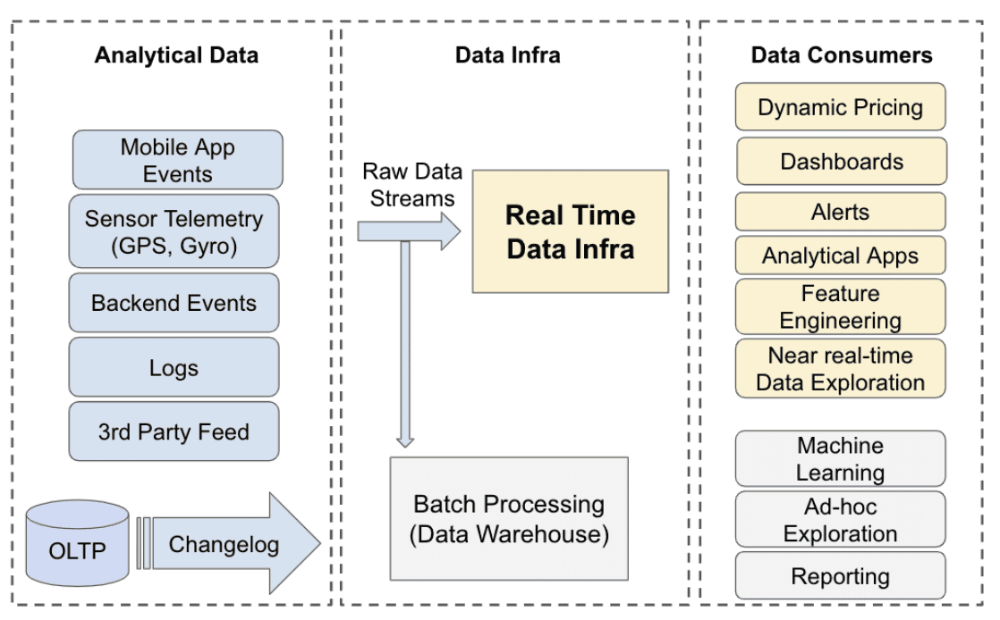

다양한 종류의 analytical data가 여러 region에걸쳐 data center로 들어온다. 이 raw data stream들은 모든 분석에서 source of truth로 쓰인다. 대부분 stream들은 batch processing으로 archived되고, warehouse로 ingest되고, machine learning이나 ad-hoc query등의 usecase에서 쓰인다. real time data infra는 data stream이 dynamic pricing, intelligent alerting, operational dashboard등의 다양한 mission critical usecase에 활용되도록 processing을 한다.

## 2 Requirements

introduction에서 나온 각 usecase category마다 각각 realtime data infra에 연관된 special requirements가 있다. 여러 requirements들은 일반적으로 아래와같은것들을 포함한다.

- Consistency: financial dashboard같은 mission critical application은 모든 region에 걸쳐 data가 consistent해야한다. 이 말엔 inter-region이나 intra-region 모두에서 data quality 보장 및 deduplication에 대해 data loss가 없어야 함도 포함된다.
- Availability: real time data infra stack은 99.99 percentile을 보장할 수 있는 availability을 가져야 한다. availability loss는 uber의 비즈니스에 직접적으로 영향을 주며 손실을 입힐 수 있다. dynamic pricing은 각 지역의 demand와 supply 비율을 계산하는데에 realtime data infra를 활용하고 ubereats의 배달비용에 영향을 미친다.
- Data Freshness: 대부분 usecase는 초단위 level freshness를 요구한다(무슨의미?). 즉 event나 log가 생성된지 몇초 후에 processing이나 query에 사용될 수 있어야 한다. freshness는 security incident, demand-supply skew, business metric alert같은 상황에 대해 즉각 대응하는것을 보장할 수 있어야 한다.
- Query Latency: 일부 usecase는 raw data stream에 대해 query를 수행할 수 있어야하며, p99 query latency가 1초이내여야 한다. ubereats restaurant manager 툴같은 external analytical tool은 각 페이지 로딩에 대해 여러 analytical query를 실행시킨다. 각 query는 user들의 경험을 위해 빠른 속도로 query result를 보여줘야 한다.
- Scalability: raw data stream은 모든 리전에서 하루에 몇 petabytes만큼의 data를 만들어낸다. data는 Uber의 성장이나, 새 비즈니스, 새로운 analtycis usecase가 생김에 따라 지속적으로 증가하고 있다. 증가하는 dataset에 대해 유저가 processing pipeline을 재설계하지 않고도 seamless하게 scale할수 있는것은 realtime data infra stack에서 가장 중요한 요구사항이다.
- Cost: Uber는 마진이 낮은 비즈니스이다. 따라서 data processing이나 service이 저렴한 비용이고, 높은 operational efficiency를 가져야한다. 이것은 memory에 저장하는 data size, tiered storage, pre-materialization vs runtime computation등의 설계에 영향을 미친다.
- Flexibility: 다양한 user group을 위해 programmatic이나 sql like interface를 제공해야 한다. 일부 usecase는 semi-stateful하고 지속적으로 result를 던져주는 push-based model을 필요로 하고, 다른 usecase는 raw data stream에서 유저가 query를 실행할 수 있는 pull-base model을 필요로 한다. 유저는 push-based stream processing pipeline으로 business rule에 대한 intelligent alert을 만들 때도 있고, 같은 dataset에대해 pull-base sql interface로 dashboard등의 작업을 할수도 있다.

같은 usecase에 대해 모든 requirements를 보장하는것은 불가능하다. dynamic pricing usecase의 경우, uber의 스케일에선 CAP theorem에 의해 consistency와 freshness(availability)를 동시에 보장할 수 없다. 하지만 business impact를 최소화 하기 위해 consistency보다 freshness를 우선할 필요가 있다. 결과적으로 이 usecase를 만들기 위해 선택한 각각의 레이어는 consistency보다 Freshness를 우선시하도록 튜닝되어야 한다. 이런 tradeoff는 Usecase Analysis 섹션에서 설명할것이다.

## 3 Abstractions

- An abstraction of the real-time data infrastructure and the overview of the components

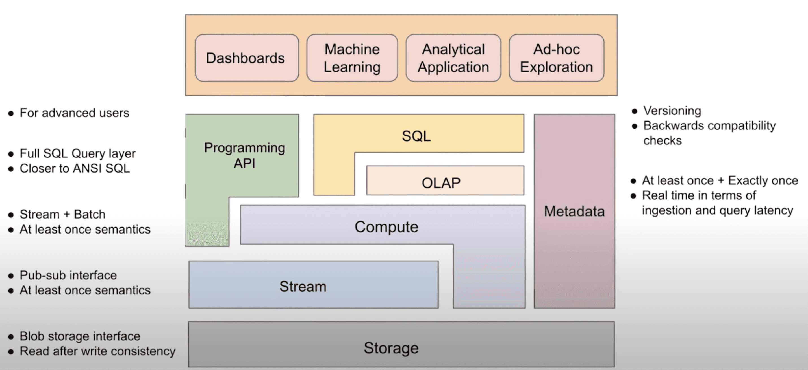

- **Storage**(HDFS): read-after-write consistency를 보장하는 generic object, blob storage interface를 제공한다. storage laye는 high write rate에 최적화되어야 하며, long term storage로 사용된다. read는 write보다 덜 발생하고, OLAP table / stream의 bootstrapping이나 data backfill등에 사용된다
- **Stream**(Kafka): publish-subscribe inetrface를 제공한다. stream layer의 유저는 특정 stream이나 topic에 대해 event를 만들 수 있고, stream을 subscribe하는 유저는 event를 한번에 한 event씩 consume할 수 있다. stream layer는 R/W low latency를 가져야하며, data partitioning, producer와 consumer간 at least once semantic을 보장해야하는 요구사항이 있다.
- **Compute**(Flink): stream이나 storage layer에서 arbitrary computation을 수행한다. stream에서 computing을 할때는 각 event에 대해 processing이 일어나고, storage에서는 batch단위로 computing한다. 중요한것은 어떤 computing에 대해 stream(event)이나 storage(batch)를 선택 할 수 있다는 점이다. stream, storage 중 한개만 선택한다면 higher layer에게 더 간단한 abstraction을 보여줄 수 있지만, 구현하기에 더 큰 복잡도를 만든다. 반면에 두개 모두를 선택하는건 개별 component가 feasible하지만, higher layer에게 federation작업을 위임하게 된다. compute layer의 요구사항은 data source와 sink에 대해 at least once semantic을 보장하는 것이다.
- **OLAP**(Pinot): stream과 storage에서 오는 data에 대해 제약이 있는 SQL(join 없음, udf 제한) 을 제공한다. OLAP layer는 filter, aggreagation, groupby, orderby같은 analtyical query를 high throughput, low latency로 처리해야 한다. 대부분의 usecase에서 OLAP layer는 다른 source에서 들어오는 data에 대해 at least once semantic을 보장해야 한다. 주요 usecase중 일부는 PK에 대해 exactly once data ingestion을 보장해야 한다.
- **SQL**(Presto): comput와 OLAP layer 위에서 full SQL query를 제공한다. compute layer를 사용할땐 SQL이 stream이나 storage layer에서 쓸 수 있게 compute function으로 컴파일 된다. OLAP layer를 사용할땐 OLAP의 limited SQL 위에서 갭을 메우기 위해 추가적인 processing을 수행한다 (join or UDF?). 대부분 realtime OLAP DB는 join에 대해 제약이 있는데 이것을 SQL layer에서 해결해준다. join은 lower layer에서도 수행될 수 있고 (compute layer에서는 pre-materialization), 추가적인 processing없이 OLAP layer에서 제공할 수 있지만, 더 높은 비용이 든다. SQL layer는 stream processing에 적합한 extension(window function 같은것들)이 포함된 ANSI SQL에 가까운 SQL semantic을 제공해야 한다.
- **API**: high layer application을 위해 stream에 접근하거나 compute function을 쓰는등의 code를 제공한다. 밑의 layer에서 선택한 technology들이 API의 simplicity에 직접적으로 영향을 미치는것을 염두해야 한다.
- **Metadata**: 다른 모든 layer에 대한 metadata를 관리하고 제공한다. 예를들면 storage와 stream에서 관리되는 structured data에대한 schema가 저장된다. metadata layer는 metadata에대한 versioning과 version간 backward compatibility check를 지원해야 한다

## 4 System Overview

- Overview of the real-time data infrastructure at Uber

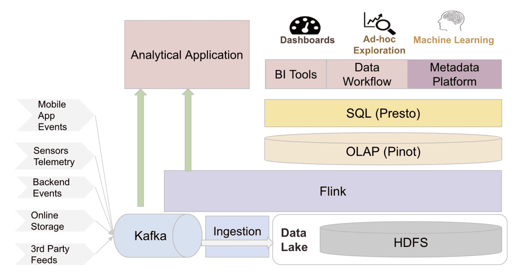

### 4.1 Apache Kafka for streaming storage

Kafka는 industry에서 널리 쓰이는 distributed event streaming system이다. Uber는 2015년에 Kafka를 도입하였다. confluent가 만든 [benchmark report](https://www.confluent.io/blog/kafka-fastest-messaging-system/)에서 Kafka, Pulsar, RabbitMQ를 production에서 system throughput과 latency를 비교했다. 성능 외에도 operational simplicity, opensource community, 업계 선호도등에서 kafka가 명백한 우위를 점하고 있다.

Uber는 kafka를 큰 스케일로 쓰는 곳들중 하나이다. streaming data를 batch/realtime으로 전송하는 메커니즘으로서, Kafka는 rider/driver app에서 event propagation, streaming analytics platform(samza, flink), streaming db changelog, 모든 data를 datalake로 수집 등의 다양한 workflow를 지원한다.

#### 4.1.1 Cluster Federation

[Kafka Cluster Federation at Uber](https://www.confluent.io/kafka-summit-san-francisco-2019/kafka-cluster-federation-at-uber/)

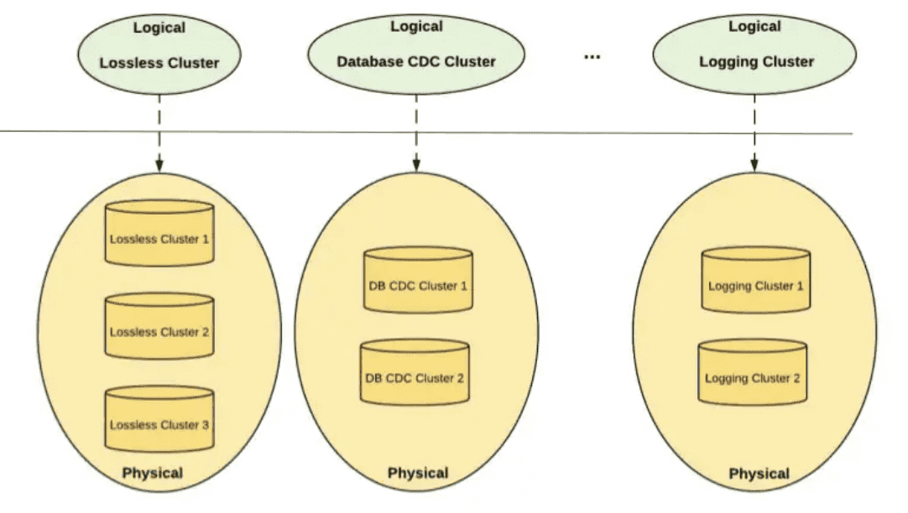

Availability를 높이고, silger cluster failure에도 문제가 없도록 하기 위해, producer와 consumer로부터 cluster detail을 숨기는 federated kafka cluster setup을 만들었다. 유저는 어떤 topic이 어떤 cluster에 존재하는지 알 필요없이 logical cluster만 보면 된다. metadata server는 cluster와 topic의 metadata를 한곳으로 aggregate하여 client의 request를 phsical cluster로 라우팅 한다. cluster federation은 reliability 뿐만아니라 scalability도 향상시킨다. 경험적으로 한개 cluster 크기는 150미만의 node를 가지면 최적의 성능이 나왔다. federation을 통해 kafka는 cluster에 node가 꽉찰때 cluster들을 더 추가하는 것으로 horizontal scale이 가능했다. 새 Topic은 새로 추가된 cluster에 자연스럽게 들어간다. 또한 cluster federation은 topic management를 쉽게 해준다. Uber는 많은 수의 application과 client가 있어, live consumer가 있는 상태에서 cluster간에 topic을 migrate하는게 어렵다. 일반적으로 migration은 traffic을 새 cluster로 옮기는 manual coordination이 필요하므로 job을 재시작해야하지만 cluster federation은 application 재시작 없이 consumer traffic을 다른 physical cluster로 redirect 할 수 있다

#### 4.1.2 Dead Letter Queue

[Building Reliable Reprocessing and Dead Letter Queues with Apache Kafka](https://eng.uber.com/reliable-reprocessing/)

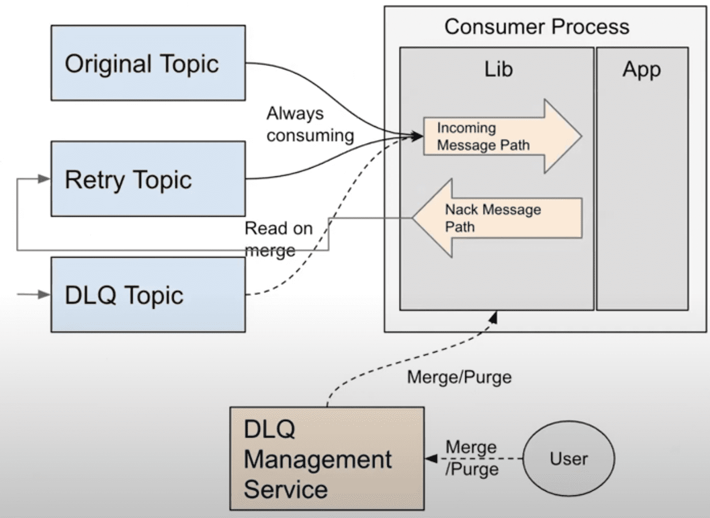

일부 message는 downstream application이 처리하다 fail이 발생한다. Kafka에선 failed message를 핸들링할 두가지 방법이 있다. message를 버리거나, 그 다음 message를 blocking하게 만드는 무한한 재시도이다. 그러나 Uber 로직의 대부분은 data loss와 blocked processing을 허용하지 않는다. 이런 usecase를 해결하기 위해 도입된 것이 Kafka interface 위에 구현된 Dead Letter Queue strategy이다. topic consumer가 몇회 재시도를 해도 message를 처리하지 못하면, 이 message는 dead letter topic으로 publish된다. dead letter topic의 message는 유저의 선택에 따라 버려지거나 retry된다. DLQ를 통해 unprocessed message는 격리되고 live traffic에 영향을 끼치지 않는다.

#### 4.1.3 Consumer Proxy

[Introducing Chaperone: How Uber Engineering Audits Apache Kafka End-to-End](https://eng.uber.com/chaperone-audit-kafka-messages/)

- Overview of the Kafka Consumer Proxy at Uber

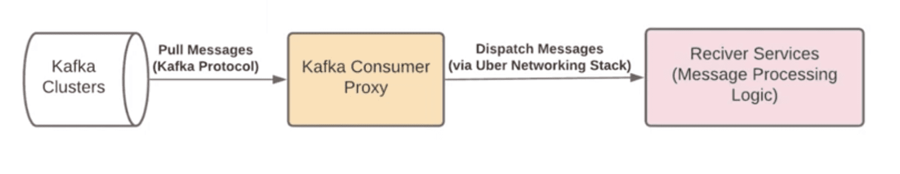

Kafka는 batch나 compression의 정교한 로직이 구현된 consumer library를 제공한다. 이런 client-side optimization이 consumer throughput을 향상시켜줘도, Uber와 같은 scale에서는 여전히 client management가 큰 챌린지이다. 몇만개의 kafka application이 동작하는 상황에서 유저의 디버깅을 지원해주는건 굉장히 어렵다. 모든 application에서 client library를 업그레이드 하는데 몇달이 걸리므로 개발 속도도 느려진다. 또한 많은 개발 언어를 쓰고있는데 client가 점점 복잡해지면 multi language support가 불가능하고, kafka architecture의 제약때문에 consumer group의 instance 수는 topic partition 갯수 이하로 제한하므로 consumer paralleism이 제약이 된다.

이 문제를 해결하기 위해 모든 pub/sub usecase에 대해 Kafka로부터 message를 받아서 user가 만든 grpc service endpoint로 찌르는 proxy layer를 만들었다. consumer library의 복잡도는 proxy layer안으로 encapsulate되고, application은 machine-generated gRPC client만 적용하면 된다. 특히 consumer proxy는 정교한 error handling을 지원한다. downstream service가 message를 처리하는데 실패하면 consumer proxy는 재시도를 하고 계속 retry가 실패하면 DLQ로 message를 보낸다.

Consumer proxy의 다른 이점은 message polling에서 push based message dispatch로 delivery mechanism을 바뀐다는 점이다. Uber에서 대부분 pub/sub usecase는 message간 dependency가 없는 가정에서 동작한다. 따라서 push based dispatching mechanism은 낮은 latency overhead가 있지만 느린 consumer들의 parallelism을 높여서 comsumption throughput을 크게 향상시킬 수 있다. 또한 Kafka consumer group size 이슈로부터 자유로워지고, application에게 더 많은 concurrent processing을 제공할 수 있다.

#### 4.1.4 Cross-Cluster Replication

[uReplicator: Uber Engineering’s Robust Apache Kafka Replicator](https://eng.uber.com/ureplicator-apache-kafka-replicator/)

Uber는 여러 data center에서 많은 kafka cluster를 운영하고 있고 cross-cluster replication이 필수적이다. 첫번째로 다양한 usecase에서 data에 대한 global view가 필요하다. 예를들어 trip에 대한 business metric을 계산하기 위해 모든 data center에서 data를 모으고 한곳에서 분석해야 한다. 두번째로 kafka는 cluster나 datacenter failure에서도 tolerate하기 위해 redundancy를 가지고있어 replication이 필요하다. Uber는 replication을 위해 robust/performant하게 kafka cluster들을 replicate하는 [uReplicator](https://eng.uber.com/ureplicator-apache-kafka-replicator/)를 만들었다. uReplicator는 높은 reliability와 elasticity를 가지도록 설계했다. uReplicator는 rebalnacing algorithm을 가지고 있어 rebalancing을 할때 영향받는 topic partition이 최소화된다. 또한 uReplicator는 workload에 적응한다. burst한 상황에서 elasticity를 위해 worker에게  로드를 재분배 할 수 있다.

[https://eng.uber.com/chaperone-audit-kafka-messages/](https://eng.uber.com/chaperone-audit-kafka-messages/)

또한 cross cluster replication에서 data loss가 없도록 보장하기 위해 end-to-end auditing service인 [Chaperone](https://eng.uber.com/chaperone-audit-kafka-messages/)을 만들었다. Chaperone은 replication pipeline에서 모든 stage마다 tumpling time window에서 unique message 갯수같은 주요 통계를 수집한다. 이 auditing service는 통계를 수집하고 mismatch상황이 생기면 alert을 생성한다.

위와 같은 방식을 통해 Uber는 Kafka위에 다양한 usecase에서 realtime으로 활용할 수 있는standardized, reliable한 stream messaging platform을 구축했다.

### 4.2 Apache Flink for Stream Processing

kafka에서 들어오는 모든 realtime data를 processing하기 위해서, Uber는 Apache Flink위에 stream processing platform을 구축했다. Apache Flink는 업계에서 널리 사용되는 high throughput, low latency인 distributed stream processing framwork이다. Uber에서는 아래와같은 이유로 Flink를 도입했다

1. 내장된 state management와 failure recovery를 위한 checkpointing feature가 내장된 많은 workload를 지원한다.
2. scale하기 쉽고, kafka lag이 발생했을때 back-pressure에서 효율적으로 동작한다.
3. open source community가 크다.

2016년에 Uber에서 비교한 Storm, Spark, Samza, Flink중 Flink가 가장 나은 선택인것으로 확인했다. Storm은 수백만개 backlog message의 backpressure상황에서 복구하는데 몇시간이 걸리지만, Flink는 20분밖에 걸리지 않았다. Spark는 같은 workload에서 Flink 대비 5~10배의 메모리를 썼다. Samza는 Kafka에 internal state를 유지하기 위해 strick dependency가 있어 큰 operational overhead를 만들 수 있다.

Uber는 Flink를 customer product를 위해 쓰거나, 각 도시의 시장 상황부터 전사적인 재무 추정까지 다양한 데이터에서 생기는 insight를 위한 internal analytics에 사용한다. stream processing logic은 유저에 의해 SQl dialect나 low level API로 표현된다. SQL dialect는 비개발, 개발 모든 직군에서 사용된다. 일부 개발직군에서는 DB나 RPC endpoint, cache등과 연결하는등 복잡한 로직을 표현하기 위해 API를 사용한다. Flink에서 더 많은 usecase를 지원하기 위해 여러가지 기능들을 개발하였다.

#### 4.2.1 Building Streaming Analytical Applications with SQL

[Introducing AthenaX, Uber Engineering’s Open Source Streaming Analytics Platform](https://eng.uber.com/athenax/)

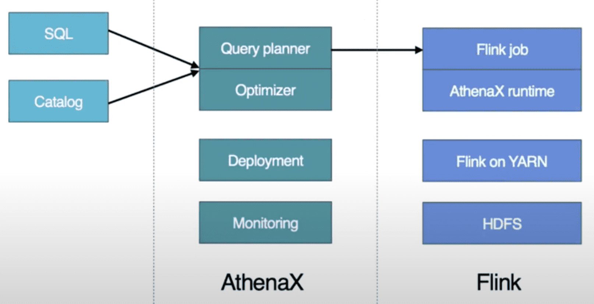

Uber는 Flink framework에 FlinkSQL을 만들었다. FlinkSQL은 Apache Calcite SQL query를 efficient Flink job으로 변환해준다. SQL processor는 query를 reliable, efficient, distributed Flink application으로 컴파일하고, application의 전체 lifecycle을 관리하여 유저가 비즈니스 로직에만 집중하도록 해준다. 내부적으로 FlinkSQL은 SQL query를 logical plan으로 변환하고, query optimizer를 수행시킨 뒤, Flink job으로 변환될 수 있는 physical plan을 생성한다. 따라서 유저들은 production에서 streaming processing application을 scale에 관계없이 몇시간내에 실행시켜 볼 수 있다.

이와같은 internal detail이 유저로부터 숨겨지는것은 큰 trade off이다. 모든 유저들이 input kafka topic같은 datasource와 sql syntax에대해 이해해야하기때문에 Flink를 활용하는것을 쉽게 만들지만, production job을 유지보수 해야하므로 platform team에게 operational overhead를 크게 증가시킨다. 특히 아래와 같은 문제들을 극복해야 했다

- **Resource estimation and auto scaling**
cpu와 memory같은 resource configuration은 job healty와 cost efficiency에 매우 중요하다. Uber에서는 job type과 resource requirements에 대해 상관관계를 분석하였다. 예를들어 aggreagation window를 유지하지 않는 stateless flink job은 cpu bound 이고, stream-stream joinb job은 거의 memory bound이다. 또한 job load는 peak일때와 아닐때의 차이가 매우 컸다. cluster utilization을 극대화 하기 위해 Uber는 job load와 GC통계를 모니터링하고, 필요시 auto scaling을 수행한다
- **Job monitoring and automatic failure recovery**
end user는 flink job의 내부와 상태에 대해 알지 못하므로, platform team은 job을 모니터링하고 strong reliability를 보장해야한다. 이를 위해 job failure에 대해 자동적으로 처리하는 component를 만들었다. 이건 resource usage같은 flink job의 key metric이 타겟 범위에 속하는지 비교하고, 멈춘 job을 restart하거나 auto scaling등의 적절한 액션을 수행하는 rule based engine이다.

FlinkSQL은 presto같은 batch processing SQL system과는 다른 semantic을 가지고 있다. FlinkSQL은 input과 output이 unbounded stream인 streaming process engine이다. 반면에 batch processing engine은 boudned dataset에대해 쿼리를 하고 output또한 bounded dataset이다. FlinkSQL의 futurework들중에는 streaming과 batch semantic을 통합시키는것이다.

#### 4.2.2 Unified Architecture for Deployment, management and Operation

[Building Unified Streaming Platform at Uber](https://www.youtube.com/watch?v=NJFM8dbsj6M)

- The layers of the Unified Flink architecture at Uber

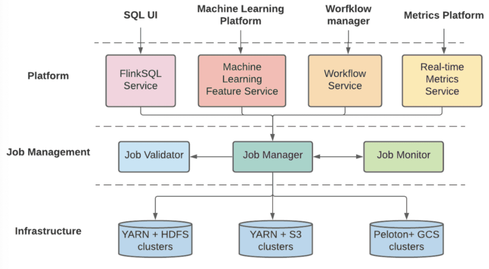

streaming processing pipeline을 만들고 매니지 하기위해 유저들에게 두개의 platform을 제공하기 떄문에, Uber는 두 시스템의 공통점을 찾아내고 deployment, management, operation을 위해 unified architecture로 합쳤다. 새 unified platform은 여러 다른 챌린지들을 해겨했고, layered architecture에서 더 나은 exensibility와 scalability를 만들었다.

- **Platform layer**는 비즈니스 로직 구성과 maching learning feature training, workflow management, sql compilation같은 external platform과의 연결되는 역할을 한다. Platform layer는 여러 business-specific component로 구성되고 쉽게 새로운 비즈니스 요구사항에 확장될 수 있다. 또한 specific business logic을 standard Flink job definition으로 변환해주고 validation과 management를 위해 다음 layer에 flink job definition을 전달한다.
- **Job management layer**는 validation, deployment, monitoring, failure recovery같은 Flink job의 lifecycle을 관리한다. 또한 platform layer를 에게 Start/Stop/List job같은 unified API abstraction으 제공하고, state checkpoint와 metadata같은 job에대한 정보를 저장한다. 게다가 job management layer는 physical cluster에게 proxy layer 역할을 하고 job type, importance, priority에 맞추어 job을 전달한다. 마지막으로 job management server의 shared component는 지속적으로 모든 job을 모니터링하고, 일시적인 장애들부터 자동적으로 Recover를 수행한다.
- **Infrastructure Layer**는 compute cluster와 storage backend로 구성된다. hosting infra가 on-prem인지 cloud인지에 관계없이 flexibility와 extensiblility를 위해 phsical resource에 대한 abstraction을 제공한다. 예를들어 compute cluster가 YARN과 [Peloton](https://eng.uber.com/resource-scheduler-cluster-management-peloton/)같은 다른 resource scheduler를 쓸 수도 있고, storage backend또한 HDFS, S3, GCS등을 state checkpoint로 쓸수도 있다.
[Peloton: Uber’s Unified Resource Scheduler for Diverse Cluster Workloads](https://eng.uber.com/resource-scheduler-cluster-management-peloton/)

이를 통해 Flink는 Uber에서 널리 쓰이는 stream processing platform이 되었고, 1년마다 job들이 30%씩 늘어나고 있다. user feedback에 따라 stream processing platform에서 현재의 챌린지는 추가적인 코드작성 없이 seanless data backfill을 해주는 것이다. 또한 주요 usecase는 Flink community에서 활발히 논의도고 있는 영역인 Flink job이 downtime없이 restart 되는 것이다.

### 4.3 Apache Pinot for OLAP

Apache Pinot은 terabytes 스케일의 데이터에서 low latency의 분석 쿼리를 수행하는 open source, distributed, OLAP system이다. Pinot은 Lambda Architecture에서 real-time과 offline data에 대해 fererated view를 보여준다. column store로서 Pinot은  low latency로 OLAP 쿼리를 처리하기 위해 inverted, range, sourted, startree index 같은 여러가지의 빠른 indexing technique을 지원한다. Pinot은 분산 환경에 있는 큰 테이블들을 쿼리하기 위해 scatter-gather-merge approach를 차용했다. data는 time boundary로 chunk 되어있고, 몇개의 segment로 그루핑된다. 쿼리처리과정은 처음에 여러 sub-plan으로 쪼개지고, 각 sub-plan은 distributed segment에서 병렬적으로 수행된다. 그리고 result들은 aggregate되고 마지막 한개의 결과로 merge된다.

Uber는 Apache Pinot을 OLAP solution으로 채택했다. 2018년에 OLAP solution에서 다른 옵션은 ElasticSearch와 Druid였다. 사내에서 실험한것과 다른 리서치들을 바탕으로 Apache Pinot이 더 적은 memory와 disk footprint를 가지면서도 훨씬 낮은 query latency SLA를 가지는 것을 보았다.

- ElasticSearch: 같은 양의 data를 Elasticsearch와 Pinot에 넣었을때, Elasticsearch의 memory는 4배, disk는 8배더 많이 썼다. 게다가 filter, aggregation, group by, orderby query에서 ElasticSearch의 query latency는 Pinot에 비해 2~4배 더 길었다.
- Apache Druid: Pinot은 Druid와 비슷한 architecture를 가졌지만, data access를 줄이기 위해  bit compressed foreward indices 최적화된 data structure를 가진다. 또한 빠를 쿼리를 위해 startree, sorted/range index 특별한 index들도 사용하여 아주 큰 query latency 차이를 만들어낼 수 있다. 최근의 연구에서도 Druid보다 Pinot이 성능에 이점이 있음이 확인되었다
[Comparison of the Open Source OLAP Systems for Big Data: ClickHouse, Druid, and Pinot](https://leventov.medium.com/comparison-of-the-open-source-olap-systems-for-big-data-clickhouse-druid-and-pinot-8e042a5ed1c7)
[Real-time Security Insights: Apache Pinot at Confluera](https://medium.com/confluera-engineering/real-time-security-insights-apache-pinot-at-confluera-a6e5f401ff02)

Uber에서 Pinot은 많은 realtime analytics usecase에 활용된다. 다양한 product에서 Pinot을 통해 customize dashboard를 구축한다. 또 다른 케이스는 많은 backend server에서 analytical query를 실행하는 것이다. 이런 usecase에서 주로 구분되는 요구사항은 realtime을 필요로하는 data freshness와 query latency이다. 예를들어 rider cancellation을 식별하는 것들은 빠르게 적절한 action을 취해야 한다. Uber가 가진 high availability, rich query support, exactly once semantic(upsert)에 대한 requirement를 충족시키기위해 Pinot에 contribute했다.

#### 4.3.1 Upsert Support

[Upsert and JSON Indexing in Apache Pinot](https://youtube.com/watch?v=CnSnLKQLuXc)

Upsert는 승차 요금을 수정하거나 delivery status를 업데이트 하는 등, Uber의 많은 Usecase에서 공통적인 요구사항이다. Uber는 Pinot에서 scalable upsert를 구현하여 record가 realtime ingestion에서 update될수 있도록 했다. Pinot은 유일하게 upsert를 지원하는 open source realtime OLAP store이다. upsert의 가장 중요한 챌린지는 같은 PK에 대해 record location을 트래킹하는 것이다. realtime system에서 distributed storage node에서 중앙화된 방식으로 record location을 트래킹하는것은 복잡하고 비효율적이다. 이를 위해 input stream을 primary key마다 multiple partition으로 만들고 여러 node에 파티션단위로 분산시킨다. 그 결과 같은 PK를 가지는 모든 레코드는 같은 node에 할당된다. 또한 query result의 integrity를 보장하기 위해 같은 partition의 segment를 통해 subquery를 같은 node로 보내는 routing strategy를 만들었다. 이런 방식들은 Pinot이 shared-nothing solution을 채택하도록 했다. 이 shared-nothing solution은 scalability, SPOF, operation등 많은 이점을 가진다.

#### 4.3.2 Full SQL Support

[Engineering SQL Support on Apache Pinot at Uber](https://eng.uber.com/engineering-sql-support-on-apache-pinot/)

Pinot은 여러 indexing technique을 지원하면서 low latency로 쿼리를 수행하는데 뛰어난 OLAP DB이다. 그러나 Pinot은 subquery나 join같은 SQL feature를 지원하지 않았다. 따라서 Uber는 Pinot table에 PrestoSQL query를 수행시키기 위해 Presto를 Pinot과 통합했다. Presto는 Uber에서 interactive query를 위한 query engine으로 널리 쓰이고 있었다. 복잡한 쿼리에 대해서 Pinot의 second level freshness와 Presto의 flexibility의 이점을 합치게 되었다. 게다가 predicate pushdown과 aggregation function pushdown은 이전에 HDFS/Hive에서는 불가능했던 sub-second query latency를 만들어주었다.

#### 4.3.3 Integration with the rest of Data ecosystem

모든 product이 빠르게 발전하는 상황에서 engineering productivity와 development velocity는 중요하다. 이 관점에서 seamless한 유저경험을 보장시키기 위해, 많은 시간을 Pinot과 다른 data ecosystem을 통합시키는데 시간을 썼다. Pinot은 input Kafka topic으로부터 스키마를 자동적으로 추론하고, sampling된 message의 cardinality를 추정하기 위해 Uber의 schema service와 통합됐다. 또한 Pinot은 data sink로 FlinkSQL과 통합되어 유저들이 간단히 SQL 변환 쿼리를 만들고 output message가 Pinot으로 push되게 했다. 비슷한 integration을 Spark를 통해 hive dataset을 pinot offline table로 만들기 위해 data workflow management system인 Piper에도 반영했다

[Piper: Managing Uber’s Data Workflows at Scale](https://eng.uber.com/managing-data-workflows-at-scale/)

#### 4.3.4 Peer-to-peer Segment Recovery

Apache Pinot의 original desgin은 HDFS, S3, GCS등과같은 external archive나 segment store에 대한 strict dependency를 가지는것이었다. realtime data ingestion에서 완성된 segment는 장애시에 복구를 위해 이런 segment store로 synchronouse하게 백업되어야만 한다. 게다가 이 backup은 single controller를 통해 완료됐다. 이런 지점은 당연히 scalability bottlenec이 되고 data freshness violation을 만들었다. 또한 segment store failure는 모든 data ingestion이 멈춰서는 문제를 일으킨다. Uber의 platform team은 failure에서도 archived segment를 서빙할 수 있는 server replica에서 동작하는 asynchronous solution을 구현했다. 따라서 중앙화된 segment store를 peer-to-peer scheme으로 바꾸면서도 같은 data/query consistency를 보장한다. 또한 single node backup bottleneck문제도 해결하고, 전체적인 data freshness도 크게 향상되었다.

이런 향상을 통해 Uber에서 Pinot은 널리 쓰이게됬고, Pinot이 적용된지 2년만에 수십기가의 data에서 수백테라의 data로 커졌고, query workload는 초당 수백개에서 수만개로 늘어났다. 하지만 여전히 해결해야할 챌린지들이 있다.

- **Ability to perform low latency joins**: 현재 join은 presto에서 pinot과 hive의 query execution을 합치는 방식으로 동작한다. 그러나 presto worker에서 inmemory로 처리되므로 중요한 usecase에서 동작되지 않는다. 일반적으로 사용되는 dimension table과 join을 지원하기 위해 Pinot에서 lookup join을 만들고 있다.
- **Semistructured (e.g. JSON) data support**: 유저는 nested json format으로 된 input kafka topic을 Pinot ingestion을 위해 flattend schema kafka topic으로 preprocess하는 flink job에 의존한다. 따라서 현재 Pinot이 ingestion과 query에서 JSON을 지원하기 위해 contribute하고있다.

### 4.4 HDFS for archival store

Uber는 long term storage로 HDFS를 쓰고 있다. kafka의 대부분 data는 avro format이고 HDFS에 raw log로 저장되고 있다. log들은 compaction을 통해 long term parquet data로 합쳐지고 Hive, Presto, Spark와 같은 processing engine에서 사용할 수 있다. 이 dataset은 모든 analytical data의 source of truth가 된다. Kafka와 Pinot, OLTP, key value store에서 백필할때에도 사용된다. 또한 HDFS는 다른 platform에서 자체 persistent storage를 관리할때도 사용한다. Flink는 job checkpoint를 저장할때 HDFS를 사용하는데,  input stream offset과 container마다 flink job interanl state의 snapshot과 저장된다. Pinot은 HDFS를 failed replica를 수정하거나 bootstrap시점에 사용하기 위한 long term segment archive로 사용한다.

### 4.5 Presto for Interactive Query

예전부터 Hive와 같은 big data ecosystem의 distributed SQL query engine은 query latency나 ingestion보다 query flexibility에 무게를 둔 batch dataset을 프로세싱하는데 사용되었다. 하지만 최근 interactive analytics workload에 대해 더 빠르게 insight를 도출해내는 요구가 증가하고있으며 Uber는 interactive query engine으로 presto를 도입하였다. Presto는 facebook이 만든 open source distributed query engine이다. Presto는 large scale dataset에서도 빠른 analytical query를 목표로 설계되었다. Massively Parallel Processing(MPP) engine과, 모든 computation을 in-memory로 처리하여 disk write를 만드는 materialization overhead를 줄이는것으로 빠르게 analytical query를 처리한다.

게다가 Presto는 flexible, extensible하다. Presto는 Hadoop이나 RDBMS, NoSQL등의 datasource에 연결할 수 있는 high perforamnce I/O를 가진 Connector API를 제공한다. Uber에서는 data scientist, engineer가 feature나 model의 sensitivity를 높이기 위해 realtime data를 들여다보길 원하는데, Presto의 connector model과 Pinot connector를 만들어서 fresh data에 대해 standard Presto SQL이 실행되도록 만들었다. Pinot connector를 만들면서 생겼던 챌린지는 physical plan의 어떤 부분을 Pinot layer로 push down할수 있는지를 intelligent하고 selective하게 만드는 것이었다. Pinot connector의 첫번째 버전은 limited connector API에서 predicate pushdown만을 포함시켰다. query latency를 낮추고 Pinot의 fast indexing을 활용하기 위해서, Presto query planner를 수정했고 Presto Connector API를 확장하여 projection, aggregation, limit같은 많은 operator들을 최대한 push down할 수 있게 만들었다.

## 5 Usecase Analysis

이 섹션에서는 Uber의 production에서 아래 그림에 표현된 4개 카테고리 (Dashboard, ML, Analytical Application, Adhoc Exploration)의 real time usecase에 대해 보여주고, 어떻게 여러 system을 활용해서 비즈니스 목표를 달성했는지 설명할것이다.

- The components used by the example usecases

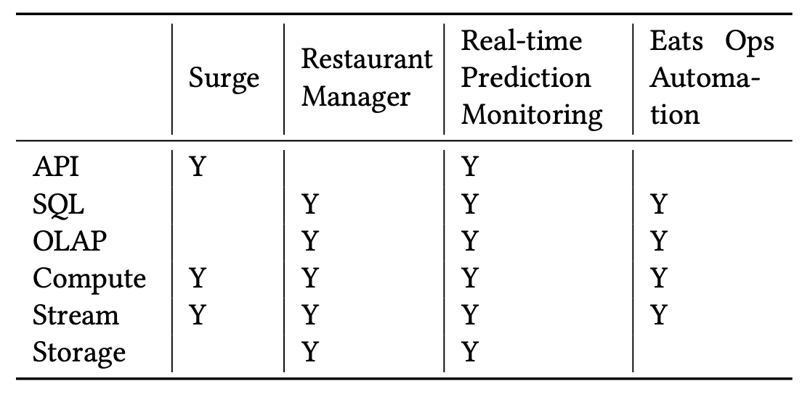

### 5.1 Analytical Application: Surge Pricing

[Driver Surge Pricing](https://arxiv.org/abs/1905.07544)

surge usecase는 Uber의 ride-hailing 시장에서 수요공급의 밸런싱을 하는 dynamic pricing mechanism이다. Demand side(Rider)에선 surge pricing은 available drvier를 맞추기 위한 수요를 줄이고 시장의 안정성을 유지시켜준다. Supply side(Driver)에서 surge pricing은 driver가 적절한 시간과 지역에 가도록 해주며, surge동안 더 많이 돈을 벌게 해준다.

Surge pricing은 time window에 따른 trip data, rider, driver status 를 바탕으로 지역당 pricing multipler를 계산하기 위한 필수적인 streaming pipeline이다. surge pricing pipeline은 kafka에서 streaming data를 받아오고 Flink를 통해 복잡한 ML based algorithm을 수행하고, 빠르게 lookup하기 위해 result를 KV store에 저장한다. Surge pricing은 consistency보다 freshness와 availability가 우선시된다. late-arriving message는 surge computation에 사용되지 못하며, surge pipline은 time window당 매우 짧은 processing time SLA를 가져야 한다.  Kafka는 high throughput이지만 loss를 허용하고, high available하기 위해 active-active setup을 쓰고있어서, surge pricing pipeline의 요구사항을 충족하므로 Kafka를 주로 활용하고 있다.

### 5.2 Dashboard: UberEats Restaurant Manager

dashboard는 트렌드를 보거나 anomaly를 확인하기 위해 많이 쓰인다. Uber에서는 많은 팀이 real-time analytics system을 활용하여 customize dashboard를 만든다. 그중 UberEats restaurant manager는 가게사장에게 고객만족도, 인기메뉴, 퀄리티등 주문에 대한 인사이트를 dashboard로 보여준다.

high level 관점에서 retaurante manager는 fresh data와 low query latency가 필요하고 생성되는 query pattern이 고정되어있으므로 높은 flexibility는 필요없다. 이를 위해 query time을 줄이기 위해 많은 레코드에 대해 pre-aggregation index를 가지는 pinot을 사용했다. 또한 Flink에 aggressive filter, partial aggregate, roll up과 같은 preprocessor를 만들어 Pinot의 processing time을 줄이고 latency SLA를 맞췄다. preprocessing을 통해 query flexibility(ad-hoc query)를 희생하고 prcessing의 복잡도를 높여 lower latency를 얻었다.

Flink의 trasnformation time과 Pinot의 query time 사이의 tradoff가 있다. transformation time동안의 preprocessing은 최적화된 index를 만들 수 있고, serving할 data 양을 줄일 수 있지만, serving layer의 query flexibility가 떨어지게 된다.

### 5.3 Machine Learning: Real-time Prediction Monitoring

[Meet Michelangelo: Uber’s Machine Learning Platform](https://eng.uber.com/michelangelo-machine-learning-platform/)

Uber에서 ML은 customer에게 좋은 경험을 제공하기 위해 중요하다. ML model quality를 보장하기 위해 prediction을 모니터링하고 data pipeline이 올바른 data를 전달하는지 보장해야 한다. 이를 위해 realtime prediction monitoring pipeline은 prediction과 data pipeline에서 생성된 observed outcome(또는 label)을 조인해서 지속적으로 모델 정확도에 대한 live measurement를 만들어낸다.

이 usecase의 요구사항은 process되는 data가 높은 volume, cardinality를 가지므로 scalable해야 한다. 수천개의 ML model이 동작하고있고 각 모델마다 수백개의 feature가 있으며, 초당 몇십만개의 timeseries와 몇백만개의 data point가 있어 Uber 내부의 timeseries database로는 감당할 수 없다. Flink의 horizontal scalability 덕분에 metric을 aggregate하고, prediction abnormality를 확인하는 large streaming job을 띄울 수 있었다. 많은 data point에서도 query performance를 높이기 위해 Flink job은 Pinot table처럼 pre-aggregation을 생성한다.

realtime prediction monitoring pipeline은 large scale dataset에 대한 execution time과 throughput을 높이기 위해, Pinot의 preaggregate과 index를 사용하여 real-time OLAP cube를 만드는 usecase이다.

### 5.3 Ad-hoc Explorartion: UberEats Ops Automation

[Introducing UberEATS Restaurant Manager](https://www.uber.com/newsroom/eats-restaurant-manager/)

UberEats 팀은 realtime data에대해 adhoc analytical query를 실행해야 했다. insight가 발견되면 rule based automation framework에서 query를 productionize 해야 했다. 이건 코로나 상황에 대처하고, 다른 지역의 가게를 계속 운영하기 위서 ops team에겐 필수적인 기능이었다. 코로나에 관련한 규정이나 safety rule을 지키기 위해 Uber는 소비자나 배달원의 수를 제한하는것도 필요했다. ops team은 Pinot이 관리하는 real-time data를 presto를 이용하여 metric을 보고, 이런 query들을 automation framework에 적용시켰다.

Automation Framework는 Pinot을 최근 몇분간 특정지역의 통계를 aggregate하고 alert, noti를 배달원, 가게사장님에게 전달한다. 따라서 sd-hoc exploration을 자연스럽게 production 배포로 이어나갈 수 있다. 당연히 이런 Automation Framework는 decision making process가 비즈니스에 매우 중요할 뿐만아니라 customer safety에도 중요하기 때문에, reliable, scalable해야 한다. Pinot, Presto, Flink는 data가 늘어나도 쉽게 scale되고 peak hour에도 안정적으로 동작한다.

## 6 All-Active Strategy

business resilience와 continuity를 제공하는것은 Uber에서 가장 중요한 것이다. disaster recovery plan은 자연재해나 휴먼에러등의 장애로부터 비즈니스 임팩트를 최소화 하기 위해 만들어진다. 우버는 서비스를 보장하기 위해 multi-region strategy를 선택해서 한 region이 unavailable해지면 다른 region에서 실행될 수 있다.

mult-reion realtime archituecture의 근간에는 kafka client들의 data redundancy와 traffic continuation을 제공하는 multi-region kafka setup이 있다. 실제로 uber 기술 스택의 대부분은 active/active setup의 Kafka에 의존한다. 밑의 그림은 surge pricing이 재해 복구 플랜에 active-active Kafka를 사용하는 예시이다. 모든 trip event는 Kafka regional cluster로 전달되고, aggregate cluster로 aggregation된다. 그리고 각 region에서 큰 메모리로 Flink job이 실행된다. 각 region은 update service가 있고 그중 한개는 all-active coordination service에서 primary instance가 된다. primary region의 update service는 active/active database에 surge pricing result를 저장한다.

- The active-active setup for surge pricing

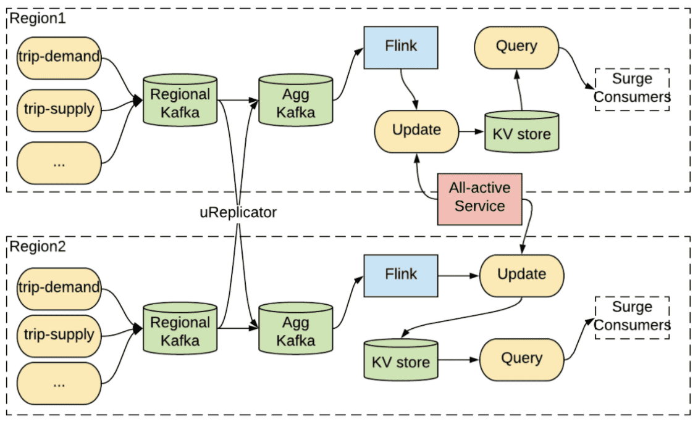

Primary region에 재해가 발생하면, all-active service는 다른 region을 primary로 설정하고 surge pricing 계산을 다른 region으로 복구한다. 여기서 Flink job의 computation state가 region간에 복제를 하기에 너무 크기 때문에 각 region은 aggregate cluster로부터 input message를 받아 다시 연산하는 점이 중요하다. aggregate kafka에서 Flink job으로 들어가는 input이 모든 region에서 consistent하기 떄문에, output state도 동일하다. 이 방식은 각 region에 redundant pipeline을 운영하므로 compute-intensive 하다.

다른 strategy는 Kafka를 active/passive mode로 쓰는것이다. 한 시점에 한 consumer만 primary region으로 설정된 region중 하나의 aggregate cluster에서 consume 할 수 있다. 재해가 발생하면 service는 다른 region에서 복구되고 consumption process를 다시 실행한다. active/passive mode는 payment processing과 auditing같은 strong consistency가 필요한 서비스들에게 적합하다.

- The active-passive setup for stronger consistency

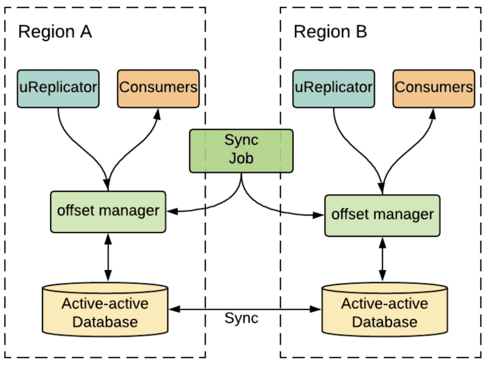

Kafka topic의 offset에 의해 consumption progress가 표현되므로, active/passive strategy는 regionr간 consumer들의 offset synchronization이 큰 챌린지이다. uber의 많은 서비스들이 failover때 data loss를 허용하지 않으므로, 너무 많은 backlog를 파히려고 high watermark (latest message)로부터 재실행 할수도, low watermark(earliest message)로부터 재실행 할 수도 없다. region간 offset sychronization을 해결하기 위해 Uber는 정교한 offset management service를 만들었다. 위의 그림에서 uReplicator가 source cluster로부터 destination cluster으로 message를 복제할때, offset management service는 active-active DB에 source에서 destination으로 offset mapping을 checkpointing한다. 그러는동안 offset sync job은 주기적으로 active-passive consumer를 위해 region간에 offset을 동기화한다. 그래서 active-passive consumer가 한 region에서 다른 Region으로 복구되면, consumer는 최신의 synchronizaed offset을 읽고 consumption을 재개한다.

## 7 Backfill

streaming data를 reprocess하는 일은 여러 이유로 계속 필요할 수밖에 없다. 첫번째로 새 data pipline이 기존 data로 test하거나, 새 ML model이 최근 몇개월간의 data로 트레이닝할때이다. iteration을 빨리 돌리기 위해서 test나 training은 과거데이터를 쓴다. 두번째로 이미 process된 data를 가진 real time application에 버그가 발견된 경우이다. 이 때는 버그를 고친 뒤, 일부 또는 모든 data를 reprocess해야한다. 세번째로 stream processing logic이 바뀐경우에도 과거 data를 reprcoess해야 한다.

- [Big Data: Principles and best practices of scalable realtime data systems](https://www.amazon.com/Big-Data-Principles-practices-scalable/dp/1617290343)
- [Moving from Lambda and Kappa Architectures to Kappa+ at Uber](https://www.youtube.com/watch?v=ExU7fJFw4Bg) ([slideshare](https://www.slideshare.net/FlinkForward/flink-forward-san-francisco-2019-moving-from-lambda-and-kappa-architectures-to-kappa-at-uber-roshan-naik))

Backfill problem은 realtime bigdata processing에서 일반적이다. Lambda, Kappa architecture가 이 문제를 해결하기 위해 도입되었지만 둘다 제약이 있다. Lambda architecture는 batch와 stream processing의 분리된 두 시스템을 운영한다. Lambda는 sync할때 두개의 구현체를 유지해야하는 오버헤드와 consistency issue를 만든다. Kappa architecture는 Lambda의 이슈를 해결하기 위해 realtime과 backfill에서 같은 streaming code를 쓰지만, Kafka에서 log data retention을 유지해야 한다는점과, processing throughput이 낮아진다는 문제점이 있다. Uber가 생성하는 data 양과 node replacement와 같은 operational 이슈를 고려했을때, Kafka retention은 며칠정도만으로 제약 할 수밖에 없다. 따라서 Kappa architecture를 도입할 수 없다.

우버에서는 Flink를 쓰는 stream processing usecase에서 backfill을 쉽게 하기 위한 solution을 만들었는데, 두가지 모드의 operation이 있다.

1. SQL based: 같은 SQL query에 대해 realtime(Kafka)과 offline dataset(Hive)에서 실행될 수 있도록 만들었다. FlinkSQL compiler는 SQL query를 두개의 Flink job으로 만든다. DataStream API와 DataSet API이다. Lambda Architecture와 유사하게 동작하지만 유저는 2개의 job이 아닌 1개의 job만을 사용하게 된다
2. API based: 이 solution은 "Kappa+"라고 부른다. Kappa+ architecture는 Kappa architecture와 같이 stream processing logic을 재사용 할 수 있을뿐만아니라, 직접적으로 Hive와 같은 offline dataset을 읽을 수 있다. Kappa+ architecture는 streaming logic으로 batch data set을 처리하는것으로 여러 issue들을 해결한다. 첫번째는 boudned input의 start/end boundary를 지정하는것, 두번째는 쓰로틀링을 통해 offline dataset의 높은 throughput을 핸들링하는것, 마지막은 offline data가 out of order일 수 있으므로 buffering을 위해 더 큰 window가 필요할 수 있어 job memory를 튜닝하는것이 있다. 가장 중요한건 Kappa+ architecture로 같은 code이지만 간단한 config 변경을 통해 streaming과 batch data source에 대해 실행 할 수 있다는 것이다.

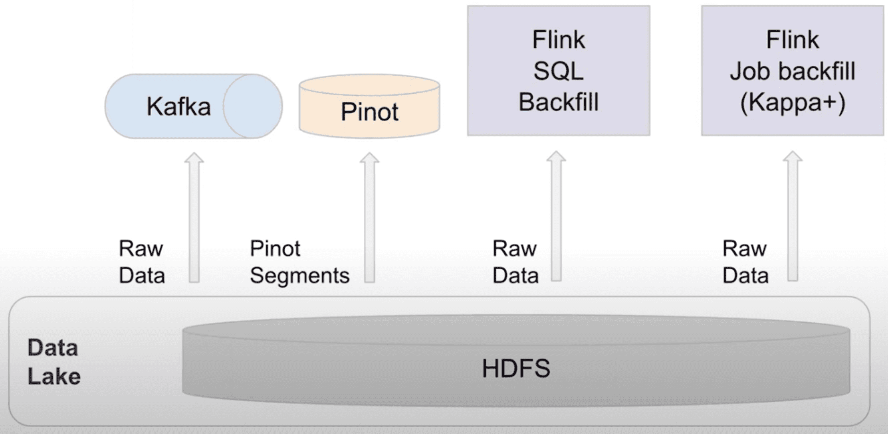

## 9 Lesson Learned

### 9.1 Open Source Adoption

위에서 보여준것처럼 대부분의 realtime analytics stack과 Uber의 data stack은 opensource를 활용한다. Uber의 engineering 니즈는 계속해서 늘어났고 빠른 솔루션을 만들어내는것은 중요하다. open source가 strong foundation을 가지고 있으므로 market에 제품을 내놓는데까지의 시간을 줄일 수 있다.

하지만 문제가 없는것은 아니다. 경험적으로 대부분 open source는 특정 목적을 위해 만들어졌지만, Uber는 넓은 범위의 usecase, language, infra, security등 다차원적인 요소를 고려했을때도 잘 동작해야 한다. 2014년에 Kafka는 log propargation에 주로 쓰이고, Java application위주였다. 따라서 Kafka에 Uber에서 쓰는 Java, Python, Go, NodeJS에서도 동작하게 만들기 위해 RESTful echosystem을 만들어야 했다. 즉 Uber가 가진 throttling mechanism, metadata discovery, client side failure handing등을 만들어야 했다. 또한 uber의 zero data loss 요구사항을 맞추기 위해 core routing과 replication mechanism을 수정했다. container ecosystem이나 security policy에 맞추거나, 비개발직군을 위해 Pinot에서 SQL layer구축이나 Flink를 활용한 seamless backfill등을 수정하기도 했다.

### 9.2 Rapid System Development and evolution

새 비즈니스 요구사항이나, 업계 트렌드, 규제, 성장에 따라 architecture evolution이 생긴다. 그 결과 빠른 소프트웨어 개발이 각 시스템을 빠르고 독립적으로 진화시키게 해준다는 것을 알았다.

Uber는 모든 infrastructure component를 Uber의 CI/CD framework에 통합했다. 이건 open source update를 보장하며 기능이 추가되는것도 staging에서 지속적으로 테스트되고 배포된다. 이건 mission critical application이 end-to-end testing이 되도록하고, production issue를 최소화 한다.

### 9.3 Ease of operation and monitoring

infrastructure scaling은 언제나 어렵다. 빠르게 비즈니스가 성장하는 상황에서 엔지니어링 팀은 계속해서 capacity를 확인하고, node, cluster, datacenter를 추가해야한다. 일반적으로 엔지니어링 팀의 scaling보다 phsyical infrastructure의 scaling 속도가 더 빠르다. 따라서 많은 scaling 수작업이 비즈니스 성장에 맞추어 자동화시킬 수 있다. 실제로 Uber는 자동화에 노력을 쏟았고 system deploy를 제어하기 위한 declaritive framework를 만들었다. 시스템 관리자는 cluster turn up&down, traffic rebalancing같은 작업에 대한 high-level intention을 표현하고, framework는 config 생성, containerization, predifined maintenance workflow같은 테크닉을 통해 engineer의 개입 없이 작업을 수행한다.

Realtime monitoring과 alerting은 system reliability와 business impact를 최소화하는데 중요하다. Uber는 cluster wide monitoring을 위해 Kafka, Flink, Pinot을 쓰는 usecase들에 대해 자동화된 dashboard, alert, chargeback mechanism을 제공한다. 이것은 usecase owner가 healthy를 확인하고 resource를 최적화 할 수 있다.

### 9.4 Ease of User Onboarding and Debugging

- **Data Discovery**: Kafka, Pinot, HIve와 같은 data system의 schema들의 source of truth를 보여주는 metadata repository를 사용하고 있다. 이건 유저가 쉽게 필요한 dataset을 찾게 해준다. 게다가 data lineage도 보여준다
- **Data Auditing**: application에서 생성된 business event들은 micro batch로 audit된다. 이런 각각의 이벤트는 unique id, timestamp, service name등의 metadata가 더 붙게된다. Kafka에서 Flink, Pinot, Hive로 가는 event 에서 위의 metadata는 모든 스테이지에서 data loss, duplication을 트래킹한다.
- **Seamless Onboarding**: application log에 쓰이는 Kafka topic은 production에서 해당 서비스가 배포될때 자동적으로 provisioning된다. 이 topic들은 사용량 증가에 따라 자동적으로 expand 된다. 비슷한 맥락에서 유저는 Flink와 Pinot pipeline을 만들 수 있다.
[No Code Workflow Orchestrator for Building Batch & Streaming Pipelines at Scale](https://eng.uber.com/no-code-workflow-orchestrator/)

## 11 Future Work

- **Streaming and batch processing unification**
몇가지 usecase에서는 lambda architecture와 offline/realtime feature computing등의 batch, stream processing 을 둘다 해야하는 니즈가 있다. 일반적으로 대부분 유저들은 같은 processing logic을 다른 언어나 다른 framework에서 실행하는 일이 생기는데, unified processing solution이 있다면 개발과 관리가 쉬워질 것이다.
- **Multi-region and multi-zone deployments**
Uber는 multi-region-multi-zone strategy를 scalability와 reliabilty를 위해 차용하고있다. 가장 큰 챌린지는 reliability와 cost관점에서 data redundancy를 제어하기 위해 data placement를 최적화 하는 것이다.
- **On-prem and cloud agnostic**
최근 cloud에 system infra를 올리는것은 중요해졌다. 우버는 cloud adoption을 진행하고 있으며 system을 data center나 cloud에 대해 agnostic하게 만들어 on-prem에서 cloud로 쉽게 전환하는것을 목표로 하고있다.
- **Tiered storage**
storage tiering은 cold data를 저렴한 storage에 저장하는 cost efficiency와 storage, service layer를 분리하는 elasticity를 향상시킨다. Uber는 Kafka와 Pinot에 대해 tiered storage solution을 만들고 있고 open source community와 협업하고 있다.