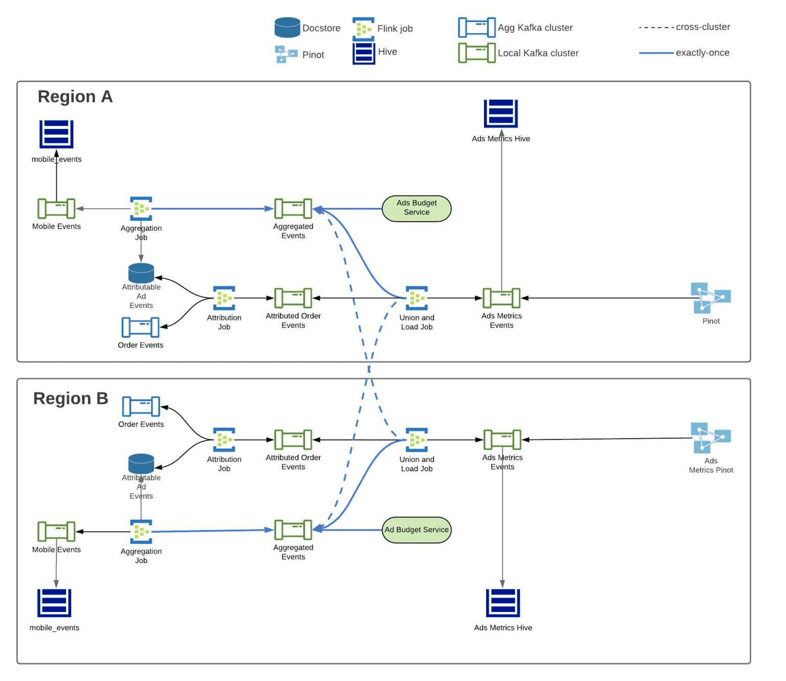

# Real-Time Exactly-Once Ad Event Processing

[https://eng.uber.com/real-time-exactly-once-ad-event-processing/](https://eng.uber.com/real-time-exactly-once-ad-event-processing/)

# Problem Statement

광고에서는 user당 이벤트들이 생긴다 (impression, click). ad events processing system은 event flow를 관리하고, 이벤트들을 클렌징하고, aggregate하고, 주문이 발생함에따라 attribution을 넣어주고, 이 data를 분석이나 리포팅에 쓰기위해 제공하는 것이다.

ad events processing system은 아래 요구사항을 맞춰야한다

### Speed

- Downstream ad system은 (**pacing, budget**)은 유저가 생성한 이벤트에 대한 real-time consuming이 필요하다.
- 광고주에게 광고성과를 최소한의 딜레이로 보여줘야 한다.

### Reliability

- data ingegrity 관점에서 Reliable 해야한다. ad events는 uber의 매출이다. event가 사라지면 uber는 잠재적인 수익을 잃게된다.
- 광고주들에게 광고 성과를 정확하게 보여줘야 한다. data loss는 광고성과를 낮게 보여주어 UX에 악영향을 준다

### Accuracy

- event를 중복집계 하면 안된다. click을 두번집계하면 광고주에게 더 많은 비용을 청구하게되고 광고성과를 부풀려서 보여주게된다. 따라서 exactly-once를 보장해야한다
- attribution이 100% 정확해야 한다

# Architecture

이 시스템에는 3개의 flink job이 동작하고, resiliency를 위해 2개의 region에 배포된다. Kafka/Flink에서는 transactionally commited되 메시지만 읽기를 보장하기 위해 exactly-once로 동작한다. 각 flink job에 대해 보기 전에 exactly-once semantic을 보장하는 방법에 대해 말할것이다.

## Exactly-Once

위에서 말한것처럼 가장 중요한 제약은 exactly-once를 보장하는것이다.

첫번째로 Flink와 Kafka에서 제공하는 exactly-once를 활용해서, Flink에서 처리되고 Kafka로 보내지는 모든 메시지가 [transactional](Real-Time%20Exactly-Once%20Ad%20Event%20Processing.md)하게 동작한다. Flink에서 `read_commited` 로 Kafka consumer를쓰면, transactional message만 읽게된다. 두번째로 aggregation job에서 생성되는 모든 record에 unique id를 부여한다. unique id는 downstream consumer에서 idempotency와 deduplication의 목적으로 쓰인다

Flink Aggregation Job은 분단위로 kafka에서 raw event를 받아 bucket에 aggregate한다. message의 timestamp에서 분단위로 truncate하고 분단위 timestamp를 ad indeitifier의 composite key중 하나로 쓰게 한다. 또한 aggregated result에 대해 record UUID를 생성한다.

1분단위 tumbling window는 다음 [Flink Checkpoint](https://ci.apache.org/projects/flink/flink-docs-master/docs/dev/datastream/fault-tolerance/checkpointing/)가 트리거 될때까지 uncommited state의 kafka sink에 aggregated result를 보낸다. 다음 checkpoint가 트리거 되면 (얘는 2분마다), message는 [two-phase commit protocol](https://flink.apache.org/features/2018/03/01/end-to-end-exactly-once-apache-flink.html)에 따라 commited state로 바뀐다. 이것은 checkpoint에 저장되는 kafka read offset이 언제나 commited message만 서빙하도록 보장해준다.

Aggregated Events topic의 consumer들(Ads Budget Service, union and load job)은 read commited events만 받도록 설정했다. 즉 flink checkpoint로 저장되지않은 message는 consume하지 못한다. 만약 Flink가 recover되는경우 aggregation job은 다시 실행되고, 새 aggregation result가 생성되고, kafka로 보내져 consumer들이 aggregation result를 받을 수 있게 된다

record UUID는 ad-budget service의 idempotency key로 사용되고, Hive에서는 deduplication에 사옹된다. Pinot에서는 upsert로 사용된다.

### Upsert in Pinot

- 우버는 Pinot에 upsert feature를 만들었따.

## Aggregation Job

### Data Cleansing (Validation, Deduplication)

Mobile Ad Events topic에서 들어오는 click, impression의 ad events stream을 ingest하는것으로 시작된다. [Filter](https://ci.apache.org/projects/flink/flink-docs-master/docs/dev/datastream/operators/overview/#filter) operator로 field가 적절하게 채워져있는지나, event age등을 검증하고, [Keyby](https://ci.apache.org/projects/flink/flink-docs-master/docs/dev/datastream/operators/overview/#keyby) operator로 event를 그루핑하고, [Map](https://ci.apache.org/projects/flink/flink-docs-master/docs/dev/datastream/operators/overview/#map) operator로 deduplicate한다. deduplicateion mapper function에서 Flink의 [keyed state](https://ci.apache.org/projects/flink/flink-docs-master/docs/dev/datastream/fault-tolerance/state/#using-keyed-state) 를 이용해서 이전에 처리했던 event를 확인한다. 이를통해 deduplicate event를 제거하고, fraud를 막게 된다

### Persistence for Order Attribution (Write to Docstore)

ad events를 clean하고 나면, order attribution job에 쓰기 위해 [docstore table](https://eng.uber.com/schemaless-sql-database/)에 event를 저장한다. docstore는 TTL을 제공하는 빠르고 reliable하기떄문에 선택했다. TTL이 있어서, system이 attribution window가 존재하는 동안에만 event를 저장할 수 있게 해준다.

### Aggregation

ad identifier와 event의 분단위 bucket의 조합을 바탕으로 event key를 지정한다. 이것은 late arrival에 관계없이 event를 항상 event가 속한 time range로 집계하기 위한 것이다. 그 다음 event들을 1분단위 tumbling window로 보낸다. (1분단위를 선택한 이유는 1. aggregated data를 쓰는 client 기준에서 충분히 작은 크기 2. 분석할때 쓰기 좋은 크기 (1분단위는 1시간, 6시간 등으로 roll up가능) 3.  db write같은 시점에서는 적절히 aggregate되어있어 overhead가 적은 크기 이기 때문이다.) tumbling window에서는 [Aggregation function](https://ci.apache.org/projects/flink/flink-docs-release-1.13/docs/dev/datastream/operators/windows/#aggregatefunction) 으로 모든 click과 impression을 카운트한다. 성능관점에서 aggregation function은 O(1)의 memory를 가지므로 (aggregated value) 증가하는 트래픽에도 충분히 scalable하다.

### Record UUID Generation

위에서 말했듯 idempotency, dedupilcation을 위해 aggregation result에 record UUID를 붙인다. Flink/Kafka에서 exactliy-once semantic이 보장되므로, record UUID는 Hive에서 deduplication, Pinot에서 upsert로 쓰인다

## Attribution Job

Attribution job은 더 직관적이다. uber eats의 모든 order data가 들어오는 kafka topic에서 order events를 받고, invalid data를 버린다. 그리고 docstore에 쿼리를 날려서 attribution을 만든다. 쿼리조건에 매치되면 attribution이 생기는 것이다. attribution event에 augment를 하기 위해 external service를 호출해서 추가 정보를 가져온다. 그리고 Pinot, Hive에서 활용하기 위한 record UUID를 붙인 뒤, Attributed Orders topic으로 event를 전달한다. 이 event는 Union and Load Job에서 쓰인다

## Union and Load Job - 월클이라 하는일

Union and Load Job은 여러 region에서 동작하는 aggregation job의 output event를 union시키고, Pinot과 Hive로 들어가게되는 output topic으로 보내준다. Pinot이 active-active(replicate없이 별도로 동작)하도록 설정되어있기때문에, region간의 event를 union해야한다. 따라서 이 job은 여러 region에서도 동일한 데이터를 가지도록 한다.

## Revisit the requirements

### Speed

주된 병목은 Flink checkpoint interval이다. exactly-once라는 제약조건에서, event가 process되기 전에 checkpoint가 commit되기를 기다려야만한다. default checkpoint interval은 10분이지만 Uber는 2분을 쓴다. 따라서 정확히 real-time은 아니지만 내부 시스템이 up-to-date하고, 광고성과를 광고주들에게 보여주기에는 충분히 합리적이다

### Reliability

cross-region replication으로 datacenter에서 발생하는 이슈에서 failover할 수 있고. Flink의 checkpoint로 wrong processing이 발생하지 않게 해준다. 또한 Uber에서는 kafka topic의 retention period를 3일로 설정하여 disaster recovery에도 대응할수 있게 되어있다.

reliability의 가장 pain point는 aggregation job 자체이다. 이 job이 잠깐 dealy가 생기면 pacing을 포함한 다양한 서비스로 이슈가 전파된다. 이 processing을 빠르게 하지 못한다면 pacing은 적절하게 업데이트 되지 않아 overspend로 이어진다. 이것은 아직 해결되지 않은 문제다

### Accuracy

kafka/flink의 exactly-once semantic, idempotency와 upsert를 통해 accuracy를 맞출 수 있었다.