{{ page.description }}

# uMetric: The Journey Towards Metric Standardization

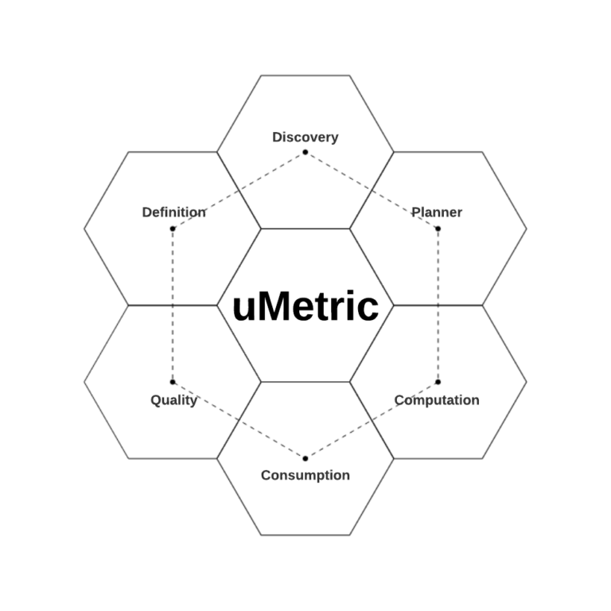

uMetric

# uMetric: The Journey Towards Metric Standardization

## Introduction

business metric은 우버가 새 프로덕트에대한 성과를 측정하고 decision making process를 최적화하는데 필수적이다. metric에 대한 usecase는 운임 단가에 대한 문제를 확인하는 operation 직원부터 dynamic pricing을 위한 ML model까지 다양하다.

metric 접근을 democratize하고, 인사이트를 주기 위해서 metric standardization이 필요하다는것을 알게 되었다. metric standardization이 없으면 종종 같은 metric에 대해 여러 버전이 생기는거나 같은 비즈니스 로직이지만 다른 테이블로 생성되어 정확하지않고 오해를 만들 수 있어 downstream consumer가 비일관적인 metric을 보게 될 수 있다.

따라서 우버는 uMetric을만들었다. uMetric은 definition, discovery, planning, computation, quality, consumption까지의 metric lifecycle을 관리하는 unified interanl metic platform이다.

## Case Study

우버의 marketplace 팀은 rider, drive의 매칭을 잘되도록 해야 한다. 이 것을 평가하기 위한 metric 중 하나는 $Driver\ Acceptance\ Rate = Accepted\ requests\ by\ DriversTotal\ offers\ to\ Drivers$ 이다.

Driver Acceptance Rate을 올리면 rider의 대기 시간은 더 짧아질 것이다. 짧은 대기시간은 rider가 다음에도 우버를 사용할 가능성이 높아지고 driver의 잠재적인 수익도 올라가게 된다.

Driver Acceptance Rate에 영향을 주는 몇가지 factor가 있지만 trip의 가치 더 중요해지고있다. 이는 Network Value로 이어지게 되는데, Network Value는 현재 trip과, 현재 trip의 도착지에서 만들 수 있는 잠재적인 수익을 의미한다. driver는 이것 또한 고려하여 평가하게 된다.

예를들어 같은곳에서 출발하고, 금액이 같지만 서로 다른 지역으로 갈때, A지역이 잠재적인 수익이 높으면 A지역을 선택하게 되는 것이다.

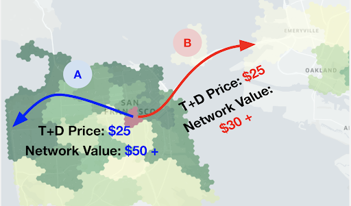

*Network Value Comparison*

marketplace 팀은 driver들에게 더 많은 수익 기회를 만들기 위해 ML로 real-time, historical data를 에서 오는`number of requested trips / number of avliable driver` metric을 이용하여 예상 미래수익을 계산한다.

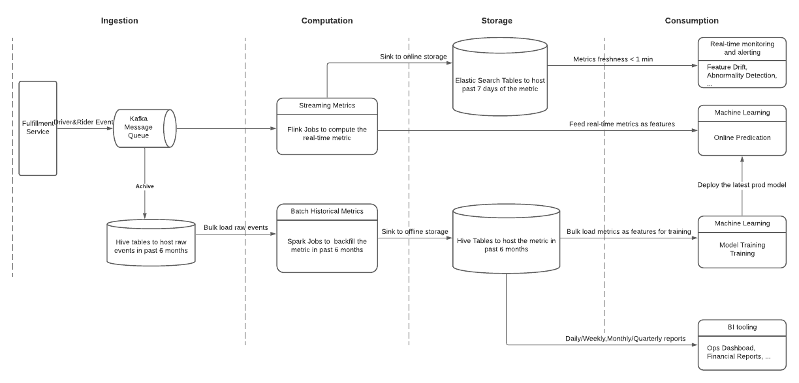

“number of requetsed trips and available drivers” Metrics for Network Pricing

## Metric Standardization in the Eror of Data Democratization

data democratization은 업계 트렌드이다. metric consumer는 이전보다 더 많은 선택지와 접근권한을 가진다. 하지만 이로인해 다른 문제점도 직면했따. 같은 business metric에 대해 다른팀이 각각의 data pipeline으로 만들거나, 서로 다른 툴을 사용해서 metric간 차이가 발생한다. 따라서 consumer들은 그들이 본 metric version에 따라 다른 결론을 내리게 된다.

예를들어 “Shopping Session” metric은 rider session 개수를 의미하는데, 우버 앱에서 rider activity를 추적하는데 중요한 metric이다. 같은 도시, 같은 기간인데도 불구하고 vis tool이 무엇인지에 따라 달라지게 된다

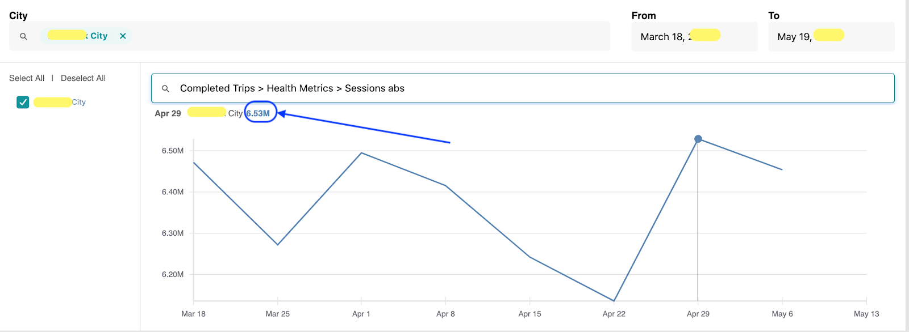

*iHub – Shopping Sessions: 6.53M*

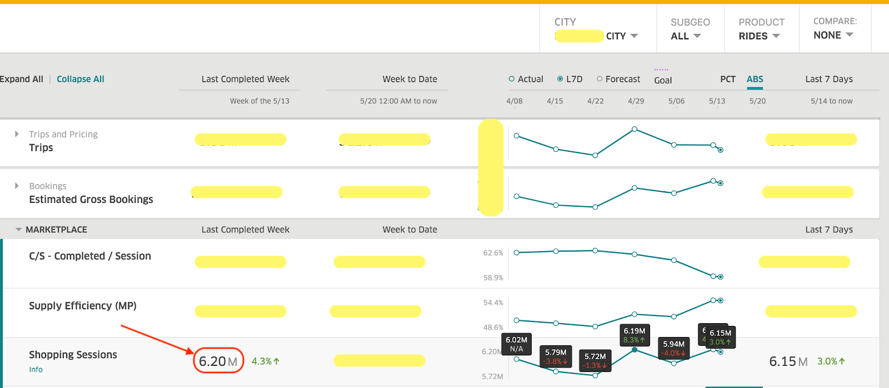

*Summary – Shopping Sessions: 6.20M*

이 이슈의 root cause는 두번째 툴이 static query에서 stale filter를 적용하여 latest data를 보여주지 못한것이 원인이다.

위의 예시처럼 customer가 metric을 보는데에 있어 paintpoint들이 존재한다.

- Data scientist, engineer, operation, PM등 data user는 필요한 table, metric을 찾기 어려워한다
- pipeline이 관리되지않거나 reliable하지 않다.
- descriptoin, SLA, data source 등 기본적인 정보가 없다.
- systematic quality check가 필요하다
- fine grained access control이 없다

이러한 문제들은 전체 lifecycle에서 모호함을 주지않고 metric과 business logic이 1:1로 매핑되는 metric standardization이 필요하다.

## uMetric

uMetric은 business-critical metric의 discrepancy를 없애기 위한 engineering solution으로 시작했다. 현재 uMetric은 아래의 design goal을 시스템에 잘 녹여  metric의 전체 lifecycle을 관리하여 standardization을 했으며, metric을 ML feature로 사용하여 “metrics and ML features as a service” 가 되었다.

- **Definition**: 어느 누구나 명확하면서 새로운(기존과 중복되지않는) metric을 만들 수 있다.
- **Discovery**: single source to search and view
- **Planner**: resource-efficient plan을 만들기 위한 centralized knowledge & execution hub
- **Computation**: batch, real-time, backfill 모든 케이스에서 안정적인 data pipeline
- **Quality**: uMetric이 바라보는 모든 data source와 metric result는 한번에 확인, 모니터링 가능
- **Consumption**: stnadardized and multifaceted access interface

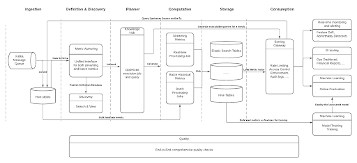

*uMetric ecosystem*

## Less is More

metric definition이 실제로 어떻게 동작하길래 어느 누구나 새 metric을 만들도록 할 수 있었을까.

### Definition Model

이에 대한 답은 uMetric 팀이 30개 이상의 팀과 10K 이상의 metric을 보면서 duplicate, ambiguous metric에서 오는 가장 빈번한 두개의 시나리오에서 시작한다.

- **Overwhelming metric instances**
”뉴욕의 완료된 trip”, “샌프란의 완료된 trip”, “샌프란의 매일 완료된 trip” 같이 slice/dice dimension의 조합과 value filter로 생성되는 수많은 metric들. popular metric에 대해 수백가지의 metric instance가 생긴다. 심지어 일부는 오해하기 쉽거나 dimension, filter에 대해 detail을 모두 반영하지 못한다.
- **Obfuscating metric instances**
source storage type마다 obfuscate됨. 다양한 metric consumer에서 오는 freshness, latency, time span의 요구사항을 반영하기 위해 “동일한 source data”가 여러 storage에서 사용될 수 있다. 예를들어 operation team은 한 metric을 최근 18개월 동안의 data를 Presto/Hive에 정의하고, Pricing Engineering team은 realtime service를 위해 Cassandra에 저장한다. 하지만 storage가 다르기때문에 business logic, dimesion등에따라 cross-validation 하는것은 굉장히 어렵다.

이런 문제를 해결하기 위해 uMetric은 아래의 metric logic을 표현하는 metric definition model을 만들었다.

- **View Definition:** 다른 storage의 테이블로 만들어진 같은 source data에 대한 unified view 제공
- **Metric Definition**: 어떻게 metric이 계산되는지 SQL로 보여주고 metric author, business cased등 주요 정보 포함
- **Dimension & Filter**: GROUP BY, WHERE 절과 비슷. uMetric은 metric instance management를 consumer가 하도록 해서 metric definition을 lean하게 만듦

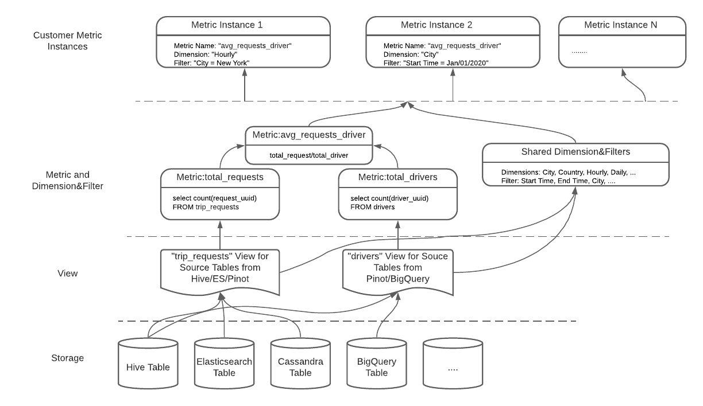

*Definition Model: “avg_requests_driver” metric*

definition model은 metic definition으로부터 planner와 computation으로 만들어진 precomputation을 하는 batch/streaming job 또는 runtime에 table에대한 executable query를 만들게 된다.

### Algorithmic Dedupe

view와 metric이 SQL statement로 표현되므로 metric author는 다른 query format으로 중복되거나 유사한 metric을 만들게 된다. 따라서 SQL query에 대해 smart algorithmic dedupe이 필요하다.

SQL equivalence checking은 NP-complete problem이다. 따라서 query를 canonical format으로 만들고 query간 차이를 비교할 수 있는 heuristic approach로 구현했다. transformation은 SQL query를 flatten시켜 nested query structue에서 오는 차이를 없앤다.

아래 그림은 “trip_completed_ratio” metric을 “completed_trips / total/trips”로 재사용하도록 추천한다.

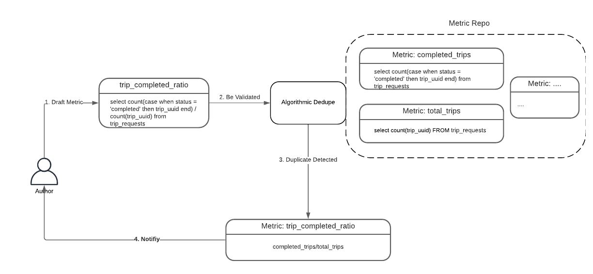

*Algorithmic Dedupe: Power of Composite Metrics*

아래 그림의 “trip_request” view는 기존 “trip_requests” view와 비교했을때 nested query로 모양이 다르다. dedupe algorithm은 이런 sturcture/alias difference를 없앤다.

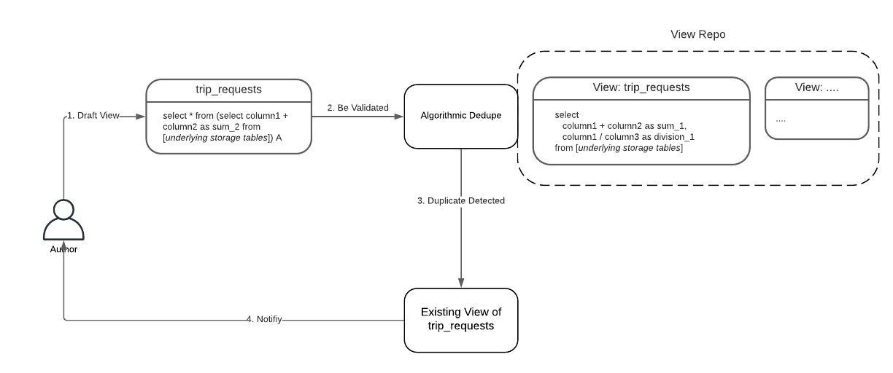

*Algorithmic Dedupe: Minimize View Redundancy*

duplicate, ambiguouse metric을 제거해서 user가 metric을 찾는것부터 사용하는것까지의 생산성을 높인다.

## Governance & Guardrails

uMetric 초기에 top business-critical metric을 서빙하는것에 우선순위를 두었다. 이런 애들은 자주사용되므로 중복되는 metric이 아주 많았다. 예를들어 “completed trips” metric은 product type(UberX, Uber Pool, ...) 에 따라 slice/dice 된다. 반면에 Uber Eats에서는 order type(Chinese, Thai, ...)의 dimension을 가지므로 전자의 metric을 사용할 수 없다. 이런 divergence는 두 조직의 하위 팀으로 갈수록 더 커지게된다.

algorithmic dedupe를 만들었지만 여전히 standardization을 달성하기 위해 해결해야 할 것들이 있었다.

- “one business logic”의 범위가 어느정도인가? “completed_trips” metric 케이스에서 같은 upstream data를 사용하므로 driver-related dimension을 하나의 metric으로 합치기로 했다.
- quality, coverate(downstream for usecase), realtime/batch support와 같은 metric definition을 위한 production-ready datasource가 어떤건가?
- qualified data source가 없는 케이스에서 어떤 액션을 할 수 있는가?

이런 질문들을 해결하기 위해 우버는 전사적으로 **Verification Committee** 를 만들었다. 각 product/business의 domain knowledge를 알고있는 사람들로 구성되며, commitee는 해결책을 만들거나 해결할수있는 팀을 연걸한다. 이건 시간이 오래걸리면서 final plan을 만들기 위해 여러 팀이 수반되지만, metric의 영향과 많은 stakeholder를 고려했을때 꼭 필요한 작업이다.

게다가 더 많은 metric에 적용하면 committee에 부담이 더 커지고, local team 수준에서 새 metric을 이용한 실험을 하기위해선 유연성도 필요하므로 tiering을 하기로 했다.

- 중요한 metric과 그렇지 않은것을 구분하고,
- metric author에게 책임과 권한을 부여해서 standardization을 확장시킨다.

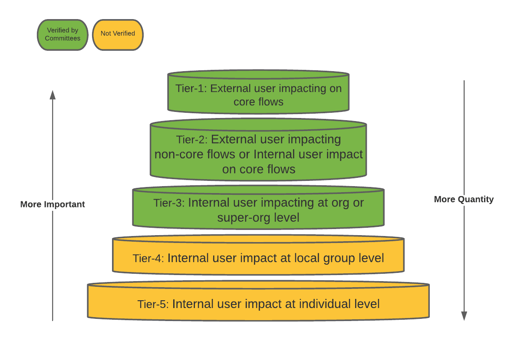

*uMetric Tiering*

## Quality & Trustworthy

Quality는 uMetric data가 customer의 신뢰를 얻어 성공하기 위해선 필수적이므로 metric quality에 대해 투명하고 actionable insight를 제공해주었다.

특히 upstream source quality는 metric quality에 직접적인 영향을 준다. production metric이 source로 정의되면, quality는 즉시 모니터링되어야하며 owner는 alert에 대해 책임을 가진다.

- **Freshness tests**: freshness period 내에 source가 들어오는지 검증한다. source freshness는 data가 얼마나 up-to-date한지 표현하고, source owner가 이 값을 정의한다. metric의 freshness는 모든 upstream source freshness중 가장 큰 값으로 결정된다.
- **Upstream Cross-Datacenter Consistency tests**: datacenter간 row count가 x% 이내의 차이가 발생하는지 확인한다. metic의 cross-datacenter consistency는 모든 upstream source중 가장 낮은 consistency로 제한된다.
- **Upstream Completeness/Duplicates tests**: metic을 계산하는데 사용되는 data가 complete하며 duplicate row가 없음을 검증한다.

metric이 quality standard를 맞추려면 모든 upstream source가 모든 test를 통과해야 한다. metric author와 verification committee가 qualification evaluation 프로세스를 진행하면서 downstream metric에 의해 test threshold가 결정된다(threshold는 upstream source인데, 결정하는건 metric committee..???). 하지만 quality를 높이는것은 metric source owner의 책임이다.

## Access Control

- cluster/table/column/row level에 대해 source의 access control policy를 inherit하며 raw data에 대한 권한이 있는 consumer를 식별한다.
- inherited plicy를 storage layer의 pre-computed metric에 전달한다
- consumption동안 user/service단위 policy를 강제한다.

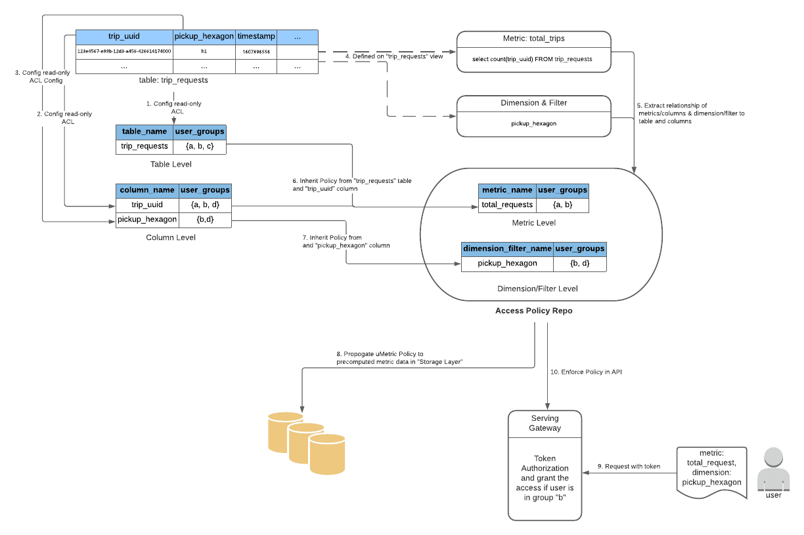

*uMetric Access Policy for “total_trips”*

위 그림의 step 5에서 “total_tips” metric은 “trip_requests” 테이블과 `select count(trip_uuid) FROM trip_requests` 쿼리의 “trip_uuid” 컬럼으로 전달되는것이 직관적이다. 하지만 metric defintion의 query는 CTE나 join으로 복잡해지기때문에 SQL과 source table column을 매칭시키는 문제를 풀어야한다.

uMetric은 Apache Calcite를 이용해 SQL processor를 만들었다. SQL processor는 SQL string을 파싱하여 structural tree model로 바꾼뒤 연관관계를 분석한다.

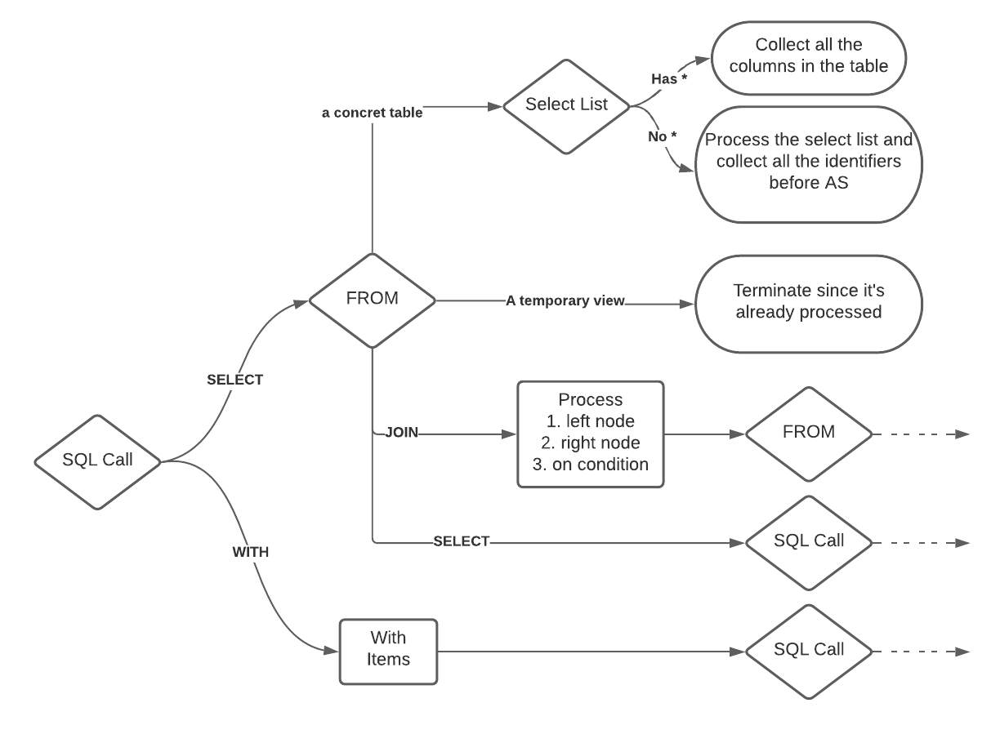

*Recursive column extraction algorithm*

## Future Work

definition authoring, governance, quality, access control